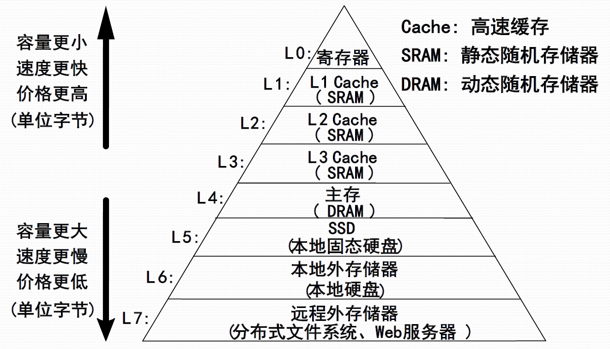

# OS

## 三、存储器

### （1）内存的基本知识

1. 内存是存放数据的硬件。程序执行前需要先放到内存中才能被CPU处理——多道程序环境下，有多个程序在内存中，那么如何区分不同的程序的数据的存放位置呢。
2. 内存是用于存放数据的硬件，程序执行前需要先放到内存中才能被CPU处理。
3. 内存空间一般分为两部分
   1. 系统区：存放操作系统内核程序和数据结构等。
   2. 用户区：存放应用程序和数据。

4. 指令是程序运行的原理。
5. 编译：由编译程序将用户源代码编译成若干个目标模块（高级语言->机器语言）。
6. 链接：由链接程序将编译后形成的一组目标模块以及所需的库函数链接在一起，形成一个完整的装入模块，由装入程序将装入模块装入内存运行。
   1. 静态链接：在程序运行之前，先将各目标模块及他们所需要的库函数连接成一个完整的可执行文件，之后就不再拆开。
   2. 装入时动态链接：将各目标模块装入内存时边装入边链接。
   3. 运行时动态链接：在程序执行中需要该模块时，才对他进行链接。——优点是便于修改和更新，便于实现对目标模块的共享。
7. 地址转换
   1. 装入模块在装入内存时需要对指令中的地址进行处理
   2. 绝对装入：在编译时，如果知道程序将放到内存中的哪个位置，编译程序将产生绝对地址的目标代码。装入程序按照装入模块中的地址，将程序和数据装入内存——只适用于单道程序环境。
   3. 静态重定位：又称可重定位装入。编译、链接后的装入模块的地址都是从0开始的，指令中使用的地址、数据存放的地址都是相对于起始地址而言的逻辑地址。可根据内存的当前情况，将装入模块装入到内存的适当位置，装入时对地址进行“重定位”，将逻辑地址转化为物理地址（地址变化是在装入是一次完成的）。**静态重定位的特点是在一个作业装入内存时，必须分配其要求的全部内存空间，如果没有足够的内存就不能装入该作业。作业一旦进入内存后，在运行期间就不能移动，也不能申请内存空间**
   4. 动态重定位：又称动态运行时装入。编译、链接后的装入模块的地址都是从0开始的。装入程序把装入模块装入内存后，并不会立即把逻辑地址装换成物理地址，而是把地址转换成推迟到程序真正要执行的时候才进行。因此装入内存后所有的地址依然是逻辑地址。——需要重定位寄存器的支持

8. 存储器
   1. 结构层次
   2. 

### （2）内存管理

1. 内存管理的功能
   1. 操作系统负责内存空间的分配与回收。
   2. 操作系统需要提供某种技术从逻辑上对内存空间进行扩容。
   3. 操作系统需要提供地址转换功能，负责程序的逻辑地址与物理地址的转换。
   4. 内存保护功能，既保护内存中运行的各个程序之间互不干扰并且保证进程只能访问自己的空间。
      1. 方法：上、下限寄存器；采用重定位寄存器（基址寄存器）和界地址（限长寄存器）寄存器。
   5. another

### （3）覆盖与交换——内存空间的扩充

1. 覆盖技术：早期计算机内存很小，因此引入了覆盖技术解决“程序大小超过物理内存总和的问题”。

   1. 思想：将程序分成多个段，常用的段常驻内存，不常用的段在需要时掉入内存——内存分成一个“固定区”和若干个“覆盖区”。
   2.  

2. 交换技术

   1. 思想：内存空间紧张时，系统将内存中某些进程暂时换出内存，把外存中某些已具备运行条件的进程换入内存。

   2. 暂时换出内存的进程状态称为挂起状态——就绪挂起/阻塞挂起。**复习一下七状态模型和各状态之间的切换**

   3. 在磁盘什么位置保存：对于对换功能的操作系统来说，通常把磁盘分为文件区和对换区，文件区主要用于存放文件，追求**储存空间的利用率**，因此采用离散分配的方式。对换区占小部分，被换出的数据存放在对换区，追求**换入换出速度**，因此采用连续分配方式——对换速度直接影响到系统整体速度因此对换区I/O快于文件区。

      

   4. 什么时候交换：交换通常发生在许多进程运行且内存吃紧的状态，当系统负荷降低就暂停。

   5. 交换哪些进程：优先换出阻塞进程、优先级低的进程、进程在内存中的驻留时间。

### （4）连续分配

1. 连续分配：只为用户进程分配的必须是一个连续的内存空间。
2. 单一连续分配：内存被分为系统区和用户区，系统区通常位于低地址部分，用于存放操作系统的数据。用户区位于高地址区，存放用户进程数据，内存中只能有一道用户程序，用户程序独占整个用户区空间。
   1. 优点：实现简单；无外部碎片；可以采用覆盖技术扩充内存；不需要内存保护。
   2. 缺点：只能用于单用户、单任务的操作系统；有内部碎片；储存器利用率极低。
   3.  
3. 固定分区分配：为了能在内存中装入多道程序，且这些程序不会相互干扰，将用户空间划分为若干个固定大小的分区，在每个分区只装入一个作业。这样就形成了最早的、最简单的可运行多道程序的内存管理方式。
   1. 分区大小相等：缺乏灵活性，但是适合用于一台计算机控制多个相同对象的场合。
   2. 分区大小不等：增加了灵活性，可以满足不同大小的进程需求，根据常在系统中运行的作业大小情况进行划分。
   3. 分区说明表：实现对各个分区的分配与回收，每个 表项对应一个分区，包括分区的大小、起始地址、状态。
   4. 优点：实现简单；无外部碎片。
   5. 缺点：
      1. 当用户程序过大时所有分区都可能不能满足，此时就需要使用覆盖技术——降低性能。
      2. 会产生内部碎片，内存利用率低。
4. 动态分区分配：不预先划分内存分区，而是在进程装入内存时，根据内存的大小动态的建立分区。
   1. 如何记录内存的使用情况：
   2. 如何选择分区——动态分区分配算法
   3. 分配与回收——合并相邻空闲分区
   4. 内部碎片：分配给某进程的内存区域中，某些部分没有被用上。
   5. 外部碎片：内存中某些空闲分区由于太小难以利用。

### （5）动态分区分配算法

1. 首次适应算法
   1. 思想：每次都从低地址开始找，找到第一个能满足大小的空闲分区。
   2. 实现：空闲分区以地址递增的次序排列，每次分配时顺序查找空闲分区，找到第一个能满足要求的第一个分区。
2. 最佳适应算法——基于分区大小排列
   1. 思想：为了保证大进程来的时候能够获得足够大的连续空间，因此我们要优先使用小空间。
   2. 实现：空闲分区按照容量递增排列，每次分配顺序查找第一个足够大的分区。
   3. 缺点：每次都选最小的分区，会留下越来越多的小内部碎片。
3. 最坏（大）适应算法——基于分区大小排列
   1. 思想：优先使用最大的分区。
   2. 实现空闲分区按容量递减排序，每次找第一个使用。
4. 邻近适应算法——基于地址顺序排列
   1. 思想：首次适应算法每次从链头开始查找，这会导致低地址部分会出现很多小的空闲空间，同时也会增加查找的开销，因此每次都从上次查找结束的地方开始检索。
   2. 实现：空闲分区以地址递增的顺序排列（循环链表），每次分配内存时从上次查找结束的位置开始查找空闲分区，找到满足的第一个分区。
   3. 缺点：高地址部分的大分区更有可能被使用并划分成小分区。
5.  

### （6）分页

1. 允许将一个进程分散的装入到许多不相邻的分区中，便可以充分利用内存而无需紧凑——非连续分配方式。
2. 分页：将内存空间分成一个个大小相等的分区，每个分区都是一个页框/页帧，页框号**从0开始**。将用户进程的地址空间分为与页框大小相等的页/页面，每个页面有一个页号，**从0开始**——最后一个页面可能达不到一个页框的大小，所以页框不能太大，否则就会产生过大的碎片。
3. 地址转换——分页技术的最大难点
   1. 采用动态重定位的方式——物理地址=页面地址+页内偏移量
   2. 页号=逻辑地址/页面长度
   3. 页内偏移量=逻辑地址%页面长度
   4. 为了方便计算页号和偏移量，页面大小一般设置为2的整数幂——直接位运算
4. 逻辑地址结构
5. 页表：OS为每个进程创建一个页表。
   1. 
   2. 页表中的页号应该是隐含的，根据页表项的大小和起始地址就可以计算出每个页表项的位置

### （7）基本地址变换

1. 基本地址变换机构可以通过进程的页表将逻辑地址转换为物理地址。通常会在PRT（页表寄存器）中存放页表在内存中的起始地址F和页表长度M。进程未执行时页表的起始地址和页表长度放在PCB中，进程被调度时内核会把它们放到PRT中。
2.  
3. 计算机在计算物理地址是可以直接将内存块号、页内偏移量用二进制表示然后拼接起来就行。
4. 在做题时注意要对页号进行越界检查
5. 为了便于计算页表项的位置，我们一般会让一个页表项占更多的字节，使得每个页面正好可以装下整数个页表项。

### （8）快表（TLB）

1. 局部性原理：
   1. 时间局部性：如果执行了程序中的某条指令，那么不久以后这条指令可能会被再次执行；数据被访问后可能会再次被访问——循环。
   2. 空间局部性：程序访问了某个储存单元，那么不久之后其附近的储存单元也可能被访问——数据在内存中连续存放。
   3. 所以在程序运行中可能每次访问同一个页表项。
2. 快表（TLB，联想寄存器）：一种访问速度比内存快很多的高速缓冲储存器，用来储存当前访问的若干页表项，以加速地址变换的过程——内存中的页表叫做慢表。*注意这里快表只是一个表项的集合，在快表中查找到了表项以后还得访问内存。*
3. 快表模式下地址的变换过程
3. 快表模式下，如果未命中就需要访问两次内存，命中则访问一次。无快表模式下稳定需要访问两次。

### （9）两级页表

1. 单级页表的问题：
   1. 对于单级页表，一个进程的页表拥有多个页框，而我们想要快速的找到每个页框的位置，就需要将这些页框连续存储。当一个进程较大时，可能拥有一个超级大的页表，而连续储存这样一个页表显然是困难且不合理的——页表连续存放。
   2. 同时，根据局部性原理可知，进程在一段时间内可能只需要访问某几个页面就可以正常运行，因此没必要让整个页表都常驻内存——整个页表常驻内存。
2. 解决：
   1. 对于大页表的存储，我们借鉴内存分页的思想，直接将页表也进行分段，采用离散分配的方式，并再建立一张页表储存，成为页目录表/外层页表/顶层页表。
   2.  
   3. 实现地址变换：
      1. 按照地址结构讲逻辑地址拆分成三部分。
      2. 从PCB中读出页目录表起始地址，再根据一级页号查表找到下一级页表的地址。
      3. 根据二级页号查表找到内存块号。
      4. 结合页内偏移量找到物理地址。
   4.  
3. 如果采用多级页表机制，则各级页表的大小不能超过一个页面——在计算地址中页表编号所占位数时使用，每一级页表的总大小不能超过一个页面。
4. 若有n级页表，则访存次数为n+1次。

### （10）分段

1. 进程的地址空间：**按照程序自身的逻辑关系**划分为若干个段，每个段都有一个段名，每段从0开始编址。

2. 内存分配规则：以段为单位分配，每个段在内存中占据连续空间，但各段之间可以不相邻。

3. 逻辑地址：段号（段名）+段内地址（段内偏移量）。

   段号的位数决定了每个进程最多可以分几个段，段内地址位数决定了每个段的最大长度。

4. 段表：为每个进程建立的一张段映射表，每个段对应一个段表项，记录了该段的起始位置（基址）和段长。

   各个段表项的长度相同，因此段号可以是隐含的，不占储存空间。

5. 分页与分段

   1. 页是信息的物理单位，分页的目的是为了实现离散分配提高内存利用率。分页仅仅是系统管理需要，完全是系统的，用户不可见。
   2. 段是信息的逻辑单位，分段的目的是为了更好地满足用户需求，一个段通常包含一组属于一个逻辑模块的信息，分段对用户是可见的，用户变成是需要显式的给出段名。
   3. 页的大小固定，由系统决定，段的长度却不固定，决定于用户编写的程序。
   4. 分页的用户进程地址空间是一维的，只需要给出记忆符就可以表示一个地址。分段的则是二维，程序员既要给出段名又要给出段内地址。
   5. 分段比分页跟容易实现信息的共享和保护，页面并不是按照逻辑划分的，但是我们共享代码是常常按照功能分享。

6. 访问一个逻辑地址的访存次数：

   1. 分页：查页表，访问内存，共两次。
   2. 分段：查段表，访问内存，两次。
   3. 分段系统也可以引入快表机制。

### （11）段页式管理方式

1. 分页、分段的优缺点

   |      | 优点                                                 | 缺点                                                         |
   | ---- | ---------------------------------------------------- | ------------------------------------------------------------ |
   | 分页 | 内存利用率高，不会产生外部碎片，只会有少量内部碎片。 | 不方便按照逻辑模块实现信息的共享和保护。                     |
   | 分段 | 很方便按照逻辑模块实现信息的共享和保护               | 如果段过大，需要为其分配很大的连续空间会很不方便。还会产生外部碎片（和动态分区分配一样）。 |

2.  

3. 逻辑地址结构：段号+页号（每个段最大有多少页）+页内偏移量

4. 每个段对应一个段表项，每个段表项由段号、页表长度、页表存放块好组成，段号隐含。每个页面对应一个页表项。

5. 一个进程只对应一个段表，但是可以对应多个页表。

6.   

### （12）虚拟内存

1. 传统储存管理方式的特征、缺点：

2. 虚拟内存是基于局部性原理（时间局部性、空间局部性）的，在程序装入时，可以将程序中很快会用到的部分装入内存，用不到的留在外存，然后就让程序开始执行。在程序执行过程中，如果访问的信息不在内存，有操作系统将所需要的信息从外存调入内存，然后继续执行程序。如果内存空间不够，由操作系统将内存中暂时用不到的信息换出到外存。在操作系统的管理下用户就可以拥有一个比实际内存大的多的内存，这就是虚存。操作系统虚拟性的体现，实际的物理内存没有变，只是在逻辑上进行扩充。

3. 虚存的最大容量是由计算机的地址结构（CPU寻址范围）决定的，但是虚存的实际容量=min（内存和外存之和，CPU寻址范围）。

4.  

   主要区别：在程序执行过程中，当访问的信息不在内存中时，有操作系统将所需信息从外存调入内存（提供请求调页/请求调段功能），然后继续执行程序。如果内存空间不够，操作系统将用不到的信息换出内存（提供页面置换/段置换功能）。

### （13）请求分页管理方式

1. 请求分页管理方式中需要实现请求调页和页面置换功能，来实现页面在内存和外存之间的转换。
2. 页表机制：首先，OS需要知道每个页面是否调入内存和页面在外村中的位置，同时OS也需要知道到底要换出哪个页面，以及页面有没有被修改过来决定是否需要覆盖外村中的旧数据。
3. 缺页中断机构
   1. 在请求分页系统中，每当访问的页面不在内存中，便产生一个缺页中断，然后由操作系统的缺页中断处理程序处理中断，此时缺页的进程阻塞，放入阻塞队列，调页完成后将其唤醒，放回就绪队列。
   2. 如果内存中有空闲块，则为进程分配一个空闲块，将缺页装入并修改页表中相应的页表项。
   3. 如果内存中没有内存快，则有页面置换算法选择一个页面淘汰，若该页面在内存期间被修改过，则将其写回外存，未修改过的的页面不用写回。
   4. 缺页中断是当前执行的指令想要访问的目标页面未调入内存产生的，因此属于内中断。一条指令在执行期间，可能产生多次缺页中断。
   5.  
4. 请求分页与基本分页的区别：
5. 请求分页地址变换：

### （14）页面置换算法

1. 页面的换入换出需要调用I/O等，开销较大，因此页面置换算法应该追求更少的缺页率。
2. 最优置换算法（OPT）
   1. 思想：每次选择淘汰的页面将是以后永不使用或在最长时间内不再被使用的页面——保证最低的缺页率。
   2. 过程：
   3. **缺页发生时未必会发生页面置换，若还有可用的空闲内存块，就不需要进行页面置换。**
   4. 缺陷：最佳置换算法需要提前知道页面的访问顺序，但是操作系统显然无法判断，因此最佳置换算法是无法实现的。
   4. 可以用作评价其他算法效率的标准。
3. 先进先出置换算法（FIFO）
   1. 思想：每次淘汰最早进入的页面。
   2. 过程：
   3. **Belady异常**：当为进程分配的物理块增大时，缺页次数不减反增的现象，只有FIFO会产生Belady异常，同时FIFO虽然实现简单，但是选择淘汰页面的原则不科学，因此算法性能差。
4. 最近最久未使用置换算法（LRU）
   1. 思想：每次淘汰的页面是最近最久未使用的页面。
   2. 过程：为每个页面对应的页表项中用用访问字段记录该页面上次访问以来的时间t，选择t最大的页面。
   3. 算法的性能好（最接近最佳置换算法的），但是实现需要专门的硬件支持，**实现困难开销大**。
5. 最近最不常用置换算法（LFU）：
   1. 思想：淘汰最近一段时间内**访问次数较少**的页面，对 OPT 的模拟性比 LRU 更好。
   2. 过程：基于时间间隔中断，并给每一页设置一个计数器，时间间隔中断发生后，所有计数器清 0，每访问页 1 次就给计数器加 1，选择计数最小的页面淘汰。

6. 时钟置换算法（CLOK）
   1. 思想：性能和开销均衡的算法，又叫最近未使用算法（NRU not recently used）。
   2. 过程：
      1. 为每个页面设置一个访问位，再将内存中的页面都通过链接指针链接成个循环队列，**并设置一个替换指针与之相关联**。
      2. 当某页被放入队列时，将该页的访问位设为1。当某页被访问时，其访问位置为1。当需要淘汰一个页面时，只需检查页的访问位，如果是0，就选择该页换出。如果是1，则将它置为0，暂不换出，继续检查下一个页面。
      3. 若第一轮扫描中所有页面都是1，则将这些页面的访问位依次置为0后，再进行第二轮扫描 （第二轮扫描中一定会有访问位为0的页面，因此简单的CLOCK算法选择个淘汰页面最多会经过两轮扫描）。
      4.  在扫描过程中，指针会指向上一次扫描过的页面的下一个，需要维持指针指向的位置。**在做题过程中，访问一个已经在队列里面的页面不需要移动指针，只有缺页的时候选择退出队列的页面才会移动指针，也就是说指针只跟访问位关联，页面本身的访问与指针无关。**同时，在指针指向一个可以替换的页面并替换为缺页页面以后，指针需要往后移动一格。
7. 改进型时钟置换算法
   1. 简单的时钟置换算法只考虑是否被访问，但是页面还有修改和I/O的问题，因此只有被淘汰的页面被修改过时才需要写回外存。**因此在其他条件相同时，应优先淘汰没有被修改过的页面。**
   2. 过程：增加一个修改位，1表示修改过0表示未修改。
8. 抖动和工作集//TODO
9. 各个算法性能的比较：

### （15）页面分配策略

1. 驻留集：指请求分页储存管理中给进程分配的物理块的集合。**在采用了虚拟储存技术的系统中驻留集大小一般小于进程大小。**如果驻留集太小，系统运行进程需要花大量时间处理缺页，驻留集太大又会导致多道并发程序并发度下降，资源利用率低。

2. 固定分配：OS为每个进程分配一组固定数目的物理块，在进程运行期间不再改变——驻留集大小不变。

3. 可变分配：现为每个进程分配一定数目的物理块，在进程运行期间可以增减——驻留集大小可变。

4. 局部置换：发生缺页时只能选进程自己的物理块进行置换。

5. 全局置换：可以将操作系统保留的空闲物理块分配给缺页进程，也可以将别的进程持有的物理块置换到外存在分配给缺页进程——必然是可变分配。

6. 分配策略和置换策略可以轮换匹配，但是全局置换只能对应可变分配。

7. 分配策略

   1.  
   2.  
   3.  
   4.  

8. 何时调入页面

   1. 预调页策略：根据局部性原理，一次调入若干个相邻的页面比一次调入一个页面要高效但是如果提前调入的页面大多数没有被访问过则又是低效的。因此可预测不久之后可能访问到的页面，将他们提前调入内存。所以这种策略主要用于**进程的首次调入**，由程序猿指出应该调入哪些部分。
   2. 请求调页策略：进程在运行期间发现缺页时才将页面调入内存。由这种策略调入的页面一定会被访问到，但是每次调入一个并且需要I/O操作，开销较大。

9. 何处调入页面

   1. 系统拥有足够的对换区空间：页面的调入、调出都是在内存与对换区之间进行，这样可以保证页面的调入、调出速度很快。在进程运行前需将进程相关的数据从文件区复制到对换区。

   2.  系统缺少足够的对换区空间：凡是不会被修改的数据都直接从文件区调入，由于这些页面不会被修改，因此换出时不必写回磁盘，下次需要时再从文件区调入即可。对于可能被修改的部分，换出时需写回磁盘对换区，下次需要时再从对换区调入。
      
   3. UNIX 方式：运行之前进程有关的数据全部放在文件区，故未使用过的页面，都可从文件区调入。若被使用过的页面需要换出，则写回对换区，下次需要时从对换区调入。

      

10. 抖动（颠簸）现象：刚刚换入/换出的页面又要换出/换入，这种频繁的调度称为抖动/颠簸。产生的主要原因是进程频繁访问页面数高于可用物理块数。解决——工作集。

11. 工作集：在某段时间间隔里进程实际访问页面的集合——相比于驻留集。

    一般来说驻留集大小不能小于工作集大小，否则就会频繁缺页。

    拓展：基于局部性原理可知，进程在一段时间内访问的页面与不久之后会访问的页面是有相关性的。因此，可以根据进程近期访问的页面集合（工作集）来设计一种页面置换算法——选择一个不在工作集中的页面进行淘汰。

### （16）反置页表

1. 页表设计的一个重大缺陷就是页表的大小和虚拟空间的大小成正比，如果虚拟空间很大而物理地址空间很小时，页表是一个稀疏的表，即页表中储存了所有页表的信息，但是只有很少的页被调入内存，其他的空间都储存的无效信息，因此引入反置页表。
2. 正向页表（所有页表的名单）：以**页号**为索引（隐含），完整连续排列，页表项中不含页号，每个进程单独一个页表。
3. 反置页表（IPT）（储存在内存中的页表名单）
   1. 概念：以**页框号**为索引（隐含），完整连续排列，每个页框填入的是哪个进程的哪个页号，索引进程共用一个反置页表。其页表项不包含页框号。
   2. 思想：**针对内存中的每个页架建立一个页表**，按照块号（页架号）排序。表项包含：正在访问该页框的进程标识、页号及特征位（标志位），和**哈希链指针**等。用来完成内存页架到访问进程页号的对应，即物理地址到逻辑地址的转换。
   3. 页表项：
      1. 页号：虚拟地址页号
      2. 进程标志符：使用该页的进程号。
      3. 标志位
      4. 链指针：哈希链。
4. 反置页表的地址转换：
   1. 需要访问内存地址时，地址转换机制用进程标识符与页号作为输入，由哈希函数先映射到哈希表，哈希表项存放的是指向IPT表项的指针
      1. 此指针**可能**就是指向匹配的IPT表项；
      2. 如果不是则遍历哈希链直至找到进程标识符与页号均匹配的IPT表项：因为多个页号通过哈希函数可能得到了相同的哈希值，所以我们选择使用哈希链。
   2. 而此表项的**序号（索引）**就是页框号，通过拼接页内位移便可生成物理地址。
   3. 若在反置页表中未能找到匹配的 IPT 页表项，说明此页不在内存，触发缺页异常，请求操作系统通过页表调入：发生缺页中断时需要多访问一次磁盘，速度会比较慢。
