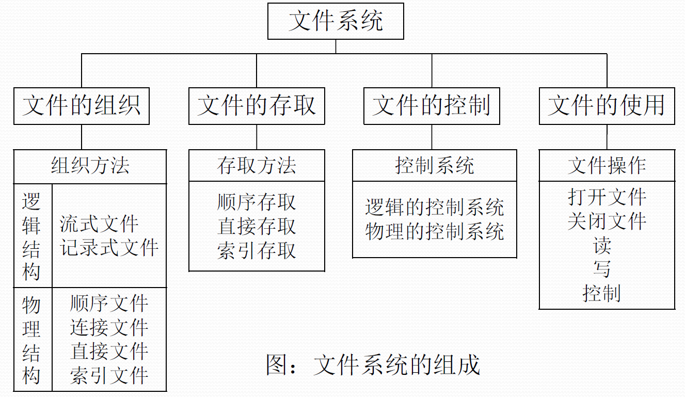

# OS

## 四、文件系统

### （1）文件管理

1. 引入文件的优点：用户使用方便；文件安全可靠；系统能有效的利用储存空间；文件可共享。

1. 一个文件的属性
   
   1. 文件名：由创建文件的用户决定文件名，用于方便找到文件，同一目录下不允许有重名文件。
   2. 标识符：一个系统内的各文件标识符唯一，对用户来说无可读性，OS用于区分文件。
   3. 类型：指明文件的类型。
   4. 位置：文件存放的路径（针对用户）、在外存中的地址（面向系统）。
   5. 大小
   6. 创建时间/上次修改时间/创建者/所有者信息。
   7. 保护信息：对文件进行保护的访问控制信息。
   
3. 文件内部的数据如何组织：

4. 文件之间如何组织：

   

4. 操作系统应该对上层提供的功能：
   1. 创建文件功能（create系统调用）——图形化界面会向下层调用这个功能。
   2. 读文件功能（read系统调用）
   3. 保存文件（write系统调用）——将文件的数据从内存写入外存。
   4. 删除文件（delete系统调用）
   5. 打开/关闭文件（open/close系统调用）——和我们在图形化界面打开/关闭文件不一样
   
6. 文件如何存放在外存

6. 文件共享和文件保护

### （2）文件的逻辑结构

1. 按文件结构分类
   1. 无结构文件：指文件内的数据不再组成记录，只是由一串依次的**字节**组成的**信息流序列**，称为字节流文件，又称**流式文件**，如txt文件。
   2. 有结构文件：有一组相似的记录组成，又称**记录式文件**，每条记录有若干个数据项组成，如数据库文件。一般来说每条记录有一个数据项作为关键字，根据各记录的长度又可以分为定长记录和可变长记录。
   
2. 有结构文件的逻辑结构
   1. 顺序文件：文件中的记录一个接一个的顺序排列，记录可定长可变长。各个记录在物理上可以顺序储存和链式储存。
      1. 串结构：记录之间的顺序与关键字无关。
      
      2. 顺序结构：记录之间的顺序按关键字顺序排列。
      
      3. 链式存储：无论是定长/可变长记录，都无法实现随机存取，每次只能从第一个记录开始依次往后查找
      
      5. 顺序存储
         1. 可变长记录：无法实现随机存取。每次只能从第一个记录开始依次往后查找。
         2. 定长记录：
            1. 可实现随机存取。记录长度为L，则第i个记录存放的相对位置是i*L。
            2. 若采用串结构，无法快速找到某关键字对应的记录/
            3. 若采用顺序结构，可以快速找到某关键字对应的记录 (如折半查找)。
         
         
   
3. 索引文件：索引文件有一个索引表记录文件的记录的信息，索引表本身是定长记录的顺序文件，因此可以快速找到第i个记录的索引。还可以支持二分查找，每次修改记录时都需要修改索引表。**索引表的检索速度很高，因此主要用于对信息处理的及时性要求高的场合**。

4. 索引顺序文件：索引文件的索引表的表项可能很大，因此提出了索引顺序文件，索引顺序文件中不会为每个记录都建立表项，而是将记录分组，为每一个组建立索引表项。——也可以解决不定长记录的检索问题

5. 多级索引顺序文件：

### （3）文件目录

1. FCB 的有序集合称为“文件目录”，1个FCB就是1个文件目录项。FCB 中包含了文件的基本信息（文件名、物理地址、逻辑结构、物理结构等），存取控制信息（是否可读/可写、禁止访问的用户名单等），使用信息（如文件的建立时间、修改时间等）。最重要，最基本的还是 文件名、文件存放的物理地址。

2. 对目录的操作：

   1. 搜索：当用户要使用一个文件时，系统要根据文件名搜索目录，找到该文件对应的目录项。
   2. 创建文件：创建一个新文件时，需要在其所属的目录中增加。
   3. 删除文件：当删除一个文件时，需要在目录中删除相应的目录项。
   4. 显示目录：用户可以请求品示目录的内容，如显示该目录中的所有文件及相应属性。
   5. 修改目录：某些文件属性存放在目录中，这些属性发生变化也需要修改。

3. 目录结构

   1. 单级目录结构：整个系统只建立一张目录表，每个文件占一个目录项。

   2. 两级目录结构：采用两级目录结构，分为主文件目录（MFD）和用户文件目录（UFD)。

   3. 多级目录结构（树形目录结构）：用户或进程想要访问文件时，需要用文件路径名标识文件，文件路径名是一个字符串，各级目录间用“/”隔开，从根目录出发的路径叫做绝对路径。

      在实际使用中，一个用户可能会连续访问同一目录内的多个文件，因此一次读入整个目录设置一个当前目录是十分高效的，从当前目录出发的路径就叫做相对路径。

      树形目录结构可以很方便地对文件进行分类，层次结构清晰，也能够更有效地进行文件的管理和保护。但树形结构不便于实现文件的共享。为此，提出了 “无环图目录结构。

   4. 无环图目录结构：可以使用不同的文件名指向同一个文件，甚至可以指向同一个目录（共享同一目录下的所有内容）。

      需要为每个共享结点设置一个共享计数器，用于记录此时有多少个地方在共享该结点。用户提出删除结点的请求时，只是删除该用户的FCB、并使共享计数器减1，并不会直接删除共享结点。只有共享计数器减为0时，才删除结点。
      注意：共享文件不同于复制文件。在共享文件中，由于各用户指向的是同一个文件，因此只要其中一个用户修改了文件数据，那么所有用户都可以看到文件数据的变化。

4. 索引节点（FCB的改进）：在查找目录时只需要文件名就可以找到，因此可以让目录表瘦身来减小体量提高效率。

   当找到文件名对应的目录项时，才需要将索引结点调入内存，索引结点中记录了文件的各种信息，包括文件在外存中的存放位置，根据“存放位置” 即可找到文件/存放在外存中的索引结点称为 “磁盘索引结点”，当索引结点放入内存后称为 “内存索引结点”/相比之下内存索引结点中需要增加一些信息，比如：文件是否被修改、此时有几个进程正在访问该文件等。

### （4）文件的物理结构

1. 文件块：在外存管理中，为了方便对文件数据的管理，文件的逻辑地址也被分成了一个一个的文件块，于是文件的逻辑地址也可以用**逻辑块号+块内地址**的形式表示。用户在管理自己的文件时，就可以通过逻辑块号来管理文件，此时OS就要提供**将文件的逻辑地址转换到物理地址的功能**。
2. 文件分配方式
   1. 连续分配：每个文件在磁盘上占有一组连续的块，在文件目录中记录存放的起始块号和长度。
      1. 优势：连续分配支持顺序访问和直接访问；由于文件是连续存放的，磁头在读取磁盘时移动的距离短，速度快，**连续分配文件在顺序读写时速度最快**。
      2. 缺点：数据迁移的开销极大，物理上采用连续分配的文件对扩展极不友好；会产生大量磁盘碎片，储存空间利用率低（可以使用紧凑来处理碎片，但是消耗大）。
   2. 链接分配：采取离散分配的方式，可以为文件分配离散的磁盘块。
      1. 隐式链接：
         1. 用户给出要访问的逻辑块号i，OS找到该文件的FCB，读入第一个逻辑块，一直顺序读取到第i个，一共i+1次磁盘I/O
         2. 只支持顺序访问，不支持随机访问，查找效率低，块之间的链接也消耗空间。
         3. 扩展文件：对文件扩展方便，空间利用率高，效率高。
      2. 显式链接：把用于连接文件的各物理块的指针显式的存放在一张表中，即文件分配表（**FAT**）。
         1. 一个磁盘仅需要一个FAT即可，开机时读入FAT到内存并常驻内存。FAT的各个表项在物理上是连续储存，且每一个表象的长度相同，因此“物理块号”字段可以隐含。
         2. 用户给出需要的逻辑块号i，OS找到FCB，拿到起始块号，若i>0则查询FAT往后一直找到i对应的物理块号。**注意FAT常驻内存，因此这里只需要一次磁盘I/O。**
         3. 支持顺序访问和随机访问。访问速度快很多，无外部碎片，对文件扩展友好。
         4. 文件分配表需要占用空间。
      3. 如果未指明链接方式，默认隐式。
   3. 索引分配
      1. 索引分配允许文件离散地分配在各个磁盘块中，系统会为每个文件建立一张索引表，索引表中记录了文件的各个逻辑块对应的物理块（索引表的功能类似于内存管理中的页表一一建立逻辑页面到物理页之间的映射关系）。索引表存放的磁盘块称为索引块，文件数据存放的磁盘块称为数据块。
      2. 在显式链接的分配方式中，FAT是一张磁盘对应一个FAT，而索引表是一个文件对应一张。
      3. 用户给出逻辑块号i，OS找到FCB，得知索引表的位置，将索引表读入内存，并查找索引表获得块i的位置。
      3. 索引分配支持随机访问，文件扩展易实现，但是索引表需要占用储存。
      5. 问题：如果一个文件非常大，仅仅是文件的索引表就超过一个磁盘块的内存，该如何处理呢？
         1. 链接方案：如果索引表太大，一个索引块装不下，那么可以将多个索引块链接起来存放。在上一个索引块的最后放置一个指针，指向下一个索引块——OS需要按顺序一个一个的读入索引块才能完全随机处理。
         2. 多层索引：建立多层索引（类似于多级页表），是第一层的索引块指向第二层索引块，等等。注意这里需要了解如何根据索引表信息计算文件最大体积。采用K层索引结构，且顶级索引表未调入内存，则访问一个数据块只需零K+1次读磁盘操作
         3. 混合索引：多种索引分配方式的结合，如：一个文件的顶级索引表中，既包含直接地址索引又包含一级间接索引又包含两级间接索引。注意这里也需要了解如何根据索引表信息计算文件最大体积，这里访问磁盘操作次数需要根据具体读入的数据计算。对于小文件来说，混合索引只需要较少的访问次数就可以获得数据块（计算机中小文件较多)。
3. 超级超级超级重要考点：①要会根据多层索引、混合索引的结构计算出文件的最大长度（Key：各级索引表最大不能超过一个块）；②要能自己分析访问某个数据块所需要的读磁盘次数(Key：FCB中会存有指向顶级索引块的指针，因此可以根据FCB读入顶级索引块。每次读入下一级的索引块都需要一次读磁盘操作。另外，要注意题目条件一一顶级索引块是否已调入内存）。
4.  

### （5）文件储存空间管理

1. 储存空间需要进行分区，如C盘和D盘等，将物理磁盘划分为一个个文件卷（逻辑卷、逻辑盘）。

2. 存储空间管理方法

   1. 空闲表法：建立一个空闲表，记录空闲的块的起始盘编号和连续的空闲块数。

      1. 适用于“连续分配方法”。
      2. 回收磁盘块：与内存管理中的动态分区分配很类似，当回收某个存储区时需要有四种情况一一（1）回收区的前后都没有相邻空闲区；（2）回收区的前后都是空闲区：（3）回收区前面是空闲区；（4）回收区后面是空闲区。总之，回收时需要注意表项的合并问题。

   2. 空闲链表法

      1. 空闲盘块链：OS保存着链头和链尾的指针。

         如何分配：若某文件申请K个盘块，则从链头开始依次摘下K个盘块分配，并修改空闲链的链头指针。

         如何回收：回收的盘块依次挂到链尾，并修改空闲链的链尾指针。

         适用于离散分配的物理结构。为文件分配多个盘块时可能要重复多次操作。

      2. 空闲盘区链：操作系统保存着链头、链尾指针。

         如何分配：若某文件申请K个盘块，则可以采用首次适应、最佳适应等算法，从链头开始检索，按照算法规则找到一个大小符合要求的空闲盘区分配给文件。若没有合适的连续空闲块，也可以将不同盘区的盘块同时分配给一个文件，注意分配后可能要修改相应的链指针、盘区大小等数据。

         如何回收：若回收区和某个空闲盘区相邻，则需要将回收区合并到空闲盘区中。若回收区没有和任何空闲区相邻，将回收区作为单独的一个空闲盘区挂到链尾。

   3. 位示图法

      1. 可以理解成状压DP的模式，每个二进制位对应一个盘块，用0/1表示空闲或分配。

      2. 和状压DP一样，这样的储存方式受限于字长的影响，因此，可以用（字号，位号）的方式来对应一个盘块号，也可以描述为（行号，列号）。这里一定要注意字号和位号是从0开始还是从1开始的。

      3. 如何分配：若文件需要K个块，①顺序扫描位示图，找到K个相邻或不相邻的“0”；②根据字号、位号算出对应的盘块号，将相应盘块分配给文件；③将相应位设置为“1”。

         如何回收：①根据回收的盘块号计算出对应的字号、位号；②将相应二进制位设为“0”。

   4. 成组链接法

      1. 文件卷的目录区中专门用一个磁盘块作为“超级块”，当系统启动时需要将超级块读入内存，并且保证内存与外存中的超级块数据一致。

      2. 超级块（这个块是一个空闲盘块的组合）记录了下一组空闲盘块数和空闲的块号。同时在下一组空闲盘块记录再下一个空闲盘块。

      3. 如何分配？

         1. 需要100个空闲块：①检杳第一个分组的块数是否足够。100=100，是足够的。②分配第一个分组中的100个空闲块。但是由于300号块内存放了再下一组的信息，因此300号块的数据需要复制到超级块中。
      2. 需要1个空闲块：①检杳第一个分组的块数是否
            足够。1<100，因此是足够的。②分配第一个分组中的1个空闲块，并修改相应数据。
   
         如何回收？

         1. 假设每个分组最多为100个空闲块，此时第一个分组己有99个块，还要再回收一块。
      2. 假设每个分组最多为100个空闲块，此时第一个分组己有100个块，还要再回收一块需要将超级块中的数据复制到新回收的块中，并修改超级块的内容，让新回收的块成为第一个分组。

### （6）文件的基本操作

1. 创建文件：进行create()系统调用时。

   1. 需要提供的几个主要参数：

      1. 所需的外存空间大小（如：一个盘块，即1KB）
      2. 文件名（这个地方默认为 “新建文本文档.txt”）

   2. 操作系统在处理 Create 系统调用时，主要做了两件事：

      1. 在外存中找到文件所需的空间（结合上小节学习的空闲链表法、位示图、成组链接法等管理策略，找到空闲空间）。

      2. 根据文件存放路径的信息找到该目录对应的目录文件（此处就是D:/Demo 目录），在目录中创建该文件对应的目录项。目录项中包含了文件名、文件在外存中的存放位置等信息。

2. 删除文件：进行Delete 系统调用时。

   1. 需要提供的几个主要参数：
      1. 文件存放路径(“D:/Demo”）

   2. 操作系统在处理 Delete 系统调用时，主要做了几件事：
      1. 根据文件存放路径战到相应的目录文件，从目录中找到文件名对应的目录项。
      2. 根据该目录项记录的文件在外存的存放位置、文件大小等信息，回收文件占用的磁盘块(回收磁盘块时，根据空闲表法、空闲链表法、位图法等管理策略的不同，需要做不同的处理）。
      3. 从目录表中删除文件对应的目录项。

3. 打开文件：在很多操作系统中，在对文件进行操作之前，要求用户先使用 open 系统调用“打开文件”。

   1. 需要提供的几个主要参数：

      1. 文件存放路径(“D:/Demo”）
      2. 要对文件的操作类型（如：r只读；rw读写等）。

   2. 操作系统在处理 open 系统调用时，主要做了几件事：

      1. 根据文件存放路径找到相应的目录文件，从目录中找到文件名对应的目录项，并检查该用户是否有指定的操作权限。

      2. 将目录项复制到内存中的“打开文件表”中。并将对应表目的编号返回给用户。之后用户使用打开文件表的编号来指明要操作的文件。

   打开文件表：可以方便实现某些文件管理的功能。例如：在Windows系统中，我们尝试删除某个txt文件，如果此时该文件己被某个“记事本”进程打开，则系统会提示我们“暂时无法删除该文件”。其实系统在背后做的事就是先检查了系统打开文件表，确认此时是杏有进程正在使用该文件。

4. 关闭文件：进程使用完文件后，要“关闭文件”，操作系统在处理 Close 系统调用时，主要做了几件事：

   1. 将进程的打开文件表相应表项删除。
   2. 回收分配给该文件的内存空间等资源。
   3. 系统打开文件表的打开计数器count 减1，若 count=0，则删除对应表项。
   4. f_count 和 i_count 分别反映进程动态地共享一个文件的两种方式
      1. f_count 反映**不同进程**通过**同一个**系统打开文件表项共享一个文件的情况；
      2. i_count 反映**不同进程**通过**不同**系统打开文件表项共享一个文件的情况。

5. 读文件：进程使用read系统调用完成写操作。需要指明是哪个文件（在支持“打开文件” 操作的系统中，只需要提供文件在打开文件表中的索引号即可）还需要指明要读入多少数据（如：读入1KB）、指明读入的数据要放在内存中的什么位置。操作系统在处理read 系统调用时，会从读指针指向的外存中，将用户指定大小的数据读入用户指定的内存区域中。

6. 写文件：进程使用 write 系统调用完成写操作，需要指明是哪个文件（在支持“打开文件” 操作的系统中，只需要提供文件在打开文件表中的索引号即可）还需要指明要写出多少数据（如：写出 1KB)、写回外存的数据放在内存中的什么位置操作系统在处理 write 系统调用时，会从用户指定的内存区域中，将指定大小的数据写回写指针指向的外存。

### （7）文件共享

1. 多个用户共享同一个文件，意味着系统中只有“一份”文件数据。并且只要某个用户修改了该文件的数据，其他用户也可以看到文件数据的变化。如果是多个用户都“复制”了同一个文件，那么系统中会有“好几份” 文件数据。其中一个用户修改了自己的那份文件数据，对其他用户的文件数据并没有影响。
2. 基于索引节点的共享方式（硬链接）
   1. 在索引节点中设置一个链接计数变量count，用于表示连接到本索引节点上的用户目录项数。
   2. 如果用户删除该文件，则只是把用户的目录中与该文件对应的目录项删除并把count减1。
3. 基于符号链的共享方式（软链接）
   1.  
   2. 被共享的用户并不是为他建立一个直接指向原物理地址的文件，而是建立一个link文件，link文件再指向物理数据地址。

### （8）文件保护

1. 口令保护：为文件设置一个口令，用户请求访问该文件时必须提供口令。
   1. 口令一般存放在文件对应的 FCB 或索引结点中。用户访问文件前需要先输入“口令”操作系统会将用户提供的口令与FCB中存储的口令进行对比，如果正确，则允许该用户访问文件。
   2. 优点：保存口令的空间开销小，验证口令时间开销小。
   3. 缺点：口令存放在系统内部，不够安全。
2. 加密保护：使用某个密码对文件进行加密，在访问文件时需要提供正确的密码才能对文件进行正确的解密。
   1. 优点：保密性强，不需要在系统中储存密码。
   2. 缺点：编码和解密的时候需要花费时间。
3. 访问控制：在每个文件的FCB增加访问控制列表（ACL），该表中记录了各个用户对该文件能执行哪些操作。
   1. 精简控制表：以组为单位，标记各组用户可以对文件执行哪些操作，可以减少访问列表的体积。

### （9）文件系统的层次结构

1.  
2. 用一个例子来辅助记忆文件系统的层次结构：假设某用户请求删除文件 “D:/工作目录/学生信息.xIsx〞 的最后100条记录。
   1. 用户需要通过操作系统提供的接口发出上述请求一一用户接口
   2. 由于用户提供的是文件的存放路径，因此需要操作系统一层一层地查找目录，找到对应的目录项——文件目录系统
   3. 不同的用户对文件有不同的操作权限，因此为了保证安全，需要检查用户是否有访问权限——存取控制模块（存取控制验证层）
   4. 验证了用户的访问权限之后，需要把用户提供的“记录号”转变为对应的逻辑地址一一逻辑文件系统与文件信息缓冲区
   5. 知道了目标记录对应的逻辑地址后，还需要转换成实际的物理地址——物理文件系统
   6. 要删除这条记录，必定要对磁盘设备发出请求——设备管理程序模块
   7. 删除这些记录后，会有一些盘块空闲，因此要将这些空闲盘块回收——辅助分配模块

### （10）磁盘的结构

1. 磁盘：磁盘的表面是一些磁性物质，使用这些词性物质来记录二进制数据。
1. 磁道：磁盘的盘面被划分成一个一个的圈，每一个圈就是一个磁道。
1. 扇区：一个磁道又被划分为一个个扇区，每个扇区就是一个磁盘块，每个扇区的数据量相同（越往内侧的扇区的数据密度就越大)。
1. 需要通过磁头臂把磁头移动到想要读/写的扇区所在的磁道。磁盘会转起来，让目标扇区从磁头下面划过，才能完成对扇区的读/写操作。
5. 盘面、柱面：
   1. 可用（柱面号，盘面号，扇区号）来定位任意一个“磁盘块”，在“文件的物理结构”小节中，我们经常提到文件数据存放在外存中的几号块，这个块号就可以转换成（柱面号，盘面号，扇区号）的地址形式。
   2. 根据地址读取数据块：
      1. 根据柱面号移动磁臂，让磁头指向指定柱面。
      2. 激活指定盘面对应的磁头。
      3. 磁盘旋转的过程中，指定的扇区会从磁头下面划过，这样就完成了对指定扇区的读/写。
6. 磁盘的分类
   1. 按磁头分类：
   2. 按盘片分类：

### （11）磁盘调度算法

1. 一次读写需要的时间：
   1. 寻找时问（寻道时间）T：在读/写数据前，将磁头移动到指定磁道所花的时间。
   2. 启动磁头臂是需要时间的，假设耗时为s。
   3. 移动磁头也是需要时间的，假设磁头匀速移动，每跨越一个磁道耗时为 m，总共需要跨越n条磁道。
   4. 寻道时间$T_s=s+m*n$。
   5. 延迟时间R：通过旋转磁盘，使磁头定位到目标扇区所需要的时间。设磁盘转速为r （单位：转/秒，或转/分），则平均所需的延迟时间$R= \frac{1}{2}*\frac{1}{r} =\frac{1}{2r}$（1/r就是转一圈需要的时间。找到目标扇区平均需要转半圈，因此再乘以1/2）。硬盘的典型转速为5400转/分或者7200转/分。
   6. 传输时间T'：从磁盘读出或向磁盘写入数据所经历的时间，假设磁盘转速为r，此次读/写的字节数为b，每个磁道上的字节数为N。则：传输时间$T'=\frac{1}{r}*\frac{b}{N}=\frac{b}{rN}$。
   7. 总的平均时间$T_a=T_s+\frac{1}{2r}+\frac{b}{rN}$。
   8. 延迟时间和传输时间都与磁盘转速相关，且为线性相关。而转速是硬件的固有属性，因此操作系统也无法优化延退时间和传输时间。
   
2. 磁盘调度算法（移臂调度）
   1. 先来先服务（FCFS）
      1. 思想：根据进程请求访问磁盘的顺序进行调度。
      2. 举例：
      3. 优点：公平，如果请求访问的磁道比较集中的话算法性能尚可。
      4. 缺点：如果请求的磁道非常分散则性能降低。
      
   2. 最短寻找时间优先（SSTF）
      1. 思想：SSTF算法会优先处理的磁道是与当前磁头最近的磁道。可以保证每次的寻道时间最短，但是并不能保证总的寻道时间最短（其实就是贪心算法的思想，只是选择眼前最优，但是总体未必最优）。
      2. 举例：
      3. 优点：性能较好，平均寻道时间较短。
      4. 缺点：可能产生饥饿现象（原因：磁头在一个小区域内不断移动）。
      
   3. 扫描算法（SCAN）
      1. 思想：SSTF 算法会产生饥饿的原因在于：磁头有可能在一个小区域内来回来去地移动。为了防止这个问题，可以规定，只有磁头移动到最外侧磁道的时候才能往内移动，移动到最内侧磁道的时候才能往外移动。这就是扫描算法 （SCAN）的思想。由于磁头移动的方式很像电梯，因此也叫电梯算法。
      2. 举例：
      3. 优点：性能较好，平均寻道时间短，不会产生饥饿现象。
      4. 缺点：
         1. 只有到达最边缘的磁道才能改变方向，会产生无效的移动。
         2. SCAN对各个位置的磁道响应频率不平均。
      5. **注意在做题时，磁头到达最侧边时回移到另一边、中间未读取任何东西的移动也算作移臂的移动距离，C_SCAN同理**
      
   4. LOOK电梯调度算法
      1. 思想：扫描算法（SCAN）中，只有到达最边上的磁道时才能改变磁头移动方向，事实上，处理了184号磁道的访问请求之后就不需要再往右移动磁头了。LOOK 调度算法就是为了解决这个问题，如果在磁头移动方向上己经没有别的请求，就可以立即改变磁头移动方向。边移动边观察，因此叫LOOK。
      2. 举例：
      3. 优点：相比SCAN不需要每次都移动到最外侧才改变方向，是寻道时间缩短。
      
   5. 循环扫描算法（C_SCAN）
      1. 思想：SCAN算法对于各个位置磁道的响应频率不平均，而 C-SCAN 算法就是为了解决这个问题。规定只有磁头朝某个特定方向移动时才处理磁道访问请求，而返回时直接快速移动至起始端而不处理任何请求。
      2. 举例：
      3. 优点：相比SCAN，对于各个位置的磁道响应频率很平均。
      4. 缺点：磁头也只有到达边缘才会返回，而且是直接返回边缘，实际平均访问长度增大了。
      
   6. C_LOOK算法
      1. 思想：C-SCAN 算法的主要缺点是只有到达最边上的磁道时才能改变磁头移动方向，并且磁头返回时不一定需要返回到最边缘的磁道上。C-LOOK 算法就是为了解决这个问题。如果磁头移动的方向上已经没有磁道访问请求了，就可以立即让磁头返回，并且磁头只需要返回到有磁道访问请求的位置即可。
      2. 举例：
      3. 优点：相比C-SCAN算法不需要每次都移动到最边缘，使寻道时间进一步缩短。
      4. 如果题目中无特别说明，则默认SCAN为LOOK，C-SCAN为C-LOOK（存疑，gjd标准未知）
      4. 这里SCAN算法、C_SCAN算法都是必须要到达磁道尽头才可以调转方向，LOOK和C_LOOK都是只需要这个方向上没有请求就可以。
      
   7. N-step——SCAN算法
   
      1. 思想：把磁盘 I/O 请求队列分成长度为N的子队列，按照FIFO处理每一个子队列，每个子队列内部使用扫描算法。在处理一个队列时，新请求必须添加到**其他**某个队列中，处理完一个子队列后再服务下一个队列，如果在扫描的最后剩下的请求数小于 N，则它们全部将在下一次扫描时处理。
   
      1. 当 $N \rightarrow \infty$时，N-step-SCAN 的性能接近 SCAN。
      2. 当 $N = 1$时，实际上是FIFO。

### （12）减少磁盘延迟

1. 磁头只能朝一个方向移动，由于磁头在读取完一个扇区的数据以后需要一段时间处理，而这段时间磁头会一直保持旋转，因此磁头在连续读取在物理上相邻的扇区时就会出现延迟。

2. 减少延迟时间的方法：交替编号

   思想：采用交替编号的策略，让逻辑上相邻的扇区在物理上有一定的间隔，可以使连续读取逻辑扇区是的延迟减小。

3. 磁盘地址结构的设计

   1. 思考：为什么？磁盘的物理地址是（柱面号，盘面号，扇区号）而不是（盘面号，桂面号，扇区号）

   2. 原因：因为磁盘是多个磁盘堆叠起来，而每个磁盘都有一个磁头，此时如果读完一个磁盘在继续读取，如果继续读取的数据仍在同一柱面，则磁头是不需要移动的。

   3. 举例：假设某磁盘有8个柱面/磁道（假设最内侧柱面/磁道号为0）
      4个盘面，8个扇区。则可用3个二进制位表示柱面，2个二进制位表示盘面，3个二进制位表示扇区。若物理地址结构是（盘面号，柱面号，扇区号），且需要连续读取物理地址 (00,000,000）～(00,001,111）的扇区：(00,000,000） ~ （00,000,111） 转两圈可读完之后再读取物理地址相邻的区域，即(00, 001, 000)~（00,001, 111），需要启动磁头臂，将磁头移动到下一个磁道。

      假设某磁盘有8个柱面/磁道（假设最内侧柱面/磁道号为0）4个盘面，8个扇区。则可用3个二进制位表示柱面，2个二进制位表示盘面，3个二进制位表示扇区若物理地址结构是（柱面号，盘面号，扇区号)，且需要连续读取物理地址 (000, 00,000）~ （000,01,111） 的扇区：(000, 00, 000）~（000,00,111） 由盘面o的磁头读入数据之后再读取物理地址相邻的区域，即(000, 01, 000)~（090,01,111），由于柱面号/磁道号相同，只是盘面号不同，因此不需要移动磁头譬。只需要激活相邻盘面的磁头即可。

4. 减少延迟的方法：错位命名

   若相邻的盘面相对位置相同处扇区编号相同，则有如下情况：

   所以这对需要将不同盘面的扇区进行错位的命名，情况如下：

### （13）磁盘的管理

1. 磁盘初始化
   1. 进行低级格式化（物理格式化），将磁盘的各个磁道划分为扇区。一个扇区通常可分为 头、数据区域（如512B大小）、尾三个部分组成。管理扇区所需要的各种数据结构一般存放在头、尾两个部分，包括扇区校验码（如奇偶校验、CRC循环冗余校验码等，校验码用于校验扇区中的数据是否发生错误。
   2. 将磁盘分区，每个分区由若干柱面组成（即分为我们熟悉的C盘、D盘、E盘）。
   3. 进行逻辑格式化，创建文件系统。包括创建文件系统的根目录、初始化存储空间管理所用的数据结构（如 位示图、空闲分区表）。
2. 引导块：计算机开机时需要进行一系列初始化的工作，这些初始化工作通过初始化程序（自举程序）完成。
   1. 初始化程序可以放在ROM中，在出厂时就集成在主板上，但是ROM不支持数据更改，不能更新自举程序。
   2. ROM只存放很小的自举装入程序，开机时先运行自举装入程序，通过执行该程序找到引导块，并将完整的自举程序读入内存，完成初始化。
   3. 完整的自举程序存放在磁盘的启动块（即引导块/启动分区），启动块位于磁盘的固定位置，拥有启动分区的磁盘被称为启动磁盘或系统磁盘（一般为C盘）。
3. 坏块：
   1. 概念：坏了、无法正常使用的扇区就是“坏块”。这属于硬件故障，操作系统是无法修复的。应该将坏块标记出来，以免错误地使用到它。
   2. 对于简单的磁盘，可以在逻辑格式化/建立文件系统时对整个磁盘进行坏块检查，标明哪些是坏的。
   3. 对于复杂的磁盘，磁盘控制器（磁盘设备内部的一个硬件部件）会维护一个坏块链表，在磁盘出厂前进行低级格式化 （物理格式化）时就将坏块链进行初始化。
   4. 会保留一些“备用扇区〞，用于替换坏块。这种方案称为扇区备用。且这种处理方式中，坏块对操作系统透明（OS不可知）。

### （14）Unix三级索引储存技术

1. 在文件系统中，文件的存储设备通常划分为若干个大小相等的物理块，每块长为512或1024字节。文件的物理结构是指文件在存储设备上的存储方法，常用的文件物理结构有：连续文件、串联文件和索引文件三种。存储空间会被划分成n个物理块，在索引文件中，一个文件会被放入不同的物理块，这时需要索引表指出一个文件分别被拆分存在哪个块，所以索引表里存的是文件碎片的地址。在多级(间接索引)技术中，在由索引表指出的物理块中存放的不是**文件存储位置**而是存放文件信息的**物理块地址**（即**索引表里存索引表**…）。
2. Unix系统三级索引：
   1. 为了使一张索引表（一个数组）能完整存下一个文件，在Unix系统中，文件的物理结构采用索引方式。定义有一个索引节点字符数组（一张索引表），inode 规定了15 个索引项，每项 4KB：
      1. 直接索引：前 12 项存放文件信息的磁盘块号
      2. 一次间接索引：第 13 项指向一个物理块
      3. 二次间接索引：第 14 项指向一个物理块
      4. 三次间接索引：第 15 项指向一个物理块
      5. ext2 中，每个物理块存放 1024B，所以上面右图最多存放\(12KB + 256KB + 256^2KB+256^3KB\)
   2. 长度不超过 12 个磁盘块的占 80%，只有超过 12 个磁盘块才使用简介索引。
   3. 多级索引例子（重要）：注意是从 0-128 一共 129 项。
   4. 在这里，要注意到**一次、二次、三次间接索引在inode文件中都只占一个地址，而一个地址指向一个间接索引表，所以每个inode只能各有一串一次、二次、三次间接索引表。**
   5.  
   6. 注意这里一次/二次/三次间接盘块指的是最底层的、储存文件数据的盘块，而不是储存索引的中间盘块。
