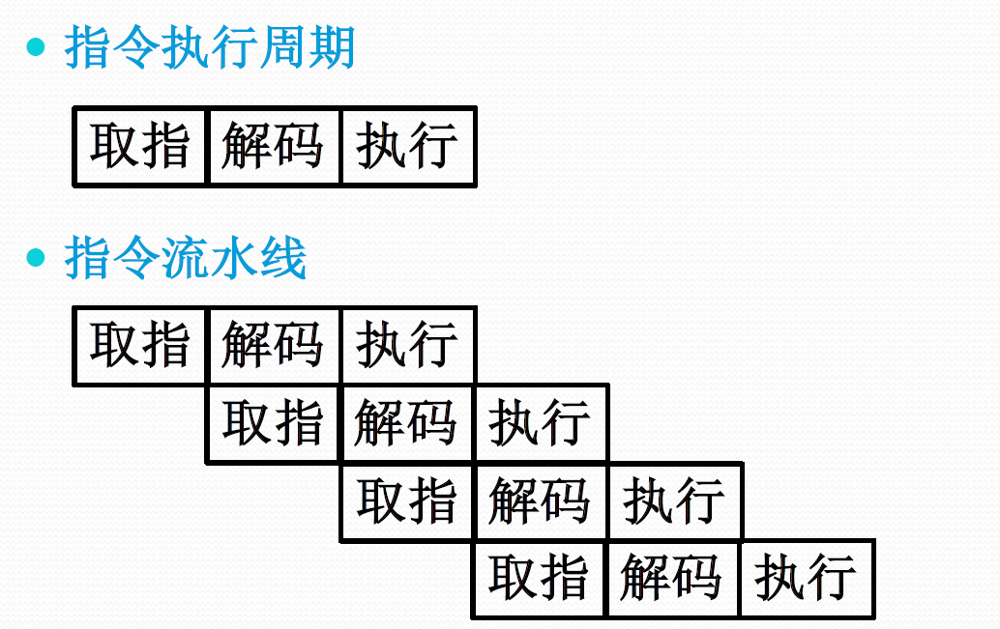

# OS

## 五、设备管理

### （1）I/O设备

1. I/O设备就是可以将数据输入到计算机，或者可以接受计算机输出数据的外部设备，属于计算机中的硬件设备。
1. I/O系统就是I/O设备及其接口线路、控制部件、通道和管理软件的统称。
2. **Unix将外部设备抽象为一种特殊的文件**，用户可以通过与文件操作相同的方式对外部设备进行操作。
3. 分类
   1. 按使用特性：
      1. 人机交互类外设——数据传输速度较慢
      2. 储存设备——数据传输速度较快
      3. 网络通信设备——速度在两者之间
   2. 按传输速率分类
      1. 低速设备（字符设备）——鼠标、键盘等，传输字节较慢（受制于用户的输入）
      2. 中速设备（块设备）——打印机等（由计算机操作，但是有外界影响限制速度）
      3. 高速设备（网络设备）——磁盘等（极快）
   3. 按信息交换的单位分类
      1. 块设备——传输速率高，可寻址，可以对他随机的读/写一块。
      2. 字符设备——传输速率较慢，不可寻址，在输入/输出时采用中断驱动的方式。

### （2）I/O控制器

1. 设备管理的目标：

   1. 解决设备和CPU速度的不匹配，提高设备使用率。
   2. 对设备进行抽象，屏蔽设备的物理细节和操作过程，配置驱动程序和提供统一节目，供用户和高层软件使用。

2. I/O设备的机械部件主要用来执行具体I/O操作。如我们看得见摸得着的鼠标/键盘的按钮；显示器的LED屏；移动硬盘的磁臂、磁盘盘面。I/O设备的电子部件通常是一块插入主板扩充槽的印刷电路板。

3. CPU无法直接控制I/O设备的机械部件，因此I/O设备还要有一个电子部件作为CPU和I/O设备机械部件之间的“中介”，用于实现CPU对设备的控制。这个电子部件就是I/O控制器，又称设备控制器。CPU可控制I/O控制器，又由I/O控制器来控制设备的机械部件。

4. I/O控制器的组成

   1. 一个I/O控制器可能会对应多个设备
   2. 数据寄存器、控制寄存器、状态寄存器可能有多个（如：每个控制/状态寄存器对应一个具体的设备），且这些奇存器都要有相应的地址，才能方便CPU操作。有的计算机会让这些寄存器占用内存地址的一部分，称为内存映像I/O：另一些计算机则采用I/O专用地址，即寄存器独立编址。

5. 内存映像I/O和寄存器独立编制

   1. 内存映射I/O，控制器中的寄存器与内存地址统一编制

      

      优点：简化了指令，可以采用对内存进行操作的指令来对控制器进行操作。

   2. 寄存器独立编制，控制器中的寄存器使用单独的地址。

      

      缺点：需要设置专门的指令来实现对控制器的操作，不仅要指明寄存器的地址，还要指明控制器的编号。

### （3）I/O控制方式

需要注意：（1）完成一次读写操作的流程；（2）CPU干预的频率；（3）数据传送的单位；（4）数据的流向；（5）主要的优缺点。

1. 程序直接控制方式（轮询方式）

   1. 操作流程（以读操作为例）

      1. CPU向控制器发出读指令于是设备启动，并且状态寄存器设为1（未就绪）。
   2. 轮询检查控制器的状态（其实就是在不断地执行程序的循环，若状态位一直是1，说明设备还没准备好要输入的数据，于是CPU会不断地轮询。
      3. 输入设备准备好数据后将数据传给控制器，并报告自身状态。
      4. 控制器将输入的数据放到数据寄存器中并将状态改为0（己就绪）。
      5. CPU发现设备已就绪，即可将数据寄存器中的内容读入CPU的寄存器中，再把CPU寄存器中的内容放入内存。
      6. 若还要继续读入数据，则CPU继续发出读指令。
   
   2. 

   3. 

      关于第五步向存储器写入字，一般程序读取内容都不是储存在寄存器中，需要存放到相应的变量位置中，变量物理储存在内存里，因此需要向储存器写入。

   4. CPU干预的频率：非常频繁，I/O开始之前、完成之后都需要CPU介入，并且在等待I/O完成的过程中CPU都需要不断的轮询。

   5. 数据传送的单位：每次读写一个字。

   6. 数据的流向：

      1. 读操作（数据输入）：I/O->CPU->内存
   2. 写操作（数据输出）：内存->CPU->I/O
      3. 每个字的读写都需要CPU的帮助。
   
   7. 优点：实现简单，在读写指令之后，加上实现循环检查的一系列指令即可。

   8. 缺点：CPU和I/O设备只能串行工作，CPU需要一直轮询检查，长期处于忙等状态，CPU利用率很低。

2. 中断驱动方式

   1. 引入中断机制。由于I/O设备速度很慢，因此在CPU发出读/写命令后，可将等待I/O的进程阻塞，先切换到别的进程执行。当I/O完成后，控制器会向CPU发出一个中断信号，CPU检测到中断信号后，会保存当前进程的运行环境信息，转去执行中断处理程序处理该中断。处理中断的过程中，CPU从I/O控制器读一个字的数据传送到CPU寄存器，再写入主存。接着，CPU恢复等待I/O的进程（或其他进程）的运行环境，然后继续执行。

      

   2. CPU会在每个指令周期的末尾检查中断。

   3. 中断处理过程中需要保存、恢复进程的运行环境，这个过程是需要一定时间开销的，可见如果中断发生的频率太高也会降低系统性能。

   4. CPU干预频率：每次I/O开始之前、完成之后CPU介入，等待I/O完成的过程中CPU切换到别的进程。

   5. 数据传送的单位：每次读写一个字。

   6. 数据的流向：
      1. 读操作（数据输入）：I/O->CPU->内存
      2. 写操作（数据输出）：内存->CPU->I/O
      
   7. 优点：与直接控制相比，中断执行过程中I/O控制器会通过中断信号主动报告I/O完成，CPU不需要持续轮询。CPU和I/O设备可以并行工作，CPU利用率得到明显提升。

   8. 缺点：每个字在I/O设备与内存之间的传输都需要经过CPU，而频繁的中断处理也会消耗较多的CPU时间。

3. DMA方式

   1. Direct Memory Access，直接存储器存取，主要用于块设备的I/O控制

   2. 改进
      1. 数据传送单位是块，不再是按字传输。
      2. 数据的流向是从设备直接放入内存，或者从内存直接到设备，不需要CPU作为中介。
      3. 仅在传送一个或多个数据块的开始和结束时才需要CPU干预。
      4.  流程
      
   3. DMA控制器
      1. 组成：主机-控制器接口，块设备-控制器接口
      2. DR：数据寄存器，暂存从设备到内存/内存到设备的数据。
      3. MAR：内存地址寄存器，在输入时，MAR表示数据应放到内存的什么位置，输出时MAR表示输出的数据要放在内存的什么位置。
      4. DC：数据计数器，表示剩余要读写的字节数。
      5. CR：命令/状态寄存器，用于储存CPU发来的I/O命令或设备的状态信息。
      
   4. CPU干预频率：仅在传送一个或多个数据块的开始和结束时需要CPU干预。

   5. 数据传送的单位：每次读写一个或多个块（每次读写的只能是多个连续的块，且这些块读入内存后也必须是连续的）

   6. 数据的流向（不再经过CPU）：
      1. 读操作（数据输入）：I/O->内存
      2. 写操作（数据输出）：内存->I/O
      
   7. 优点：数据以块为单位传输，CPU介入频率进一步降低，数据的传输不再需要先经过CPU再写入内存，数据传输效率进一步增加。CPU和I/O设备的并行性得到提升。线路简单、价格低廉，适合小型和微型计算机的快速设备。

   8. 缺点：CPU每发出一条I/O指令，只能读写一个或多个连续的数据块。DMA窃取时钟周期，功能不够强，不能满足复杂的I/O操作。

   9. 周期窃取：

   10. 当 DMA 和 CPU 同时经总线访问内存时，CPU **总是**将总线的占有权让给 DMA 一个或几个主存周期，一般是 1 个存取周期，让设备和内存之间交换数据。

       周期窃取对延迟 CPU 与主存的数据交换影响不大：

       1. 数据传送过程是不连续的和不规则的
       2. CPU 大部分情况下与 Cache 进行数据交换，直接访问内存较少

4. 通道控制方式

   1. 通道：一种硬件（可以理解成猴版的CPU）通道可以识别并执行一系列通道指令，用于完成逻辑上独立的I/O任务，适用于中大型计算系统，实现*内存和外设（而不是CPU和外设）*之间的信息传输。
   2. 原理
   3. 特点
      1. I/O指令不再由处理器执行，而是储存在主存中让通道的处理器执行。
      2. 采用主存-通道-控制器-设备的四级结构，可以实现三级控制来控制多台不同的设备：
         1. 一个 CPU 通常连接多个通道，通过 I/O 指令控制
         2. 一个通道可以连接若干控制器，通过执行通道命令控制
         3. 一个控制器可以连接若干设备，通过动作序列控制
   4. 与CPU相比，通道可以执行的指令很单一，并且通道程序是放在主机内存中的，也就是说通道与CPU共享内存。
   5. 流程
   6. CPU干预的频率：极低，通道会根据CPU的指示执行相应的通道程序，只有完成一组数据块的读写后才需要发出中断信号，请求CPU干预。
   7. 数据传送的单位：每次读写一组数据块。
   8. 数据的流向（在通道的控制下进行）：
      1. 读操作（数据输入）：I/O->内存
      2. 写操作（数据输出）：内存->I/O
   9. 优点：CPU、通道、I/O设备可以并行工作，资源利用率很高。
   10. 缺点：实现复杂，需要专门的通道硬件支持。

5. 总结

   重点要理解通道的地位和通道程序的概念

### （4）I/O软件

1. I/O软件设计目标

   1. 高效率：改善设备效率，尤其是磁盘I/O的效率。
   2. 通用性：用统一的标准来管理所有设备。
   
2. 用户层软件：

   1. 用户层软件实现了与用户交互的接口，用户可直接使用该层提供的、与I/O操作相关的库函数对设备进行操作。

   2. 用户层软件将用户请求翻译成格式化的I/O请求，并通过“系统调用”请求操作系统内核的服务。

      

   3. Eg：printf("hello world!")，会被翻译成等价的write系统调用，当然，用户层软件也会在系统调用时填入相应参数。

   4. windows 操作系统向外提供的一系列系统调用，但是由于系统调用的格式严格，使用麻烦，因此在用户层上封装了一系列更方便的库函数接口供用户使——Windows API。

3. 设备独立性软件

   1. 又称设备无关性软件，与设备的硬件特性无关的功能几乎都在这一层实现。

   2. 功能

      1. 向上一层提供统一的调用接口（如write、read系统调用）。

      2. 设备的保护：原理类似文件保护，设备被看作是一种特殊的文件，不同用户对文件的访问权限不一样，同理对设备的访问权限也不一样。

      3. 差错处理：对一些设备的错误进行处理（错误类型极多）。

      4. 设备的分配与回收

      5. 数据缓冲区管理：通过缓冲技术屏蔽设备之间数据交换单位大小和传输速度的差异。

      6. 建立逻辑设备名到物理设备名的映射关系，根据设备类型选择调用相应的驱动程序。

         1. 用户或用户层软件发出I/O操作相关系统调用的系统调用时，需要指明此次要操作的I/O设备的遇辑设备名(eg：去学校打印店打印时，需要选择打印机1/打印机2/打印机3，其实这些都是逻辑设备名）。

         2. 逻辑设备表：

         3. 操作系统系统可以采用两种方式管理逻辑设备表(LUT)

            1. 第一种方式，整个系统只设置一张LUT，这就意味着所有用户不能使用相同的逻辑设备名，因此这种方式只适用于单用户操作系统。
            2. 第二种方式，为每个用户设置一张LUT，各个用户使用的逻辑设备名可以重复，适用于多用户操作系统。系统会在用户登录时为其建立一个用户管理进程，而LUT就存放在用户管理进程的PCB中。

         4. 为何不同设备需要不同的设备驱动程序？

            以佳能打印机为例

            而惠普打印机的内部结构就是

            因此不同型号的设备内部的电子部件是完全不一样的，厂家需要提供与设备对应的驱动程序，CPU执行驱动程序的指令序列，来完成设置设备寄存器、检查设备状态等工作。

4. 设备驱动程序

   1. 主要和实际的物理设备相关，将用户提交的逻辑I/O请求转化为物理I/O操作。

5. 中断处理程序：当I/O任务完成时，I/O控制器会发送一个I/O信号，系统会根据中断信号类型找到响应的中断处理程序并执行。

6. 

7. 理解并记住!0软件各个层次之间的顺序，要能够推理判断某个处理应该是在哪个层次完成的（最常考的
   是设备独立性软件、设备驱动程序这两层。只需理解一个特点即可：直接涉及到硬件具体细节、且与中断无关的操作肯定是在设备驱动程序层完成的：没有涉及硬件的、对各种设备都需要进行的管理工作都是在设各独立性软件层完成的）

### （5）I/O核心子系统

1.  假脱机技术(SPOOLing 技术)需要请求𥔵盘设备的设备独立性软件的服务，
   因此一般来说假脱机技术是在用户层软件实现的。但是408大纲又将假脱机技术归为
   “I/O核心子系统”
   的功能，因此考试时还是以大纲为准。
2.  
2. I/O调度：用某种算法来确定一个好的处理I/O请求的顺序
3. 设备保护：操作系统需要实现文件保护功能，不同的用户对各个文件有不同的访问权限。
4.  

### （6）假脱机技术

1. 脱机技术

   1. 为了解决手工输入阶段CPU和I/O之间过大的速度差，在之后的批处理阶段引入了脱机技术（基于磁带完成)：
   2. 引入脱机技术后，缓解了CPU与慢速I/O设备的速度矛盾。另一方面，即使CPU在忙碌，也可以提前将数据输入到磁带，即使慢速的输出设备正在忙碌，也可以提前将数据输出到磁带。

2. 假脱机技术：又称SPOOLing技术，使用软件的方式模拟脱机技术。

   1. 组成：

   2. 原理

      在磁盘上开辟出两个存储区域——“输入井”和“输出井”：

      1. “输入井”模拟脱机输入时的磁带，用于收容I/O设备输入的数据。
      2. “输出井”模拟脱机输出时的磁带，用于收容用户进程输出的数据。

      “输入进程” 模拟脱机输入时的外围控制机输入进程。
      “输出进程”模拟脱机输出时的外围控制机。**要实现SPOOLing 技术，必须要有多道程序技术的支持。系统会建立 “输入进程”和“输出进程”。**

      在输入进程的控制下，“输入缓冲区”用于暂存从输入设备输入的数据，之后再转存到输入井中。

      注意，输入缓冲区和输出缓冲区是在内存中的缓冲区。

      在输出进程的控制下，“输出缓冲区”用于暂存从输出井送来的数据，之后再传送到输出设备上。

3. 共享打印机原理分析：

   1. 独占式设备——只允许各个进程串行使用的设备，一段时间内只能满足一个进程的请求。
   2. 共享设备——允许多个进程“同时”使用的设备（宏观上同时使用，微观上可能是交替使用），可以同时满足多个进程的使用请求。
   3. 打印机是独占设备，但是可以通过SPOOLing技术实现虚拟共享：
   4. 原理：
      1. 当多个用广进程提出输出打印的请求时，系统会答应它们的请求，但是并不是真正把打印机分配给他们，而是由假脱机管理进程为每个进程做两件事：
         1. 在磁盘输出井中为进程申请一个空闲缓冲区（也就是说，这个**缓冲区是在磁盘上的**），并将要打印的数据送入其中。
         2. 为用户进程申请一张空白的打印请求表，并将用户的打印请求填入表中（其实就是用来说明用户的打印数据存放位置等信息的），再将该表挂到假脱机文件队列上。
      2. 当打印机空闲时，输出进程会从文件队列的队头取出一张打印请求表，并根据表中的要求将要打印的数据从输出井传送到输出缓冲区，，再输出到打印机进行打印。用这种方式可依次处理完全部的打印任务。
      3. 虽然系统中只有一个台打印机，但每个进程提出打印请求时，系统都会为在输出井中为其分配一个存储区（相当于分配了一个逻辑设备），使每个用户进程都觉得自己在独占一台打印机，从而实现对打印机的共享。
   5. SPOOLing 技术可以把一台物理设备虚拟成逻辑上的多台设备，丽将独占式设备改造成共享设备。

### （7）设备的分配与回收

1. 设备分配时应该考虑的因素

   1. 设备的固有属性：独占设备、共享设备（宏观上共享微观上独有）、虚拟设备。
   2. 设备分配算法：先来先服务、短任务优先......
   3. 设备分配的安全性
      1. 安全分配方式：为进程分配一个设备后就将进程阻塞，本次I/O完成后才将进程唤醒。一个时段内每个进程只能使用一个设备。
         优点：破坏了“请求和保持”条件，不会死锁。
         缺点：对于个进程来说，CPU和I/O设备只能串行工作。
      2. 不安全分配：进程发出I/O请求以后，系统为其分配I/O设备，进程可继续执行，之后还可以发出新的I/O请求，只有某个I/O请求得不到满足时才将进程阻塞。一个进程可以同时使用多个设备。
         优点：进程的计算任务和I/O任务可以并行处理，使进程迅速推进。
         缺点：有可能发生死锁（死锁避免、死锁的检测和解除）。

2. 静态分配和动态分配——联系到PV操作。

   1. 静态分配：进程在运行前就为其分配所有资源，结束后归还。这种分配方式破坏了“请求和保持”条件，不会发生死锁。

   2. 动态分配：进程随用随申请，提高设备利用率。

3. 设备分配管理中的数据结构

   1. 设备、控制器、通道之间的关系
   2. 一个通道可以对应多个控制器，一个控制器可以控制多个设备。
   3. 设备控制表（DCT）：系统为每个设备配置一张DCT，用于记录设备情况。
   4. 控制器控制表（COCT）：每个设备控制器都会对应一张COCT，OS根据COCT的信息对控制器进行操作和管理。
   5. 通道控制表（CHCT）：每个通道都会对应一张CHCT，OS根据CHCT的信息对通道进行操作和管理。
   6. 系统设备表（SDT）：记录了系统中**全部设备**的情况，每个设备对应一个表目。

4. 设备分配的步骤

   1. 内容：
      1. 根据进程请求的物理设备名查找SDT（注：物理设备名是进程请求分配设备时提供的参数）。
      2. 根据SDT找到DCT，若设备忙碌则将进程PCB挂到设备等待队列中，不忙碌则将设备分配给进程。
      3. 根据DCT找到COCT，若控制器忙碌则将进程PCB挂到控制器等待队列中，不忙碌则将控制器分配给进程。
      4. 根据COCT找到CHCT，若通道忙碌则将进程PCB挂到通道等待队列中，不忙碌则将通道分配给进程。
   2. **只有设备、控制器、通道三者都分配成功时，这次设备分配才算成功，之后便可启动I/O设备进行数据传送**
   3. 缺点：
      1. 用户编程时必须使用，物理设备名，底层细节对用户不透明，不方便编程
      2. 若换了一个物理设备，则程序无法运行。
      3. 若进程请求的物理设备正在忙碌，则即使系统中还有同类型的设备，进程也必须阻塞等待。
   4. 改进：

### （8）缓冲区管理

1. 缓冲区
   1. 概念：缓冲区是一个存储区域，可以由专门的硬件寄存器组成，也可利用内存作为缓冲区。
   2. 使用硬件作为缓冲区的成本较高，容量也较小，一般仅用在对速度要求非常高的场合（如存储器管理中所用的联想寄存器，由于对页表的访问频率极高，因此使用速度很快的联想寄存器来存放页表项的副本）一般情况下，更多的是利用内存作为缓冲区，“设备独立性软件”的缓冲区管理就是要组织管理好这些缓冲区。
   3. 作用
      1. 缓和**CPU与设备之间速度不匹配**的矛盾。
      2. 减少对CPU的中断频率，放宽对CPU中断相应时问的限制。
      3. 解决数据粒度不匹配的问题（如输出进程每次生成一块数据，I/O设备只输出一个字符）。
      4. 提高CPU与I/O设备之间的并行性。
2. 缓冲区管理策略
   1. 单缓冲
      1. 假设某用户进程请求某种块设备读入若干块的数据。若采用单缓冲的策略，操作系统会在主存中为其分配一个缓冲区（若题目中没有特别说明，一个缓冲区的大小就是一个块）。注意当缓冲区数据非空时，不能往缓冲区冲入数据，只能从缓冲区把数据传出；当缓冲区为空时，可以往缓冲区冲入数据，但必须把缓冲区充满以后，才能从缓冲区把数据传出。
      2.  
      3. 常考题型：计算每处理一块数据平均需要多久？技巧：假定一个初始状态，分析下次到达相同状态需要多少时间，这就是处理一块数据平均所需时间。
      4. 如果CPU处理时间C<缓冲区充满时间T：
      5. 如果CPU处理时间C>缓冲区充满时间T：
      6. 结论：采用单缓冲策略，则处理时间为max(T,C) + M
   2. 双缓冲
      1. 假设某用户进程请求某种块设备读入若干块的数据。若采用双缓冲的策略，操作系统会在主存中为其分配两个缓冲区（若题目中没有特别说明，一个缓冲区的大小就是一个块）。
      2. 如果T>C+M：
      3. 如果T<C+M：
      4. 要注意到如果T<C+M的话，很难找到一个和初始情况相同的状态。
      5. 结论：处理数据块的平均时间为max(T,C+M)。
   3. 使用单双缓冲的区别：
      1. 两台机器之间通信时，可以配置缓冲区用于数据的发送和接受。
      2. 如果两个互相通信的机器只设置单缓冲区，则在任一时刻只能单向传输。
      3. 为了实现双向传送，需要设置双缓冲区。
      4. 管道通信中的管道就是缓冲区，要实现数据的双向传输，必须设置两个管道。
   4. 循环缓冲区：将多个大小相等的缓冲区连接成一个循环队列，用in、out指针分别表示可以冲入和取出数据的缓冲区。
   5. 缓冲池
      1. 缓冲池由系统中共用的缓冲区组成。这些缓冲区按使用状况可以分为：空缓冲队列、装满输入数据的缓冲队列（输入队列）、装满输出数据的缓冲队列（输出队列）。
      2. 另外，根据一个缓冲区在实际运算中扮演的功能不同，又设置了四种工作缓冲区：用于收容输入数据的工作缓冲区 (hin)
         、用于提取输入数据的工作缓冲区（sin）、用于收容输出数据的工作缓冲区 （hout）、用于提取输出数据的工作缓冲区 （sout）。
      3. 缓冲池的工作原理：
         1. 输入进程请求输入数据：从空缓冲队列中取出块作为收容输入数据的工作缓冲区（hin）冲满数据后将缓冲区挂到输入队列队尾。
         2. 计算进程想要取得一块输入数据：从输入队列中取得一块冲满输入数据的缓沖区作为“提取输入数据的工作缓冲区 (sin)”，缓冲区读空后挂到空缓冲区队列。
         3. 计算进程想要将准备好的数据冲入缓冲区：从空缓冲队列中取出一块作为“收容输出数据的工作缓冲区 (hout)。数据沖满后将缓冲区挂到输出队列队尾。
         4. 输出进程请求输出数据：从输出队列中取得一块冲满输出数据的缓冲区作为“提取输出数据的工作缓冲区 (sout)”。缓冲区读空后挂到空缓冲区队列。

## 六、处理机

### （1）寄存器

1. 用户可见寄存器
   1. 作用：可以使程序员减少访问主存储器的次数，提高指令执行的效。所有程序可使用，包括应用程序和系统程序。
   2. 数据（通用）寄存器：AX、BX、CX、DX等。
   3. 地址寄存器：索引（SI、DI）、栈指针（SP、BP）、段地址（CS、DS、SS、ES）、页表寄存器等。
   4. 控制和状态寄存器：控制和状态寄存器用于控制处理器的操作，主要是被具有特权的操作系统程序使用，以控制程序的执行。
      1. 程序计数器PC：存储将取指令的地址。
      2. 指令寄存器IR：储存最近使用的指令。
      3. 条件码CC：CPU为指令操作结果设置的位，标志正/负/零/溢出等结果。
      4. 标志位：中断位等。
   5. 程序状态字PSW：记录当前程序运行的动态信息，包括：
      1. 程序计数器、指令寄存器、条件码
      2. 中断字、中断允许/禁止、中断屏蔽、处理器模式、内存保护、调试控制
   6. PSW 也是计算机系统的**寄存器**
      1. 通常设置一组控制与状态寄存器
      2. 也可以专设一个 PSW 寄存器
   7. 标志划分为三组：**状态标志、控制标志和系统标志**（更多见 P58）
      1. 状态标志：使得一条指令的执行结果影响其后指令的执行，比如溢出等标志
      2. 控制指令：控制操作系统行为，比如模式转换等。
      3. 系统标志：与进程管理有关，用于保护模式。

### （2）指令

1. 机器指令：计算机系统执行的基本命令，是中央处理器执行的基本单位。

   指令由一个或多个字节组成，包括操作码字段、一个或多个操作数地址字段、以及一些表征机器状态的状态字以及特征码。指令完成各种算术逻辑运算、数据传输、控制流跳转。

2. 指令执行过程：CPU根据PC*取出指令*、放入IR，并对指令*译码*，然后发出各种控制命令，执行微操作系列，从而完成一条指令的*执行*。

### （3）处理器模式

1. 计算机通过设置处理器模式实现特权指令管理。

2. 设置四种0、1、2、3运行模式（保护级别）：

   1. 0：内核级，操作系统内核，可以执行全部指令，包括中断处理、处理 I/O 操作等命令。
   2. ​	1：系统调用级，执行系统调用，获得特定的和受保护的程序服务。
   3. 2：共享库级，可以多个运行进程共享，允许调用库函数，读取但不修改相关数据。
   4. 3：用户程序，只能执行非特权指令，受到的保护最少。

3. 模式切换：“用户态->内核态”和“内核态->用户态”两种。

   1. 中断、异常或系统异常等事件导致用户程序向 OS 内核切换，触发：“用户模式->内核模式”，仅有以下三种方式能触发：

      1. 程序请求操作系统服务，`执行系统调用`
      2. 程序`运行时发生异常`（如发生程序性中断，或者目态执行特权指令）
      3. 程序运行时发生并`响应中断`（*一般是 I/O 中断*）

      可以认为中断和异常是用户态到内核态的唯一途径。

   2. 内核处理完中断以后调用中断返回指令触发“内核态->用户态”的转换，将控制权交给应用程序。

### （4）栈空间

1. 用户栈：用户栈是用户进程空间中开辟的一块区域，用于保存应用程序的子程序（函数）间相互调用的参数、返回值、返回点以及子程序的局部变量。

   如果只有用户栈，没有核心栈，那么操作系统则很难对核心栈的数据提供相应的保护措施。

2. 核心栈：也叫系统栈或内核栈，是内存中属于操作系统空间的一块区域，**每个进程有一个核心栈：可读可写不可执行，大小有限**。硬件栈指针只有一个。

   用途：保存中断现场，嵌套中断；保存操作系统程序（函数）间相互调用的参数、返回值、返回点以及程序局部变量。

