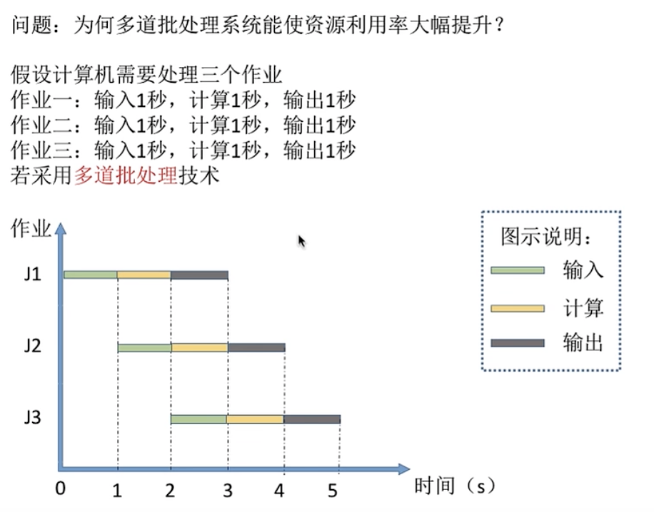
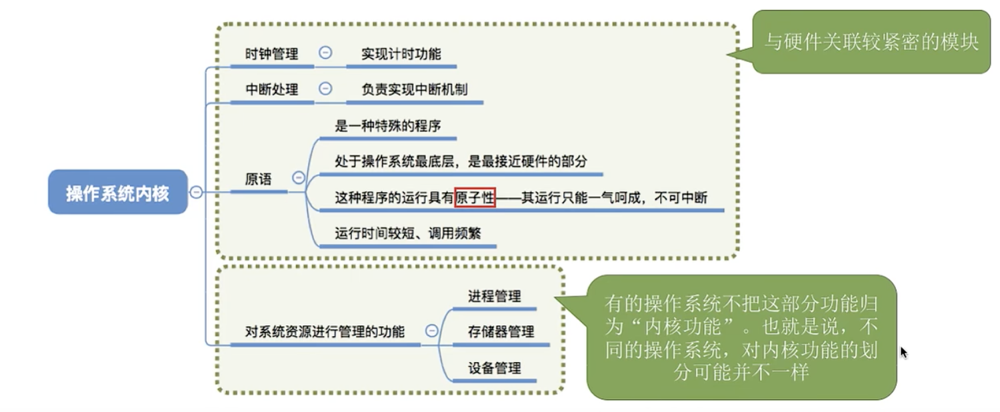

# OS

## 一

### （1）操作系统的概念

1. 裸机（纯硬件）->操作系统->应用程序（软件）->用户
2. 操作系统： 是指控制和管理整个计算机系统的硬件和软件资源，并合理的组织调度计算机的工作和资源的分配，以提供给用户和其他软件方便的接口和环境，他是计算机系统中最基本的系统软件。
3. 进程：一个程序的执行过程，执行前需要将该程序放到内存中，才能被CPU处理。
4.  

### （2）操作系统的功能和目标

1. 作为用户和计算机硬件之间的接口
2. 用户接口
   1. 命令接口（允许用户直接使用）
      1. 联机命令接口（交互式命令接口）：用户说一句系统做一句
      2. 脱机命令接口（批处理命令接口）：用户对操作系统说一堆，操作系统做一堆
   2. 程序接口（用户通过程序间接调用）：由一组系统调用组成（大多数情况下程序接口=系统调用/广义命令）
3. GUI：图形用户界面
4.  
5. 操作系统是最接近硬件的层次

### （3）操作系统的特性

1. 操作系统的特征：并发、共享、虚拟、异步

2. 并发：指两个或多个事件在同一时间间隔内发生，这些事件宏观上是同时发生的，但是微观上是交替发生的。

   并行——两个或多个事件在同一时刻同时发生（宏观和微观上都是同时的）。

   1. 操作系统的并发性指操作系统中同时存在着多个运行着的程序。
   2. 

3. 共享：资源共享，指系统中的资源可供内存中多个并发执行的进程共同使用。

   1. 资源共享方式
      1. 互斥共享：系统中的某些资源，虽然可以提供给多个进程使用，但一个时间段内只允许一个进程访问该资源。
      2. 同时共享：系统中的某些资源，可以提供给多个进程使用，一个时间段内可允许多个进程访问该资源。**（所谓的同时往往是宏观上的，在微观上这些进程可能是交替的对该资源进行访问的——分时共享）**

4. 虚拟：将物理上的实体变成若干个逻辑上的对应物，物理实体是实际存在的，而逻辑上的对应物是用户感受到的。（虚拟技术中的“空分复用技术”、“时分复用技术”）——虚拟性依赖于并发性。

5. 异步：在多道程序的环境下，允许多个程序并发执行，但由于资源有限，进程的执行不是一贯到底的，而是走走停停，以不可预知的速度向前推进。

6. 操作系统的三层抽象：

   1. 进程->程序的抽象
   2. 文件系统->磁盘的抽象
   3. 虚拟内存->主存的抽象


### （4）操作系统的发展和分类

1. 手工操作阶段：计算机刚发明的阶段，操作系统未被发明
   1. 主要缺点：用户独占全机，**人机速度矛盾**导致资源利用率极低。
2. 批处理阶段
   1. 单道批处理阶段：引入脱机输入输出技术（基于磁带），并监督程序负责控制作业的输入输出。
      1. 优点：**缓解了一定程度的人机速度矛盾**，资源利用率有所提升。
      2. 缺点：内存中仅能运行一道程序，只有该程序运行结束以后才能调入下一道程序。CPU有大量时间是在空闲等待I/O完成，**资源利用率依旧很低**。
   2. 多道批处理阶段：每次往内存中输入多道程序，操作系统正式诞生，并引入了中断技术，由操作系统负责管理这些程序的鱼腥，各个程序并发执行。
      1. 优点：**多道程序并发执行**，共享计算机资源，**资源利用率大幅提升**，CPU和其他资源保持忙碌状态，系统吞吐量大。
      2. 缺点：用户响应时间长，**没有人机交互功能**（用户提交自己的操作以后就只能等待计算机完成，中间不能控制自己的操作执行）。
      3. 多道批处理技术将计算机、I/O设备等分离，各个设备同一时间可以处理不同的程序的作业。
3. 分时操作系统：计算机以时间片为单位轮流为各个用户/作业服务，各个用户可以通过终端与计算机交互。
   1. 优点：用户请求可以被及时响应，**解决了人机交互问题**，允许多个用户同时使用一台计算机，并且用户对计算机的操作相互独立，感受不到人的存在。
   2. 缺点：**不能优先处理一些紧急任务**，操作系统对各个用户/作业的优先级相同，循环地为每个处理，不区分任务的紧急性。
4. 实时操作系统：**主要特点是及时性和可靠性**
   1. 优点：**能够优先响应一些紧急任务**，某些紧急任务不需要时间片排队。
   2.  
5. 其他几种操作系统：

### （5）OS的运行机制和体系结构

1. 运行机制：两种指令、两种处理器状态、两种程序
   1. 两种指令
      1. 特权指令（需要核心态）
      2. 非特权指令
   2. 两种处理器状态
      1. 核心态
      2. 用户态
   3. 两种程序
      1. 内核程序（只能在核心态下执行）：系统的管理者，既可以执行特权指令，也可以执行非，运行在核心态。
      2. 应用程序：为保障系统能安全运行，普通应用程序只能执行非特权指令，运行在用户态。
   4. 操作系统中的哪些功能需要内核程序执行？->内核
   5. 内核 
      1. 内核是计算机上配置的底层如那件，是操作系统最基本、最核心的部分。**实现操作系统内核功能的程序就是内核程序**
      2.  
2. 操作系统的体系结构：大内核和微内核
   1. 操作系统的体系结构经典的分法就是将操作系统分成大内核和微内核。
   2. 大内核：将操作系统的主要功能模块都作为系统内核，运行在核心态
      1. 优点：高性能
      2. 缺点：内核代码庞大，结构混乱，难以维护
   3. 微内核：只把最基本的功能保留在内核
      1. 优点：内核功能少，结构清晰、方便维护
      2. 缺点：需要频繁的在核心态和用户态之间切换
   4. 类比：操作系统的体系结构问题与企业的管理问题很相似。
      内核就是企业的管理层，负责一些重要的工作。只有管理层才能执行特权指令，普通员工只能执行非特权指令。用户态、核心态之间的切换相当于普通员工和管理层之间的工作交接
      大内核：企业初创时体量不大，管理层的人会负责大部分的事情。优点是效率高；缺点是组织
      结构混乱，难以维护。
      微内核：随着企业体量越来越大，管理层只负责最核心的一些工作。优点是组织结构清晰，方
      便维护；缺点是效率低

### （6）中断和异常

1. 中断机制的诞生
   1. 早期计算机只能串行执行，人们发明操作系统引入中断机制，实现了多道程序并发执行。
   2. 本质：发生中断就意味着需要操作系统介入，开展管理工作。
2. 中断的概念和作用
   1. 过程：
      1. CPU收到计时部件发出的**中断信号**，切换为核心态该进行处理。
      2. 操作系统内核对中断信号进行处理。
      3. 进程1时间片已用完，换进程2执行。
      4. 进程2发出系统调用（内中断信号），请求输出，CPU切换为核心态，对中断进行处理。
      5. 同2。
      6. OS要求I/O设备工作，进程2中断，进程3运行。
      7. 当I/O完成后，发送中断信号......
      8. 进程2I/O操作完成，恢复进程2的操作
   2. 特点
3. 中断的分类
   1. 内中断（**异常**、例外、陷入）：信号来源是CPU内部，与当前执行的指令有关。
      1. 自愿中断——指令中断（如**系统调用**时使用的访管指令）
      2. 强迫中断：硬件故障、软件中断
   2. 外中断（**中断**，狭义上的中断）：信号来源是CPU外部，与当前执行的指令无关。
      1. 外设请求
      2. 人工干预
4. 外中断处理过程：
5. 恢复正常操作
   1. 对于某些中断，在处理完成后直接返回刚刚被中断的进程。
   2. 对于其他的一些中断，需要中断当前进程的运行，调整进程队列，启动进程调度，选择下一个执行的进程并恢复其执行。

6. 中断可以嵌套，在中断处理过程中可以再响应其他中断，但是中断的嵌套层数应该有限制，同时中断的嵌套处理改变了中断处理的次序。

### （7）系统调用

1. 什么是系统调用
   1. 程序接口由一组系统调用组成，系统调用就是由操作系统提供给应用程序/程序员/编程者使用的接口，可以理解成一种可供应用程序调用的特殊函数，应用程序可以发出系统调用请求来获得操作系统的服务。
   2. 应用程序通过系统调用请求OS的服务，系统中的各种共享资源都有OS统一掌管。

2. 系统调用和库函数的区别
   1. OS提供系统调用函数，应用程序调用高级计算机语言的库函数，而高级计算机语言的库函数包装了系统调用函数

3. 系统调用的过程

4. **凡是与资源相关的操作、会直接影响到其他进程的操作，一定需要操作系统介入，需要通过系统调用实现**

## 二

### （1）进程

1. 进程的定义

   1. 程序：一个指令序列

   2. 引入多道程序技术以后，计算机中同时可以有多个程序运行，内存里同时放入多道程序，每个程序的代码、数据等存放的位置都不同，操作系统如何才能找到具体位置呢？

   3. 程序段、数据段、PCB三部分组成了进程实体（进程映像）。一般来说把进程实体简称为进程。

      所谓创造进程，就是创造进程实体中的PCB，撤销进程就是撤销进程实体中的PCB

      **PCB是进程存在的唯一标志**

   4. 进程是进程实体的**运行过程**，是**系统进行资源分配和调度的一个独立单位**。**进程实体和进程并不一样，进程实体是静态的，进程是动态的，运行过程更加强调于他这这个生命周期。**

2. 进程的组成：有程序段、数据段、PCB组成

   1. PCB：进程管理者（操作系统）所需的数据都在PCB中，**PCB是进程存在的唯一标志**

   2. 程序段：存放要执行的代码

   3. 数据段：存放程序运行过程中处理的各种数据

   4. 进程的组织：在一个系统中有成千上万个进程及其PCB，所以我们需要将他们组织起来。

   5. 链接方式：按照进程状态将PCB分成多个队列；操作系统持有指向各个队列的指针。

   6. 索引方式：根据进程状态的不同，建立几张索引表；操作系统持有指向各个索引表的指针。

3. 进程的特征
   1. 动态性：进程是程序的一次执行过程，动态的产生、变化和消亡。->**动态性是进程最基本的特征**
   2. 并发性；进程中有多个进程实体，各进程可并发执行。
   3. 独立性：进程是能独立运行、独立获得资源、独立接受调度的基本单位。->**进程是资源分配、接受调度的基本单位**
   4. 异步性：各进程按各自独立的、不可预知的速度向前推进，操作系统要提供“进程同步机制”来解决异步问题。->**异步性会导致并发程序执行结果的不确定性**
   5. 结构性：每个进程都会配置一个PCB。结构上看，进程由程数P组成。

### （2）进程的状态

1. 三种基本状态

   1. 运行态（Running）：占有CPU，并在CPU上运行（CPU的每一个核只能运行一个进程）。
   2. 就绪态（Ready）：已经具备运行条件，但没有空闲CPU，而暂时不能运行。
   3. 阻塞态（Waiting/Blocked）：：因等待某一事件而暂时不能运行。**CPU是计算机中最宝贵的资源，为了提高CPU的使用率，需要先分配其他资源再得到CPU的服务**

2. 另外两种状态

   1. 创建态（New）：进程正在被创建，操作系统为进程分配资源，初始化PCB。
   2. 终止态（Terminated）：进程正在从系统中撤销，操作系统会回收进程拥有的资源、撤销PCB。

3. 进程状态的转换

   

### （3） 进程控制

1. 什么是进程控制：进程控制的主要功能就是对系统中的所有进程实施有效的管理，它具有创建新进程、撤销已有进程、实现进程状态转换等功能。->进程控制就是实现进程状态转换。

2. 为了避免进程的一个状态没有执行完毕就进入其他状态导致错误，使用**原语**实现进程控制，原语的特点是执行期间不允许中断，只能一次执行完毕，这种不可被中断操作即**原子操作**。

   原语采用“关中断指令”和“开中断指令”实现。

   **开/关中断指令的权限非常大，必然是只允许在核心态下执行的特权指令**

3. 进程控制会导致状态的切换，无论哪个原语，无非都是要做三件事：

   1. 更新PCB信息
      1. 所有进程控制原语都一定会修改进程状态标志
      2. 剥夺当前运行进程的CPU使用权必然需要保存其运行环境
      3. 某进程开始运行前必然要恢复其运行环境
   2. 将PCB插入合适的队列
   3. 分配/回收资源

4. 进程的创建

   1. 创建原语：申请空白PCB；为新进程分配所需资源；初始化PCB；将PCB插入就绪队列。
   2. 引起进程创建的事件：
      1. 用户登录：分时系统中，用户登录成功，系统会为其建立一个新的进程。
      2. 作业调度：多道批处理系统中，有新的作业放入内存时，会为其建立一个新的进程。
      3. 提供服务：用户向操作系统提出某些请求时，会新建一个进程处理该请求。
      4. 应用请求：有用户进程主动请求创建一个子进程。

5. 进程的终止

   1. 撤销原语：从PCB集合中找到终止进程的PCB；若进程正在运行，立即剥夺CPU，将CPU分配给其他进程；终止其所有子进程；将该进程拥有的所有资源归还给父进程或者操作系统；删除PCB。
   2. 引起进程终止的事件：
      1. 正常结束
      2. 异常结束
      3. 外界干预

6. 进程的阻塞

   阻塞和唤醒原语应该成对使用。

7. 进程的切换

### （4）进程通信

1. 进程通信就是进程之间的信息交换

   进程是分配系统资源的单位（包括内存地址空间），因此各进程拥有的内存地址空间相互独立。

   为了保证安全，一个进程不能直接访问另一个进程的地址空间，但是有的时候进程之间的信息交换是需要实现的，所以操作系统提供了方法来保障进程间的安全通信。

2. 进程通信

   1. 共享存储：操作系统在进程的私有空间之外，设立一个共享空间，而两个进程对共享空间的访问是互斥的。
      1. 基于数据结构的共享：如空间只能放一个10的数组，共享方式速度慢，限制多，是一种**低级通信方式**。
      2. 基于存储区的共享：在内存中划出一块共享存储区，数据的形式、存放位置都有进程控制而不是OS，相比之下速度更快，是一种**高级通信方式**。
   2. 管道通信
      1. “管道”就是用于连接写进程的一个共享文件（又名pipe文件），其实就是在内存中开辟一个大小固定的缓冲区。
      2. 管道只能“半双工通信”，某段时间内只能实现单向传输。如果要同时双向传输，需要两条管道。
      3. 各进程应该互斥的访问管道。
      4. 数据以字符流的形式写入管道，当管道写满时，写进程的write()系统调用的调用将被阻塞，等待读进程将数据取走，当读进程被取走以后，管道变空，此时read()系统调用被阻塞。
      4. **如果写满，就不能再写，如果读空，就不能再读，如果没有写满，就不允许读，如果没有读空，就不允许写**。
      4. 数据一旦被独处，就从管道中抛弃，意味着读进程最多有一个（如果有多个读进程，那个另外的进程可能会错误的读别的进程的数据，而这些被错误读的数据就会被抛弃），否则可能会有读错数据的情况
   2. 消息传递：进程间的数据交换以格式化的消息（Message）为单位。进程通过操作系统提供的“发送消息/接收消息”两个原语进行数据交换。
      1. 消息头：发送进程ID、接受进程ID、消息类型、消息长度等格式化的消息。
      2. 直接通信方式：消息直接挂到接受进程的消息缓冲队列上。
      3. 间接通信方式：消息要先发送到中间实体（信箱）中，由接受进程自己在信箱中读取信息，因此也称“信箱通信方式”。

### （5）线程

1. 为什么要引入线程：在引入进程之前，系统中的程序只能串行，进程使得程序可以并行，但是进程是程序的一次执行，显然不是一次执行就可以完成的，有的进程可能需要“同时”做很多事情，而传统的进程都只能串行的执行一系列程序，为此引入线程来增加并发性。

   线程就是在进程之下的程序的执行流的最小单位，是基本的CPU执行单元。

   引入了线程以后，进一步提高系统的并发性，

   在线程以后，进程只作为除CPU之外的系统资源分配单元。

   
   **<font color=red>引入线程以后，原本的进程成为了资源分配的最小单元，因为不同进程之间的切换是需要改变运行环境的，所以同一个进程中间的线程切换时，就不需要更换运行环境</font>**


2. 线程的属性

<font color=blue>注意这里线程几乎不占有系统资源，这是区分线程和进程的重要区别。</font>

3. 线程的实现方式

   1. 用户级线程

      1. 用户级线程由应用程序通过线程库实现，所有线程管理工作都由应用程序负责。
      2. 用户级线程在用户态下就可以切换，不需要OS去干预，因此**用户级线程的切换OS是看不见的，即用户看来有多个线程，但是OS眼里并看不到线程的存在->对用户不透明，对OS透明。**
   
   
      2. 内核级线程
         1. 内核级线程的管理由操作系统内核完成，线程调度、切换等工作由内核完成，因此需要在内核态下进行切换。
   
   
   3. 在同时支持用户级和内核级的系统中，采用二者结合的方式：将n个用户级线程映射到m个内核级线程上（n>=m)

4. <font color=blue>OS只能看见内核级线程，因此内核级线程才是处理机分配的单位</font>

5. 多线程模型：由几个用户级线程映射到几个内核级线程的问题，引出了“多线程模型”问题。

6. 多对一模型：多个用户级线程映射到一个内核级线程。

​		优点：用户级线程的切换在用户空间即可完成，不需要切换到核心态，线程管理的系统开销小，效率高。

​		缺点：当一个用户级线程被阻塞以后，整个进程都会被阻塞，并发度不高，多个线程不可在多核处理机上并行运行。

7. 一对一模型：一个对一个，就是变成了纯粹的内核级线程。

​		优点：当一个线程被阻塞以后，别的线程也可以继续执行，并发能力强，多线程可在多核处理机上执行。

​		缺点：一个用户级进程会占用多个内核级线程，线程切换操作有系统内核我那会蹭，需要切换到核心态，因此线程管理的成本高开销大。

8. 多对多模型：n对m

​		优点：克服了多对一模型并发度不高的缺点和一对一开销大的缺点。

9. Jacketing技术：jacketing的目标是把一个产生阻塞的系统调用转化成一个非阻塞的系统调用。例如,当进程中的一个线程调用IO中断前，先调用一个应用级的I/O jacket例程，而不是直接调用一个系统I/O。让这个jacket例程检查并确定I/O设备是否忙。如果忙，则jacketing将控制权交给该进程的线程调度程序，决定该线程进入阻塞状态并将控制权传送给另一个线程（若无就绪态线程咋可能执行进程切换）。

### （6）处理机调度

1. 基本概念

   当有一堆的任务需要处理，但由于资源有限，需要按某种规则来决定处理的顺序，这就是调度要解决的。

2. 高级调度（作业调度）

   1. 概念：按一定的原则从外存上处于后备队列的作业中选一个或多个作业，给他们分配内存等必要的资源，并建立相应的进程（建立PCB），以使其获得竞争处理机的机会。
   2. 高级调度事内外存之间的调度，每个作业只会调入调出一次，调入时创建PCB，调出时撤销PCB。

3. 中级调度（内存调度）

   1. 概念：中级调度就是要决定将那个处于挂起状态的进程重新调入内存。
   2. 一个进程可能会多次调入、调出内存，因此会有多次中级调度，中级调度的频率比高级调度高得多。
   3. 挂起：
   4. 挂起态与七状态模型


4. 低级调度（进程调度）

   1. 概念：按照某种方法和策略从就绪队列中选取一个进程，将处理机分配给他。

   2. 低级调度是OS最基本的一种调度，一般的操作系统中都必须配置低级调度。

   3. 低级调度的频率很高，一般几十毫秒一次。

5. 三级调度的对比

### （7）进程调度

1. 进程调度的时机
   1. 需要进行进程调度与切换的情况
      1. 当前运行的进程主动放弃处理机。
      2. 当前运行的进程被动放弃处理机。
   2. 不能进行进程调度与切换的情况
      1. 在处理中断的过程中。
      2. 进程在操作系统**内核程序**临界区中。<font color=red>（为什么在临界区不能切换）</font>
      3. 在原子操作过程中（原语）。
2. 进程调度的方式
   1. 非剥夺调度方式（非抢占方式）：只允许进程主动放弃处理机，在运行过程中即使有更紧迫的任务到达，当前进程依然会继续使用处理机，直到该进程终止或主动要求进入阻塞态。
   2. 剥夺调度方式（抢占方式）：当一个进程在处理机上执行时，如果有一个更重要的进程需要使用处理机，则立即暂停该进程，将处理机分配给更紧急的进程。
3. 进程的切换与过程

### （8）调度算法的评价指标

1. CPU利用率：指CPU“忙碌”的时间占总时间的比例，$利用率=\frac{忙碌的时间}{总时间}$。**某些题目会要求计算某些其他设备的利用率**

2. 系统吞吐量：单位时间内完成的作业的数量，$系统吞吐量=\frac{总共完成作业数}{总共所需时间}$。

3. 周转时间：指从作业被提交给系统开始到被完成的时间间隔。

   周转时间包括四个部分：作业在外存后背队列等待调度时间、在就绪队列等待调度时间、CPU执行时间、等待I/O时间，其中后三项在一个作业中可能会发生多次。

   $周转时间=作业完成时间-作业提交时间$

   $平均周转时间=\frac{各作业周转时间之和}{作业数}$，OS会更关心系统的整体表现，因此会更倾向于周转时间的平均值。

   $带权周转时间=\frac{作业周转时间}{作业实际运行时间}=\frac{作业完成时间-作业提交时间}{作业实际运行时间}$，带权周转时间必定大于等于1。

   $平均带权周转时间=\frac{各作业带权周转时间之和}{作业数}$

4. 等待时间：指进程/作业处于等待处理机状态时间之和。对进程来说，等待时间就是进程被建立以后等待被服务的时间之和。对作业来说，不仅要考虑建立进程以后的等待时间，还要加厚收纳柜作业在后备队列中的等待时间。

5. 响应时间：指从用户提交请求到首次产生响应的时间。

### （9）调度算法


1. 先来先服务（FCFS）
2. 短作业优先（SJF）：SRTN在SJF的基础上的并非将一个进程放入处理机就一直处理结束，当进入一个比当前进程更短的进程是，处理机会切换进程

3. 高响应比优先（HRRN)

| 算法 | 算法思想                                                     | 算法规则                               | 用于作业/进程调度                                            | 是否可抢占                                                 |                             优点                             | 缺点                                                      | 是否会导致饥饿 |
| ---- | ------------------------------------------------------------ | -------------------------------------- | ------------------------------------------------------------ | ---------------------------------------------------------- | :----------------------------------------------------------: | --------------------------------------------------------- | -------------- |
| FCFS | 从“公平”的角度考虑                                           | 按照作业/进程到达的先后顺序服务        | 用于作业调度时，考虑哪个作业先到达后备队列；进程调度时，考虑那个进程先到达就绪队列 | 非抢占式算法                                               |                        公平，算法简单                        | 在长进程/作业后面的短进程需要等待很长时间，带权周转时间大 | 不会           |
| SJF  | 追求更少的平均等待时间，最少的平均周转时间，最少的平均带权周转时间 | 最短的进程优先服务                     | 两者皆可                                                     | 非抢占式算法，但最短剩余时间优先算法（SRTN）是抢占式的版本 |               最短的平均等待时间、平均周转时间               | 不公平，对短作业有利长作业不利                            | 会             |
| HRRN | 综合考虑等待时间和服务时间                                   | 每次调度时计算响应比，选择响应比最高的 | 皆可                                                         | 非抢占式                                                   | 综合考虑了等待时间和运行时间（要求服务时间）等待时间相同时，要求服务时间短的优先 （SJF 的优点）要求服务时间相同时，等待时间长的优先 （FCFS 的优点）对于长作业来说，随着等待时间越来越久，其响应比也会越来越大，从而避免了长作业饥饿的问题 |                                                           | 不会           |

### （10）调度算法

1. 时间片轮转（RR）：若时间片太大，每个进程都在一个时间片内完成，则算法会退化为FCFS，且用户发出的指令如果在自己的进程的时间片外，则用户的进程需要等待较长的时间才会被响应，增大进程响应时间。

   若时间片太小，则进程切换过于频繁，效率低。

   <font color=red>当采用时间片的方式调度进程时，我们不需要确切的知道进程究竟要执行多久，</font>

2. 优先级调度算法：优先级可以分为静态和动态。

   优先级选择：系统进程>用户进程，前台进程>后台进程，操作系统会倾向于I/O进程。

   动态优先级：从追求公平、提高资源利用率的角度，如果某进程等待时间过久，可以提高优先级，某进程占有处理机过久，降低优先级，某进程频繁使用I/O操作，提高优先级。

3. 多级反馈队列调度算法

| 算法   | 算法思想                                                     |                           算法规则                           | 用于作业/进程调度         | 是否可抢占                                                   | 优点                                                         | 缺点                                           | 饥饿 |
| ------ | ------------------------------------------------------------ | :----------------------------------------------------------: | ------------------------- | ------------------------------------------------------------ | ------------------------------------------------------------ | ---------------------------------------------- | ---- |
| RR     | 公平的、轮流的为各个进程服务，让每个进程在一定时间间隔内都可以得到响应 | 按照各进程到达就绪队列的顺序，轮流让各个进程执行一个时间片。若进程为在一个时间片内执行完，则剥夺处理机，将进程重新放入就绪队列。 | 用于进程调度              | 属于抢占式                                                   | 公平；响应快；适用于分时操作系统                             | 高频率的进程切换有一定开销；不区分任务紧急程度 | 不会 |
| 优先级 | 根据任务的紧急程度决定处理顺序                               |      每个作业/进程有自己的优先级，调度时选优先级最高的       | 皆可（甚至可用于I/O调度） | 抢占式（低优先级进程未执行完也更换高优先级进程）、非抢占式都有 | 用优先级区分紧急程度、重要程度，适用于实时操作系统。可灵活的调整偏好 | 可能会导致饥饿                                 | 会   |
| 多级   | 对其他调度算法的平衡                                         | 1. 设置多级就绪队列，各级队列优先级从高到低，时间片从小到大新进程到达时先进入第1级队列，按FCFS原则排队等待被分配时间片，若用完时间片进程还未结束，则进程进入下一级队列队尾。如果此时己经是在最下级的队列，则重新放回该队列队尾只有第k级队列为空时，才会为k+1级队头的进程分配时间片 | 进程调度                  | 抢占式，高优先级队列进程抢占低优先级                         | 对对各类型进程相对公平 （FCFS的优点）；每个新到达的进程都可以很快就得到响应（RR的优点）：短进程只用较少的时间就可完成（SPF的优点）；不必实现估计进程的运行时间 （避免用户作假）可灵活地调整对各类进程的偏好程度，比如CPU密集型进程、I/O密集型进程（拓展：可以将因I/O而阻塞的进程重新放回原队列，这样I/O型进程就可以保持较高优先级） |                                                | 会   |

### （11）进程同步、进程互斥

### （12）进程互斥的软件实现方法

1. 单标志法（Dekker算法）
   1. 算法思想：两个进程在访问完临界区以后会把临界区的权限交给另一个进程，也就是说每个进程进入临界区的权限只能被另一个进程赋予。
   2. 主要问题：违背了“空闲让进”的原则。

1. 双标志先检查

   1. 算法思想：设置数组flag，用各个元素表示每个进程想进入临界区的意愿，每个进程进入临界区之前先检查当前有没有别的进程想进入临界区，如果没有则修改自身对应的flag后访问临界区。**如果此时有两个进程同时检查数组并发现没有其他进程有访问意向，则这两个进程有可能会同时修改自身flag，同时访问临界区。**
   2. 主要问题：违背了“忙则等待”原则。

2. 双标志后检查

   1. 算法思想：基于双标志后检查法，使用先上锁后检查的方法。
   2. 主要问题：可能导致死锁，

3. Peterson算法

   1. 算法思想：为每个进程设置一个标志，当标志为 false 时表示该进程要求进入临界区。另外再设置一个指示器 turn 以指示可以由哪个进程进入临界区，当 turn=i 时则可由进程 Pi 进入临界区。**其中，任意一个进程进入临界区的条件都是其他进程即不在临界区也没有进入临界区的意向。**

   2. 代码

      ``` 
      bool flag[2];
      int turn = 0;
      
      Process1
      flag[1] = true;
      turn = 2;	//when the process1 wants to access the critical section, it will switch the turn into another process so that it can let another process to access the critical section first
      while(flag[2] && turn==2);	//process1 is waiting
      access the critical section;
      flag[1] = false;
      
      Process2
      flag[2] = true;
      turn = 1;	
      while(flag[0] && turn==0);
      access the critical section;
      flag[2] = false;
      ```

### （13）进程互斥的硬件实现方法

1. 中断屏蔽方法
   1. 思想：利用“开/关中断指令”，将临界区的访问原子化，即某进程开始访问临界区到结束访问为止都不允许被中断。
   2. 优点：简单、高效。
   3. 缺点：不适用于多处理机；只适用于OS内核进程，不适用于用户进程（因为开/关中断指令只能运行在内核态）。
2. 测试并建立指令（Test and Set，简称TS指令）
   1. TS指令是使用硬件实现的，执行的过程不允许中断。
   2. 优点：实现简单，无需像软件那样严格检查是否会有逻辑漏洞；适用于多处理机环境。
   3. 缺点：不满足“让权等待”原则，暂时无法进入临界区的进程会一直占用CPU，进入忙等状态。
3. Swap指令
   1. 思想：使用硬件实现将两个变量调换数值。
   2. 优缺点：逻辑上与TSL相同。

### （14）信号量机制

1. 信号量机制：信号量就是一个变量，可以是整数也可以更复杂的记录型变量，可以用一个信号量来表示系统中的某种资源的数量。

2. 整形信号量
   1. 概念：就是用一个整数型的变量作为信号量来标识系统中的某种资源的数量。

   2. 比如，可以使用整数来标识某种资源的数量，然后每一个进程要占用一个资源，就调用wait原语，释放资源就是用signal原语。

      ```
      viod wait(s){
      	while(s <= 0);
      	s = s-1;
      }
      
      void signal(s){
      	s = s+1;
      }
      ```

3. 3. 对信号量的操作只有初始化、P操作、V操作三种，同时wait原语检查和上锁同步完成，避免并发、异步。**这里不满足让权等待，会不会出现忙等**

4. 记录型信号量**（高频）**

   1. 概念：使用记录型数据结构表示信号量。


   2.  

      **注意，这里的阻塞态指的是请求服务的进程，wakeup进程是从信号量的请求队列中唤醒一个排队请求的进程**


   2. <font color=red>wait(s)和signal(s)原语可以记为P(s)、V(s)，这一对原语用于实现系统资源的申请和释放，同时对信号量的一次P操作就意味着一个进程请求一个该类资源，当s.value<0是表示该类资源已分配完毕，所以此时再申请的进程需要block进行自我阻塞，主动放弃处理机，该机制遵循了**让权等待**原则，避免忙等。</font>

### （15）信号量实现进程互斥与同步

1.  实现互斥

   1. 分析并发进程的关键活动，划定临界区；
   2. 设置互斥信号量mutex，初值为1；
   3. 在临界区之前执行P，之后执行V。
   4. **注意：不同的临界资源需要设置不同的互斥信号量。**
   5. P、V操作必须成对出现，缺少P就不能保证临界资源的互斥访问。缺少V会导致资源永不被释放，等待进程就不会被唤醒。

2. 实现同步（让并发进程有序推进）

   1. 分析什么地方需要实现“同步关系”，既保证“一前一后”执行的两个操作。

   2. 设置同步信号量s，初始为0。

   3. 在“前操作”之后执行V，在“后操作”之前执行P。

   4. <font color=green>一定要注意这里s初始化为0，即表示开始情况下资源不可用，因此V操作可以在P之前执行，表示在进程请求资源之前资源就准备好了。</font>

      ``` 
      //assuming that fun5 of P2 is based on the result of fun1 and fun2, so that we should execute P before fun5 to make sure it won't work before fun2, and execute V after fun2 to wakeup fun5
      //if fun2 finishes before fun5, so V has made s to be 1 which is inited as 0, and when we execute P, s is 1 so that the P won't stop fun5
      P1(){
      	while(1){
          fun1();
          fun2();
          V(s);
          fun3;
      	}
      }
      P2(){
      	while(1){
          fun4();
          P(s);
          fun5();
          fun6();
         }
      }
      ```


3. 前驱关系
   1. 实际的系统进程中，进程之间的前驱关系是类似于图的形式，因此我们需要在每一对前驱关系都设置信号量。

### （16）生产者-消费者问题

1. 问题描述：系统中有一组生产者进程和一组消费者进程，生产者进程每次生产一个产品放入缓冲区，消费者进程每次从缓冲区取出一个产品并使用。生产者、消费者共享一个初始为空、大小为n的缓冲区。只有缓冲区没满时，生产者才能放入产品，否则必须等待。只有缓冲区不空时，消费者才能取出产品，否则等待。**缓冲区是临界资源，各进程必须互斥的访问**
2.  


2. 示例代码

``` 
int mutex = 1;
int empty = n;
int full = 0;
producer(){
	while(1){
    produce();
    P(empty);
    P(mutex);
    put the production into the buffer;
    V(mutex);
    V(full);
	}
}

customer(){
	while(1){
    P(full);
    P(mutex);
    get the production from the buffer;
    V(mutex);
    V(empty);
	}
}

//so,can we switch the order of P/V(mutex) and P/V(empty/full) like the following?
producer(){
	while(1){
    produce();
    P(mutex);		//(1)
    P(empty);		//(2)
    put the production into the buffer;
    V(mutex);
    V(full);
	}
}

customer(){
	while(1){
    P(mutex);		//(3)
    P(full);		//(4)
    get the production from the buffer;
    V(mutex);
    V(empty);
	}
}
//ans: if the buffer is full of productions, as empty=0 and full=n.So the producer will execute (1) and make mutex to 0 and stop itself to wait the buffer be free, then switch to the customer. The customer will execute (3) but beacause  mutex is 0 so that customer will stop to wait the producer to free the mutex.
```

3. <font color=yellow>实现互斥的P操作一定要在实现同步的P之后，但是V操作不会导致进程阻塞，所以两个V操作顺序可以互换。</font>

### （17）多生产者-多消费者问题*（考点）*

1. 描述：多生产/消费者不是指多个，而是多类，即在一个缓冲区中，有多类生产者在生产不同种类的产品，同时不同的消费者也需要不同种类的产品。
2. 方法
   1. 关系分析：找出各个进程，并分析他们之间的同步、互斥关系。
   2. 整理思路：根据各进程的操作流程确定P、V操作的大致顺序。
   3. 设置信号量。设置需要的信号量，根据实际情况选定信号量初值（互斥信号量一般为1，同步信号量初始值一般看对应的资源是多少）。
3. 互斥信号量在缓冲区等于1的时候可以省略，但是当缓冲区大于1时，缺省互斥信号量可能会导致多生产者覆盖的现象。

### （18）抽烟者进程

1. 描述：假设一个系统有3个抽烟者进程和1个供应者进程，每个抽烟者都在不停的卷烟并抽掉，但是卷起一根香烟需要3种材料a、b、c，3个抽烟者每人拥有一种互不相同的材料。供应者无限的提供三种材料并每次将某两种材料放在肘子上，拥有剩下那种材料的抽烟者拿起材料并消耗掉，同时返回供应者一个完成信号，供应者会继续提供另外的两种材料（让三个抽烟者轮流抽烟）。
2. <font color=red>值得注意的是，这里供应者并非是单独的提供材料，我们不该把供应者提供的材料组合看作两种材料，而是供应者在一次提供三种不同的材料组合，三位抽烟者分别需要不同的材料组合。</font>
3. 吸烟者问题是为多产品单生产者问题提供了一种解决思路。
4. 如果一个生产者要生产多种产品，或者说会引发多种前驱事件，那么每个V操作应该放在各自对应的事件发生之后的位置。

### （19）读者-写者问题

1. 描述：有多个读者和写者进程在共享一个文件，当多个读者访问文件时不会产生副作用，但是写者在和其他进程共享文件时就会引发错误。因此要求：（1）允许多个读者同时读文件；（2）只允许一个写者向文件中写信息；（3）任意写者在完成写操作之前不允许其他人访问；（4）写者执行操作之前应该要求其他所有读写者退出。

2. 两类进程：写进程、读进程
   互斥关系：写进程一写进程、写进程一读进程。读进程与读进程不存在互斥问题。写者进程和任何进程都互斥，设置一个互斥信号量rw，在写者访问共享文件前后分别执行P、V操作。读者进程和写者进程也要互斥，因此读者访问共享文件前后也要对rw执行P、V操作。如果所有读者进程在访问共享文件之前都执行 P(rw)操作，那么会导致各个读进程之间也无法同时访问文件。

3. **Key：读者写者问题的核心思想——怎么处理该问题呢？**
   P（rw）和V（rw）其实就是对共享文件的“加锁”和“解锁”，既然各个读进程需要同时访问，而读进程与写进程又必须互斥访问，那么我们可以让第一个访问文件的读进程“加锁”让最后一个访问完文件的读进程“解锁”，可以设置一个整数变量count来记录当前有几个读进程在访问文件。

4. 代码一

   ``` 
   int rw = 1;
   int count = 0;	//recording how many readers are reading the file
   
   writer(){
   	while(1){
       P(rw);
       write into the file
       V(rw);
   	}
   }
   
   reader(){
   	while(1){
       if(count == 0)
         P(rw);
       count++;
   
       read the file
   
       count--;
       if(count == 0)
         V(rw);
      }
   }
   ```

   <font color=red>问题：当两个读进程并发执行，可能存在两个进程先后执行P（rw）而导致后一个进程阻塞——通过设置互斥变量来保证对count的互斥访问解决。</font>

5. 代码二

   ``` 
   int rw = 1;
   int count = 0;	//recording how many readers are reading the file
   mutex = 1;
   
   writer(){
   	while(1){
       P(rw);
       write into the file
       V(rw);
      }
   }
   
   reader(){
   	while(1){
       P(mutex);
       if(count == 0)
         P(rw);
       count++;
       V(mutex);
   
       read the file
   
       P(mutex);
       count--;
       if(count == 0)
         V(rw);
       V(mutex);
   	}
   }
   ```

   <font color=yellow>问题：这种方法下读进程是优先的，因为只要有一个读进程在读，写进程都会被阻塞但是读进程可以执行，因此可能会存在有源源不断的读进程进来导致写进程饿死的情况——引入新的互斥变量让写进程可以封锁读进程。</font>

6. 代码三

   ``` 
   int rw = 1;
   int count = 0;	//recording how many readers are reading the file
   int mutex = 1;
   int write = 1;
   
   writer(){
   	while(1){
       P(w);
       P(rw);
       write into the file
       V(rw);
       V(w);
   	}
   }
   
   reader(){
   	while(1){
       P(w);
       P(mutex);
       if(count == 0)
         P(rw);
       count++;
       V(mutex);
       V(w);
   
       read the file
   
       P(mutex);
       count--;
       if(count == 0)
         V(rw);
       V(mutex);
   	}
   }
   ```

   <font color=blue>这种方法下，写进程不算是写优点，更多的相似于先来先服务原则，因此又称为”读写公平法“。</font>

7. 读者-写者问题核心思想

   1. 核心在于设置一个计数器count来记录读进程数量。
   2. 注意在对count访问的互斥性处理。
   3. 解决写进程饥饿的方法。

### （20）哲学家问题

1. 一张圆桌上有5位哲学家，桌子上每两位哲学家中间放置一根筷子，每位哲学家饥饿时会试图拿起左右两根筷子（一根一根的依次拿起）。如果筷子在其他人受伤，则需要等待。哲学家进餐完毕后就归还筷子进入思考状态。

2. 分析

   1. 一共有5个进程，5个进程对其左右的资源访问是互斥的。
   2. 只存在互斥关系，但是与之前的问题不同，每个进程只有持有左右两个资源才能开始工作，所以我们需要避免死锁问题。
   3. 信号量设置：设置互斥信号量数组chopstick[5]={1,1,1,1,1}，哲学家进程编号为0～4，每个哲学家左边的筷子编号为i，右边的为(i+1)%5。

3. 代码一

   ``` 
   int chopstick[5] = {1, 1, 1, 1, 1};
   
   Pi(){
   	while(1){
       P(chopstick[i]);
       P(chopstick[(i+1)%5]);
   
       eat;
   
       V(chopstick[i]);
       V(chopstick[(i+1)%5]);
   	}
   }
   ```

   <font color=red>这种方法下，如果每个哲学家都并发的执行，并全部都拿起了自己左手边的筷子，即每个哲学家都占用了一个资源，那么显然这种情况下每个哲学家都在等待自己右边的哲学家放弃筷子而进入死锁状态。</font>

   思考如何避免死锁的发生：（1）可以每次只允许最多4名哲学家持有筷子，那么这样就至少可以保证一个哲学家能够吃饭；（2）要求偶数号的哲学家先拿左边的筷子，然后再拿右边筷子，而奇数号的哲学家相反。

4. 代码二

   ``` 
   int chopstick[5] = {1, 1, 1, 1, 1};
   int mutex = 1;	//recording how many process have get a chopstick
   
   Pi(){
   	while(1){
   		P(mutex);
       P(chopstick[i]);
       P(chopstick[(i+1)%5]);
       V(mutex);
   
       eat;
   
       V(chopstick[i]);
       V(chopstick[(i+1)%5]);
   	}
   }
   //In this form of code, one process can get all the chopsticks it need.
   ```

   但是这种方法不能保证哲学家只有在两侧的筷子都可用时才会拿起筷子，即使只有一个筷子可用，哲学家也会有先拿起左侧的筷子。

5. 思想：关键在于解决死锁的问题。

### （21）管程

1. 为什要引入管程：在引入管程之前，人们实现进程互斥依赖于信号量机制，但是信号量机制编者程序困难、易出错。因此人们考虑通过管程来让程序员不需要关注复杂的PV操作。

2. 定义：管程是一种特殊的软件模块，由以下部分组成：

   1. 局部于管程的共享数据结构说明；
   2. 对该数据结构进行操作的一组过程；
   3. 对局部于管程的共享数据设置初始值的语句；
   4. 管程有一个名字。

   管程与class有部分相似

3. 基本特征

   1. 局部于管程的数据只能被局部于管程的过程所访问；
   2. 一个进程只有通过调用管程内的进程才能进入管程访问共享数据；
   3. 每次仅允许一个进程在管程内执行某个内部过程。

4. 例子1：用管程解决生产者消费者问题

5. 引入管程的目的就是为了更方便的实现进程互斥和同步：（1）需要在管程中定义共享数据；（2）需要在管程中定义访问这些共享数据的入口；（3）只能通过这些入口来访问共享数据；（4）管程中可能有多个入口，但是每次只能开放一个入口并且只能允许一个进程或线程进入；（5）可以在管程中设置条件变量及等待/唤醒操作以解决同步问题。

6. java与管程：Java中，关键字synchronized修饰的函数，同一时间段内只能被一个线程调用。

### （22）死锁

1. 概念：各进程互相等待对方手里的资源，导致各进程阻塞，无法向前推进的情况。
2. 饥饿：若有源源不断的进程到来，使得某个长进程一直得不到处理机的情况，导致长进程饥饿。
3.  
4. 死锁产生的必要条件：
   1. 互斥条件：只有对必须互斥使用的资源争抢才会导致死锁。
   2. 不剥夺条件：进程所获得的资源在未使用完之前不能有其他资源抢夺，只能主动释放。
   3. 请求和保持条件：进程已经保持了至少一个资源，但是又提出了新的资源请求，而该资源又被其它进程占有，导致请求进程被阻塞，但是自己持有的资源又不会被释放。
   4. 循环等待条件：存在一种进程资源的循环等待链，链中的每一个进程已获得的资源同时被下一个进程所请求。<font color=yellow>循环等待链出现不代表会出现死锁，一个等待环上可能有其他支链，这些支链能使得这个环解锁</font>
5. 什么时候会发生死锁——对不可剥夺资源的不合理分配
   1. 对系统资源的竞争
   2. 进程推进顺序非法
   3. 信号量使用不当
6. 死锁的处理策略
   1. 预防死锁：破坏死锁的四个必要条件。
   2. 避免死锁：是用某种方法阻止系统进入不安全状态。——银行家算法
   3. 死锁的检测和解除：允许死锁的发生，但是系统会检测死锁并采取某种方式接触死锁。

### （23）预防死锁

1. 破坏互斥条件

   1. 如果把只能互斥使用的资源改为允许共享使用，则系统就不会进入死锁状态，比如SPOOLing技术。
   2. 缺点：并不是所有资源都可以被改造成可共享使用的资源。并且很多地方为了系统安全还需要保护这种互斥性，因此很多时候无法破坏互斥条件。

2. 破坏不剥夺条件

   1. 当一个进程请求新的资源得不到满足时，他就必须立即释放保持的所有资源。
   2. 当某个进程需要的资源被其它进程占有时，可以由OS协助强行剥夺。
   3. 缺点：
      1. 实现复杂。
      2. 释放已获得的资源可能会导致前一阶段的工作失效，只适用于易保存和易恢复的进程。
      3. 反复的申请和释放会增加系统开销，降低系统吞吐量。
      4. 同时，方案一可能会导致某个进程一直在不停地放弃已获得的资源导致进程饥饿。

3. 破坏请求和保持条件

   1. 使用静态分配方法，即在进程运行之前一次性申请所有的资源。
   2. 缺点：资源利用率极低，也可能会导致某些进程饥饿。

4. 破坏循环等待条件

   1. 采用顺序资源分配法，即对系统中的资源编号，规定每个进程必须按照编号递增的顺序请求资源，同类资源（即编号相同的资源）一次申请完。

      原理：一个进程只有已经占有小编号的资源才能申请大编号资源，而已占有大编号资源的进程不会逆向申请小编号资源从而不会产生循环等待的现象——>必然会存在一个占有最大编号资源的进程可以成功申请资源。

   2. 缺点：不方便增加新的设备；进程实际使用顺序与深编号申请顺序不一致就会导致资源浪费；必须按照次序申请资源，用户编程麻烦。

### （24）避免死锁

1. 安全序列：如果系统按照一个安全序列分配资源，则每个进程都能顺利完成。只要能找出一个安全序列，系统就是安全状态（安全序列可能有多个）。

   **系统处于安全状态，就一定不会发生死锁，但是处于不安全状态，未必会发生死锁。**

2. 银行家算法

   1. 核心思想：在资源分配之前预先判断这次分配是否会导致系统进入不安全状态，如果会进入不安全状态，就暂时不答应这次请求，让该进程先阻塞等待。
   
   2. 算法：假设系统中有n个进程m种资源，则每个进程在运行前先声明对各种资源的最大需求量。则可以用两个n*m的矩阵Max、Allocation分别表示进程对资源的最大需求量和目前已拥有需求量。则Max-Allocation=Need就可以表示个进程还需要多少资源。另外，用一个长度为m的向量Available表示当前系统中还有多少可用资源。某进程Pi请求资源就使用Request表示申请的资源量。
   
      运行方式：
   
      1. 如果Request[ i ] [ j ] <= Need[ i ] [ j ]则转向2，否则认为出错。
      2. 如果Request[ i ] [ j ] <= Available[ i ] [ j ]则转向3.，否则认为无足够资源，Pi必须等待。
      3. 系统试探着把资源分配给Pi，并修改相应数据（并非真的分配，修改数值是为了做判断）。
   
3.  

### （25）死锁的检测和解除

1. 死锁的检测

   1. 使用某种数据结构来保存资源的请求和分配信息。

   2. 提供一种算法，利用上述信息来检测系统是否进入死锁状态。

   3. 数据结构：资源分配图

      如果系统中剩余的可用资源数足够满足进程的需求，那么这个进程暂时是不会阻塞的，可以顺利地执行下去。如果这个进程执行结束了把资源归还系统，就可能使某些正在等待资源的进程被激活，并顺利地执行下去。相应的，这些被激活的进程执行完了之后又会归还一些资源，这样可能又会激活另外一些阻塞的进程。如果按上述过程分析，最终能消除所有边，就称这个图是可完全简化的。此时一定没有发生死锁（相当于能找到一个安全序列）。如果最终不能消除所有边，那么此时就是发生了死锁。最终还连着边的那些进程就是处于死锁状态的进程。

   4. 检测死锁的算法

      1. 在资源分配图中，找出既不阻塞又不是孤点的进程 Pi（即找出一条有向边与它相连，且该有向边对应资源的申请数量小于等于系统中已有空闲资源数量。若所有的连接该进程的边均满足上述条件，则这个进程能继续运行直至完成，然后释放它所占有的所有资源）。消去它所有的请求边和分配变，使之成为孤立的结点。
      2. 进程pi所释放的资源，可以唤醒某些因等待这些资源而阻塞的进程，原来的阻塞进程可能变为非阻塞进程。根据1中的方法进行一系列简化后，若能消去途中所有的边，则称该图是可完全简化的。
      3. 要注意到，即使死锁发生，也不是所有的进程都是死锁进程，用检测算法简化资源分配图以后，还连着边的进程就是死锁进程。

   5. 死锁定理：如果某时刻系统的资源分配图是不可完全简化的，那么此时系统死锁。

2. 解除死锁

   1. 资源剥夺法：挂起那些死锁进程，并抢占他的资源，将这些资源分配给其他的死锁进程。但是要防止被挂起的进程长时间得不到资源而饥饿。
   2. 撤销/终止进程法：强制撤销部分、甚至全部的死锁进程，并剥夺资源。这种方法的优点是简单，但是代价较大（有些进程可能运行时间较长，被终止就意味着放弃之前的任务）。
   3. 进程回退法：让一个或多个死锁进程回退到足以避免死锁的地步——要求系统记录进程历史信息，设置还原点。
   4. 如何决定操作哪个死锁进程：进程优先级；已执行时间；还需要的执行时间；进程已使用资源；进程是交互式还是批处理式（交互式进程大多于用户有关，倾向于解除批处理式）。


## 三

### （1）内存的基本知识

1. 内存是存放数据的硬件。程序执行前需要先放到内存中才能被CPU处理——多道程序环境下，有多个程序在内存中，那么如何区分不同的程序的数据的存放位置呢。
2. 内存是用于存放数据的硬件，程序执行前需要先放到内存中才能被CPU处理。
3. 指令是程序运行的原理。
4. 编译：由编译程序将用户源代码编译成若干个目标模块（高级语言->机器语言）。
5. 链接：由链接程序将编译后形成的一组目标模块以及所需的库函数链接在一起，形成一个完整的装入模块，由装入程序将装入模块装入内存运行。
   1. 静态链接：在程序运行之前，先将各目标模块及他们所需要的库函数连接成一个完整的可执行文件，之后就不再拆开。
   2. 装入时动态链接：将各目标模块装入内存时边装入边链接。
   3. 运行时动态链接：在程序执行中需要该模块时，才对他进行链接。——优点是便于修改和更新，便于实现对目标模块的共享。
6. 装入模块在装入内存时需要对指令中的地址进行处理
   1. 绝对装入：在编译时，如果知道程序将放到内存中的哪个位置，编译程序将产生绝对地址的目标代码。装入程序按照装入模块中的地址，将程序和数据装入内存——只适用于单道程序环境。
   2. 静态重定位：又称可重定位装入。编译、链接后的装入模块的地址都是从0开始的，指令中使用的地址、数据存放的地址都是相对于起始地址而言的逻辑地址。可根据内存的当前情况，将装入 模块装入到内存的适当位置，装入时对地址进行“重定位”，将逻辑地址转化为物理地址（地址变化是在装入是一次完成的）。**静态重定位的特点是在一个作业装入内存时，必须分配其要求的全部内存空间，如果没有足够的内存就不能装入该作业。作业一旦进入内存后，在运行期间就不能移动，也不能申请内存空间**
   3. 动态重定位：又称动态运行时装入。编译、链接后的装入模块的地址都是从0开始的。装入程序把装入模块装入内存后，并不会立即把逻辑地址装换成物理地址，而是把地址转换成推迟到程序真正要执行的时候才进行。因此装入内存后所有的地址依然是逻辑地址。——需要重定位寄存器的支持

### （2）内存管理

1. 内存管理的功能
   1. 操作系统负责内存空间的分配与回收。
   2. 操作系统需要提供某种技术从逻辑上对内存空间进行扩容。
   3. 操作系统需要提供地址转换功能，负责程序的逻辑地址与物理地址的转换。
   4. 内存保护功能，既保护内存中运行的各个程序之间互不干扰并且保证进程只能访问自己的空间。
      1. 方法：上、下限寄存器；采用重定位寄存器（基址寄存器）和界地址（限长寄存器）寄存器。
   5. <font color=red>another</font>

### （3）覆盖与交换——内存空间的扩充

1. 覆盖技术：早期计算机内存很小，因此引入了覆盖技术解决“程序大小超过物理内存总和的问题”。

   1. 思想：将程序分成多个段，常用的段常驻内存，不常用的段在需要时掉入内存——内存分成一个“固定区”和若干个“覆盖区”。
   2.  

2. 交换技术

   1. 思想：内存空间紧张时，系统将内存中某些进程暂时换出内存，把外存中某些已具备运行条件的进程换入内存。

   2. 暂时换出内存的进程状态称为挂起状态——就绪挂起/阻塞挂起。**复习一下七状态模型和各状态之间的切换**

   3. 在磁盘什么位置保存：对于对换功能的操作系统来说，通常把磁盘分为文件区和对换区，文件区主要用于存放文件，追求**储存空间的利用率**，因此采用离散分配的方式。对换区占小部分，被换出的数据存放在对换区，追求**换入换出速度**，因此采用连续分配方式——对换速度直接影响到系统整体速度因此对换区I/O快于文件区。

      

   4. 什么时候交换：交换通常发生在许多进程运行且内存吃紧的状态，当系统负荷降低就暂停。

   5. 交换哪些进程：优先换出阻塞进程、优先级低的进程、进程在内存中的驻留时间。

### （4）连续分配

1. 连续分配：只为用户进程分配的必须是一个连续的内存空间。
2. 单一连续分配：内存被分为系统区和用户区，系统区通常位于低地址部分，用于存放操作系统的数据。用户区位于高地址区，存放用户进程数据，内存中只能有一道用户程序，用户程序独占整个用户区空间。
   1. 优点：实现简单；无外部碎片；可以采用覆盖技术扩充内存；不需要内存保护。
   2. 缺点：只能用于单用户、单任务的操作系统；有内部碎片；储存器利用率极低。
   3.  
3. 固定分区分配：为了能在内存中装入多道程序，且这些程序不会相互干扰，将用户空间划分为若干个固定大小的分区，在每个分区只装入一个作业。这样就形成了最早的、最简单的可运行多道程序的内存管理方式。
   1. 分区大小相等：缺乏灵活性，但是适合用于一台计算机控制多个相同对象的场合。
   2. 分区大小不等：增加了灵活性，可以满足不同大小的进程需求，根据常在系统中运行的作业大小情况进行划分。
   3. 分区说明表：实现对各个分区的分配与回收，每个 表项对应一个分区，包括分区的大小、起始地址、状态。
   4. 优点：实现简单；无外部碎片。
   5. 缺点：
      1. 当用户程序过大时所有分区都可能不能满足，此时就需要使用覆盖技术——降低性能。
      2. 会产生内部碎片，内存利用率低。
4. 动态分区分配：不预先划分内存分区，而是在进程装入内存时，根据内存的大小动态的建立分区。
   1. 如何记录内存的使用情况：
   2. 如何选择分区——动态分区分配算法
   3. 分配与回收——合并相邻空闲分区
   4. 内部碎片：分配给某进程的内存区域中，某些部分没有被用上。
   5. 外部碎片：内存中某些空闲分区由于太小难以利用。

### （5）动态分区分配算法

1. 首次适应算法
   1. 思想：每次都从低地址开始找，找到第一个能满足大小的空闲分区。
   2. 实现：空闲分区以地址递增的次序排列，每次分配时顺序查找空闲分区，找到第一个能满足要求的第一个分区。
2. 最佳适应算法——基于分区大小排列
   1. 思想：为了保证大进程来的时候能够获得足够大的连续空间，因此我们要优先使用小空间。
   2. 实现：空闲分区按照容量递增排列，每次分配顺序查找第一个足够大的分区。
   3. 缺点：每次都选最小的分区，会留下越来越多的小内部碎片。
3. 最坏（大）适应算法——基于分区大小排列
   1. 思想：优先使用最大的分区。
   2. 实现空闲分区按容量递减排序，每次找第一个使用。
4. 邻近适应算法——基于地址顺序排列
   1. 思想：首次适应算法每次从链头开始查找，这会导致低地址部分会出现很多小的空闲空间，同时也会增加查找的开销，因此每次都从上次查找结束的地方开始检索。
   2. 实现：空闲分区以地址递增的顺序排列（循环链表），每次分配内存时从上次查找结束的位置开始查找空闲分区，找到满足的第一个分区。
   3. 缺点：高地址部分的大分区更有可能被使用并划分成小分区。
5.  

### （6）分页

1. 允许将一个进程分散的装入到许多不相邻的分区中，便可以充分利用内存而无需紧凑——非连续分配方式。
2. 分页：将内存空间分成一个个大小相等的分区，每个分区都是一个页框/页帧，页框号**从0开始**。将用户进程的地址空间分为与页框大小相等的页/页面，每个页面有一个页号，**从0开始**——最后一个页面可能达不到一个页框的大小，所以页框不能太大，否则就会产生过大的碎片。
3. 地址转换——分页技术的最大难点
   1. 采用动态重定位的方式——物理地址=页面地址+页内偏移量
   2. 页号=逻辑地址/页面长度
   3. 页内偏移量=逻辑地址%页面长度
   4. <font color=green>为了方便计算页号和偏移量，页面大小一般设置为2的整数幂——直接位运算</font>
4. 逻辑地址结构
5. 页表：OS为每个进程创建一个页表。
   1. 
   2. 页表中的页号应该是隐含的，根据页表项的大小和起始地址就可以计算出每个页表项的位置

### （7）基本地址变换

1. 基本地址变换机构可以通过进程的页表将逻辑地址转换为物理地址。通常会在PRT（页表寄存器）中存放页表在内存中的起始地址F和页表长度M。进程未执行时页表的起始地址和页表长度放在PCB中，进程被调度时内核会把它们放到PRT中。
2.  
3. 计算机在计算物理地址是可以直接将内存块号、页内偏移量用二进制表示然后拼接起来就行。
4. <font color=yellow>在做题时注意要对页号进行越界检查</font>
5. 为了便于计算页表项的位置，我们一般会让一个页表项占更多的字节，使得每个页面正好可以装下整数个页表项。

### （8）快表（TLB）

1. 局部性原理：
   1. 时间局部性：如果执行了程序中的某条指令，那么不久以后这条指令可能会被再次执行；数据被访问后可能会再次被访问——循环。
   2. 空间局部性：程序访问了某个储存单元，那么不久之后其附近的储存单元也可能被访问——数据在内存中连续存放。
   3. 所以在程序运行中可能每次访问同一个页表项。
2. 快表（TLB，联想寄存器）：一种访问速度比内存快很多的高速缓冲储存器，用来储存当前访问的若干页表项，以加速地址变换的过程——内存中的页表叫做慢表。
3. 快表模式下地址的变换过程
3. 快表模式下，如果未命中就需要访问两次内存，命中则访问一次。无快表模式下稳定需要访问两次。

### （9）两级页表

1. 单级页表的问题：
   1. 对于单级页表，一个进程的页表拥有多个页框，而我们想要快速的找到每个页框的位置，就需要将这些页框连续存储。当一个进程较大时，可能拥有一个超级大的页表，而连续储存这样一个页表显然是困难且不合理的——页表连续存放。
   2. 同时，根据局部性原理可知，进程在一段时间内可能只需要访问某几个页面就可以正常运行，因此没必要让整个页表都常驻内存——整个页表常驻内存。
2. 解决：
   1. 对于大页表的存储，我们借鉴内存分页的思想，直接将页表也进行分段，采用离散分配的方式，并再建立一张页表储存，成为页目录表/外层页表/顶层页表。
   2.  
   3. 实现地址变换：
      1. 按照地址结构讲逻辑地址拆分成三部分。
      2. 从PCB中读出页目录表起始地址，再根据一级页号查表找到下一级页表的地址。
      3. 根据二级页号查表找到内存块号。
      4. 结合页内偏移量找到物理地址。
   4.  
3. 如果采用多级页表机制，则各级页表的大小不能超过一个页面——在计算地址中页表编号所占位数时使用，每一级页表的总大小不能超过一个页面。
4. 若有n级页表，则访存次数为n+1次。

### （10）分段

1. 进程的地址空间：**按照程序自身的逻辑关系**划分为若干个段，每个段都有一个段名，每段从0开始编址。

2. 内存分配规则：以段为单位分配，每个段在内存中占据连续空间，但各段之间可以不相邻。

3. 逻辑地址：段号（段名）+段内地址（段内偏移量）。

   段号的位数决定了每个进程最多可以分几个段，段内地址位数决定了每个段的最大长度。

4. 段表：为每个进程建立的一张段映射表，每个段对应一个段表项，记录了该段的起始位置（基址）和段长。

   各个段表项的长度相同，因此段号可以是隐含的，不占储存空间。

5. 分页与分段

   1. 页是信息的物理单位，分页的目的是为了实现离散分配提高内存利用率。分页仅仅是系统管理需要，完全是系统的，用户不可见。
   2. 段是信息的逻辑单位，分段的目的是为了更好地满足用户需求，一个段通常包含一组属于一个逻辑模块的信息，分段对用户是可见的，用户变成是需要显式的给出段名。
   3. 页的大小固定，由系统决定，段的长度却不固定，决定于用户编写的程序。
   4. 分页的用户进程地址空间是一维的，只需要给出记忆符就可以表示一个地址。分段的则是二维，程序员既要给出段名又要给出段内地址。
   5. 分段比分页跟容易实现信息的共享和保护，页面并不是按照逻辑划分的，但是我们共享代码是常常按照功能分享。

6. 访问一个逻辑地址的访存次数：

   1. 分页：查页表，访问内存，共两次。
   2. 分段：查段表，访问内存，两次。
   3. 分段系统也可以引入快表机制。

### （11）段页式管理方式

1. 分页、分段的优缺点

   |      | 优点                                                 | 缺点                                                         |
   | ---- | ---------------------------------------------------- | ------------------------------------------------------------ |
   | 分页 | 内存利用率高，不会产生外部碎片，只会有少量内部碎片。 | 不方便按照逻辑模块实现信息的共享和保护。                     |
   | 分段 | 很方便按照逻辑模块实现信息的共享和保护               | 如果段过大，需要为其分配很大的连续空间会很不方便。还会产生外部碎片（和动态分区分配一样）。 |

2.  

3. 逻辑地址结构：段号+页号（每个段最大有多少页）+页内偏移量

4. 每个段对应一个段表项，每个段表项由段号、页表长度、页表存放块好组成，段号隐含。每个页面对应一个页表项。

5. 一个进程只对应一个段表，但是可以对应多个页表。

6.   

### （12）虚拟内存

1. 传统储存管理方式的特征、缺点：

2. 虚拟内存是基于局部性原理（时间局部性、空间局部性）的，在程序装入时，可以将程序中很快会用到的部分装入内存，用不到的留在外存，然后就让程序开始执行。在程序执行过程中，如果访问的信息不在内存，有操作系统将所需要的信息从外存调入内存，然后继续执行程序。如果内存空间不够，由操作系统将内存中暂时用不到的信息换出到外存。在操作系统的管理下用户就可以拥有一个比实际内存大的多的内存，这就是虚存。<font color=red>操作系统虚拟性的体现，实际的物理内存没有变，只是在逻辑上进行扩充。</font>

3. 虚存的最大容量是由计算机的地址结构（CPU寻址范围）决定的，但是虚存的实际容量=min（内存和外存之和，CPU寻址范围）。

4.  

   主要区别：在程序执行过程中，当访问的信息不在内存中时，有操作系统将所需信息从外存调入内存（提供请求调页/请求调段功能），然后继续执行程序。如果内存空间不够，操作系统将用不到的信息换出内存（提供页面置换/段置换功能）。

### （13）请求分页管理方式

1. 请求分页管理方式中需要实现请求调页和页面置换功能，来实现页面在内存和外存之间的转换。
2. 页表机制：首先，OS需要知道每个页面是否调入内存和页面在外村中的位置，同时OS也需要知道到底要换出哪个页面，以及页面有没有被修改过来决定是否需要覆盖外村中的旧数据。
3. 缺页中断机构
   1. 在请求分页系统中，每当访问的页面不在内存中，便产生一个缺页中断，然后由操作系统的缺页中断处理程序处理中断，此时缺页的进程阻塞，放入阻塞队列，调页完成后将其唤醒，放回就绪队列。
   2. 如果内存中有空闲块，则为进程分配一个空闲块，将缺页装入并修改页表中相应的页表项。
   3. 如果内存中没有内存快，则有页面置换算法选择一个页面淘汰，若该页面在内存期间被修改过，则将其写回外存，未修改过的的页面不用写回。
   4. 缺页中断是当前执行的指令想要访问的目标页面未调入内存产生的，因此属于内中断。一条指令在执行期间，可能产生多次缺页中断。
   5.  
4. 请求分页与基本分页的区别：
5. 请求分页地址变换：

### （14）页面置换算法

1. 页面的换入换出需要调用I/O等，开销较大，因此页面置换算法应该追求更少的缺页率。
2. 最佳置换算法
   1. 思想：每次选择淘汰的页面将是以后永不使用或在最长时间内不再被使用的页面——保证最低的缺页率。
   2. 过程：
   3. **缺页发生时未必会发生页面置换，若还有可用的空闲内存块，就不需要进行页面置换。**
   4. 缺陷：最佳置换算法需要提前知道页面的访问顺序，但是操作系统显然无法判断，因此最佳置换算法是无法实现的。
3. 先进先出置换算法（FIFO）
   1. 思想：每次淘汰最早进入的页面。
   2. 过程：
   3. **Belady异常**：当为进程分配的物理块增大时，缺页次数不减反增的现象，只有FIFO会产生Belady异常，同时FIFO虽然实现简单，但是选择淘汰页面的原则不科学，因此算法性能差。
3. 最近最久未使用置换算法（LRU）
   1. 思想：每次淘汰的页面是最近最久未使用的页面。
   2. 过程：为每个页面对应的页表项中用用访问字段记录该页面上次访问以来的时间t，选择t最大的页面。
   3. 算法的性能好（最接近最佳置换算法的），但是实现需要专门的硬件支持，**实现困难开销大**。
5. 时钟置换算法（CLOK）
   1. 思想：性能和开销均衡的算法，又叫最近未使用算法（NRU not recently used）。
   2. 过程：为每个页面设置一个访问位，再将内存中的页面都通过链接指针链接成个循环队列。当某页被访问时，其访问位置为1。当需要淘汰一个页面时，只需检查页的访问位，如果是0，就选择该页换出；如果是1，则将它置为0，暂不换出，继续检查下一个页面，若第一轮扫描中所有页面都是1，则将这些页面的访问位依次置为0后，再进行第二轮扫描 （第二轮扫描中一定会有访问位为0的页面，因此简单的CLOCK算法选择个淘汰页面最多会经过两轮扫描）。进程初始放入队列时刚被访问过一次，因此置为1。
6. 改进型时钟置换算法
   1. 简单的时钟置换算法只考虑是否被访问，但是页面还有修改和I/O的问题，因此只有被淘汰的页面被修改过时才需要写回外存。**因此在其他条件相同时，应优先淘汰没有被修改过的页面。**
   2. 过程：增加一个修改位，1表示修改过0表示未修改。
7.  

### （15）页面分配策略

1. 驻留集：指请求分页储存管理中给进程分配的物理块的集合。**在采用了虚拟储存技术的系统中驻留集大小一般小于进程大小。**如果驻留集太小，系统运行进程需要花大量时间处理缺页，驻留集太大又会导致多道并发程序并发度下降，资源利用率低。

2. 固定分配：OS为每个进程分配一组固定数目的物理块，在进程运行期间不再改变——驻留集大小不变。

3. 可变分配：现为每个进程分配一定数目的物理块，在进程运行期间可以增减——驻留集大小可变。

4. 局部置换：发生缺页时只能选进程自己的物理块进行置换。

5. 全局置换：可以将操作系统保留的空闲物理块分配给缺页进程，也可以将别的进程持有的物理块置换到外存在分配给缺页进程——必然是可变分配。

6. <font color=red>分配策略和置换策略可以轮换匹配，但是全局置换只能对应可变分配。</font>

7. 分配策略

   1.  
   2.  
   3.  
   4.  

8. 何时掉入页面

   1. 预调页策略：根据局部性原理，一次调入若干个相邻的页面比一次调入一个页面要高效但是如果提前调入的页面大多数没有被访问过则又是低效的。因此可预测不久之后可能访问到的页面，将他们提前调入内存。所以这种策略主要用于**进程的首次调入**，有程序猿指出应该调入哪些部分。
   2. 请求调页策略：进程在运行期间发现缺页时才将页面调入内存。由这种策略调入的页面一定会被访问到，但是每次调入一个并且需要I/O操作，开销较大。

9. 何处调入页面

   1.  系统拥有足够的对换区空间：页面的调入、调出都是在内存与对换区之间进行，这样可以保证页面的调入、调出速度很快。在进程运行前需将进程相关的数据从文件区复制到对换区。
   2.  系统缺少足够的对换区空间：凡是不会被修改的数据都直接从文件区调入，由于这些页面不会被修改，因此换出时不必写回磁盘，下次需
      要时再从文件区调入即可。对于可能被修改的部分，换出时需写回磁盘对换区，下次需要时再从对换区调入。
   3. UNIX 方式：运行之前进程有关的数据全部放在文件区，故未使用过的页面，都可从文件区调入。若被使用过的页面需要换出，则写回对换区，下次需要时从对换区调入。

10. 抖动（颠簸）现象：刚刚换入/换出的页面又要换出/换入，这种频繁的调度称为抖动/颠簸。产生的主要原因是进程频繁访问页面数高于可用物理块数。解决——工作集。

11. 工作集：在某段时间间隔里进程世纪访问页面的集合——相比于驻留集。

    一般来说驻留集大小不能小于工作集大小，否则就会频繁缺页。

    拓展：基于局部性原理可知，进程在一段时间内访问的页面与不久之后会访问的页面是有相关性的。因此，可以根据进程近期访问的页面集合（工作集）来设计一种页面置换算法——选择一个不在工作集中的页面进行淘汰。


## 四

### （1）文件管理

1. 一个文件的属性
   1. 文件名：由创建文件的用户决定文件名，用于方便找到文件，同一目录下不允许有重名文件。
   2. 标识符：一个系统内的各文件标识符唯一，对用户来说无可读性，OS用于区分文件。
   3. 类型：指明文件的类型。
   4. 位置：文件存放的路径（针对用户）、在外存中的地址（面向系统）。
   5. 大小
   6. 创建时间/上次修改时间/创建者/所有者信息。
   7. 保护信息：对文件进行保护的访问控制信息。
2. 文件内部的数据如何组织：
3. 文件之间如何组织：
4. 操作系统应该对上层提供的功能：
   1. 创建文件功能（create系统调用）——图形化界面会向下层调用这个功能。
   2. 读文件功能（read系统调用）
   3. 保存文件（write系统调用）——将文件的数据从内存写入外存。
   4. 删除文件（delete系统调用）
   5. 打开/关闭文件（open/close系统调用）——和我们在图形化界面打开/关闭文件不一样
5. 文件如何存放在外存
6. 文件共享和文件保护

### （2）文件的逻辑结构

1. 按文件结构分类
   1. 无结构文件：文件内部的数据就是一系列二进制流或者字符流组成，又称“流式文件”，如txt文件。
   2. 有结构文件：有一组相似的记录组成，又称“记录式文件”，每条记录有若干个数据项组成，如数据库文件。一般来说每条记录有一个数据项作为关键字，根据各记录的长度又可以分为定长记录和可变长记录。
2. 有结构文件的逻辑结构
   1. 顺序文件：文件中的记录一个接一个的顺序排列，记录可定长可变长。各个记录在物理上可以顺序储存和链式储存。
      1. 串结构：记录之间的顺序与关键字无关。
      2. 顺序结构：记录之间的顺序按关键字顺序排列。
      3.  
      4. 链式存储：无论是定长/可变长记录，都无法实现随机存取，每次只能从第一个记录开始依次往后查找
      5. 顺序存储
         1. 可变长记录：无法实现随机存取。每次只能从第一个记录开始依次往后查找。
         2. 定长记录：
            1. 可实现随机存取。记录长度为L，则第i个记录存放的相对位置是i*L。
            2. 若采用串结构，无法快速找到某关键字对应的记录/
            3. 若采用顺序结构，可以快速找到某关键字对应的记录 (如折半查找)。
3. 索引文件：索引文件有一个索引表记录文件的记录的信息，索引表本身是定长记录的顺序文件，因此可以快速找到第i个记录的索引。还可以支持二分查找，每次修改记录时都需要修改索引表。索引表的检索速度很高，因此主要用于对信息处理的及时性要求高的场合。
4. 索引顺序文件：索引文件的索引表的表项可能很大，因此提出了索引顺序文件，索引顺序文件中不会为每个记录都建立表项，而是将记录分组，为每一个组建立索引表项。——也可以解决不定长记录的检索问题
5. 多级索引顺序文件：

### （3）文件目录

1. FCB 的有序集合称为“文件目录”，1个FCB就是1个文件目录项。FCB 中包含了文件的基本信息（文件名、物理地址、逻辑结构、物理结构等），存取控制信息（是否可读/可写、禁止访问的用户名单等），使用信息（如文件的建立时间、修改时间等）。最重要，最基本的还是 文件名、文件存放的物理地址。

2. 对目录的操作：

   1. 搜索：当用户要使用一个文件时，系统要根据文件名搜索目录，找到该文件对应的目录项。
   2. 创建文件：创建一个新文件时，需要在其所属的目录中增加。
   3. 删除文件：当删除一个文件时，需要在目录中删除相应的目录项。
   4. 显示目录：用户可以请求品示目录的内容，如显示该目录中的所有文件及相应属性。
   5. 修改目录：某些文件属性存放在目录中，这些属性发生变化也需要修改。

3. 目录结构

   1. 单级目录结构：整个系统只建立一张目录表，每个文件占一个目录项。

   2. 两级目录结构：采用两级目录结构，分为主文件目录（MFD）和用户文件目录（UFD)。

   3. 多级目录结构（树形目录结构）：用户或进程想要访问文件时，需要用文件路径名标识文件，文件路径名是一个字符串，各级目录间用“/”隔开，从根目录出发的路径叫做绝对路径。

      在实际使用中，一个用户可能会连续访问同一目录内的多个文件，因此一次读入整个目录设置一个当前目录是十分高效的，从当前目录出发的路径就叫做相对路径。

      <font color=red>树形目录结构可以很方便地对文件进行分类，层次结构清晰，也能够更有效地进行文件的管理和保护。但树形结构不便于实现文件的共享。为此，提出了 “无环图目录结构。</font>

   4. 无环图目录结构：可以使用不同的文件名指向同一个文件，甚至可以指向同一个目录（共享同一目录下的所有内容）。

      需要为每个共享结点设置一个共享计数器，用于记录此时有多少个地方在共享该结点。用户提出删除结点的请求时，只是删除该用户的FCB、并使共享计数器减1，并不会直接删除共享结点。只有共享计数器减为0时，才删除结点。
      注意：共享文件不同于复制文件。在共享文件中，由于各用户指向的是同一个文件，因此只要其中一个用户修改了文件数据，那么所有用户都可以看到文件数据的变化。

4. 索引节点（FCB的改进）：在查找目录时只需要文件名就可以找到，因此可以让目录表瘦身来减小体量提高效率。

   当找到文件名对应的目录项时，才需要将索引结点调入内存，索引结点中记录了文件的各种信息，包括文件在外存中的存放位置，根据“存放位置” 即可找到文件/存放在外存中的索引结点称为 “磁盘索引结点”，当索引结点放入内存后称为 “内存索引结点”/相比之下内存索引结点中需要增加一些信息，比如：文件是否被修改、此时有几个进程正在访问该文件等。

### （4）文件的物理结构

1. 文件块：在外存管理中，为了方便对文件数据的管理，文件的逻辑地址也被分成了一个一个的文件块，于是文件的逻辑地址也可以用**逻辑块号+块内地址**的形式表示。用户在管理自己的文件时，就可以通过逻辑块号来管理文件，此时OS就要提供**将文件的逻辑地址转换到物理地址的功能**。
2. 文件分配方式
   1. 连续分配：每个文件在磁盘上占有一组连续的块，在文件目录中记录存放的起始块号和长度。
      1. 优势：连续分配支持顺序访问和直接访问；由于文件是连续存放的，磁头在读取磁盘时移动的距离短，速度快，**连续分配文件在顺序读写时速度最快**。
      2. 缺点：数据迁移的开销极大，物理上采用连续分配的文件对扩展极不友好；会产生大量磁盘碎片，储存空间利用率低（可以使用紧凑来处理碎片，但是消耗大）。
   2. 链接分配：采取离散分配的方式，可以为文件分配离散的磁盘块。
      1. 隐式链接：
         1. 用户给出要访问的逻辑块号i，OS找到改完呢就爱你的FCB，读入第一个逻辑块，一直顺序读取到第i个，一共i+1刺磁盘I/O
         2. 只支持顺序访问，不支持随机访问，查找效率低，块之间的链接也消耗空间。
         3. 扩展文件：对文件扩展方便，空间利用率高，效率高。
      2. 显式链接：把用于连接文件的各物理块的指针显式的存放在一张表中，即文件分配表（**FAT**）。
         1. 一个磁盘仅需要一个FAT即可，开机时读入FAT到内存并常驻内存。FAT的各个表项在物理上是连续储存，且每一个表象的长度相同，因此“物理块号”字段可以隐含。
         2. 用户给出需要的逻辑块号i，OS找到FCB，拿到起始块号，若i>0则查询FAT往后一直找到i对应的物理块号。**注意FAT常驻内存，因此这里只需要一次磁盘I/O。**
         3. 支持顺序访问和随机访问。访问速度快很多，无外部碎片，对文件扩展友好。
         4. 文件分配表需要占用空间。
      3. <font color=green>如果未指明链接方式，默认隐式。</font>
   3. 索引分配
      1. 索引分配允许文件离散地分配在各个磁盘块中，系统会为每个文件建立一张索引表，索引表中杞录了文件的各个逻辑块对应的物理块（索引表的功能类似于内存管理中的页表一一建立逻辑页面到物理页之间的映射关系）。索引表存放的磁盘块称为索引块，文件数据存放的磁盘块称为数据块。
      2. 在显式链接的分配方式中，FAT是一张磁盘对应一个FAT，而索引表是一个文件对应一张。
      3. 用户给出逻辑块号i，OS找到FCB，得知索引表的位置，将索引表读入内存，并查找索引表获得块i的位置。
      3. 索引分配支持随机访问，文件扩展易实现，但是索引表需要占用储存。
      5. 问题：如果一个文件非常大，仅仅是文件的索引表就超过一个磁盘块的内存，该如何处理呢？
         1. 链接方案：如果索引表太大，一个索引块装不下，那么可以将多个索引块链接起来存放。在上一个索引块的最后放置一个指针，指向下一个索引块——OS需要按顺序一个一个的读入索引块才能完全随机处理。
         2. 多层索引：建立多层索引（类似于多级页表），是第一层的索引块指向第二层索引块，等等。<font color=red>注意这里需要了解如何根据索引表信息计算文件最大体积</font>。采用K层索引结构，且顶级索引表未调入内存，则访问一个数据块只需零K+1次读磁盘操作
         3. 混合索引：多种索引分配方式的结合，如：一个文件的顶级索引表中，既包含直接地址索引又包含一级间接索引又包含两级间接索引。<font color=red>注意这里也需要了解如何根据索引表信息计算文件最大体积，这里访问磁盘操作次数需要根据具体读入的数据计算</font>。对于小文件来说，混合索引只需要较少的访问次数就可以获得数据块（计算机中小文件较多)。
2. 超级超级超级重要考点：①要会根据多层索引、混合索引的结构计算出文件的最大长度（Key：各级索引表最大不能超过一个块）；②要能自己分析访问某个数据块所需要的读磁盘次数(Key：FCB中会存有
   指向顶级索引块的指针，因此可以根据FCB读入顶级索引块。每次读入下一级的索引块都需要一次读磁盘操作。另外，要注意题目条件一一顶级索引块是否已调入内存）。
4.  

### （5）文件储存空间管理

1. 储存空间需要进行分区，如C盘和D盘等，将物理磁盘划分为一个个文件卷（逻辑卷、逻辑盘）。

2. 存储空间管理方法

   1. 空闲表法：建立一个空闲表，记录空闲的块的起始盘编号和连续的空闲块数。

      1. 适用于“连续分配方法”。
      2. 回收磁盘块：与内存管理中的动态分区分配很类似，当回收某个存储区时需要有四种情况一一（1）回收区的前后都没有相邻空闲区；（2）回收区的前后都是空闲区：（3）回收区前面是空闲区；（4）回收区后面是空闲区。总之，回收时需要注意表项的合并问题。

   2. 空闲链表法

      1. 空闲盘块链：OS保存着链头和链尾的指针。

         如何分配：若某文件申请K个盘块，则从链头开始依次摘下K个盘块分配，并修改空闲链的链头指针。

         如何回收：回收的盘块依次挂到链尾，并修改空闲链的链尾指针。

         适用于离散分配的物理结构。为文件分配多个盘块时可能要重复多次操作。

      2. 空闲盘区链：

      3. 操作系统保存着链头、链尾指针。

         如何分配：若某文件申请K个盘块，则可以采用首次适应、最佳适应等算法，从链头开始检索，按照算法规则找到一个大小符合要求的空闲盘区分配给文件。若没有合适的连续空闲块，也可以将不同盘区的盘块同时分配给一个文件，注意分配后可能要修改相应的链指针、盘区大小等数据。

         如何回收：若回收区和某个空闲盘区相邻，则需要将回收区合并到空闲盘区中。若回收区没有和任何空闲区相邻，将回收区作为单独的一个空闲盘区挂到链尾。

   3. 位示图法

      1. 可以理解成状压DP的模式，每个二进制位对应一个盘块，用0/1表示空闲或分配。

      2. 和状压DP一样，这样的储存方式受限于字长的影响，因此，可以用（字号，位号）的方式来对应一个盘块号，也可以描述为（行号，列号）。<font color=blue>这里一定要注意字号和位号是从0开始还是从1开始的。</font>

      3. 如何分配：若文件需要K个块，①顺序扫描位示图，找到K个相邻或不相邻的“0”；②根据字号、位号算出对应的盘块号，将相应盘块分配给文件；③将相应位设置为“1”。

         如何回收：①根据回收的盘块号计算出对应的字号、位号；②将相应二进制位设为“0”。

   4. 成组链接法

      1. 文件卷的目录区中专门用一个磁盘块作为“超级块”，当系统启动时需要将超级块读入内存，并且保证内存与外存中的超级块数据一致。

      2. 超级块（这个块是一个空闲盘块的组合）记录了下一组空闲盘块数和空闲的块号。同时在下一组空闲盘块记录再下一个空闲盘块。

      3. 如何分配？

         1. 需要100个空闲块：①检杳第一个分组的块数是否足够。100=100，是足够的。②分配第一个分组中的100个空闲块。但是由于300号块内存放了再下一组的信息，因此300号块的数据需要复制到超级块中。
         2. 需要1个空闲块：①检杳第一个分组的块数是否
            足够。1<100，因此是足够的。②分配第一个分组中的1个空闲块，并修改相应数据。

         如何回收？

         1. 假设每个分组最多为100个空闲块，此时第一个分组己有99个块，还要再回收一块。
         2. 假设每个分组最名为100个空闲块，此时第一个分组己有100个块，还要再回收一块需要将超级块中的数据复制到新回收的块中，并修改超级块的内容，让新回收的块成为第一个分组。

### （6）文件的基本操作

1. 创建文件：进行 Create 系统调用时，需要提供的几个主要参数：

   1. 所需的外存空间大小（如：一个盘块，即1KB）
   2. 文件存放路径(“D:/Demo”
   3. 文件名（这个地方默认为 “新建文本文档.txt”）

   操作系统在处理 Create 系统调用时，主要做了两件事：

   1. 在外存中找到文件所需的空间（结合上小节学习的空闲链表法、位示图、成组链接法等管理策略，找到空闲空间）。
   2. 根据文件存放路径的信息找到该目录对应的目录文件（此处就是D:/Demo 目录），在目录中创建该文件对应的目录项。目录项中包含了文件名、文件在外存中的存放位置等信息。

2. 删除文件：进行Delete 系统调用时，需要提供的几个主要参数：

   1. 文件存放路径(“D:/Demo”）
   2. 文件名(“test.txt”）

   操作系统在处理 Delete 系统调用时，主要做了几件事：

   1. 根据文件存放路径战到相应的目录文件，从目录中找到文件名对应的目录项。
   2. 根据该目录项记录的文件在外存的存放位置、文件大小等信息，回收文件占用的磁盘块(回收磁盘块时，根据空闲表法、空闲链表法、位图法等管理策略的不同，需要做不同的处理）。
   3. 从目录表中删除文件对应的目录项。

3. 打开文件：在很多操作系统中，在对文件进行操作之前，要求用户先使用 open 系统调用“打开文件”，需要提供的几个主要参数：

   1. 文件存放路径(“D:/Demo”）
   2. 文件名(“test.txt”）
   3. 要对文件的操作类型（如：r只读；rw读写等）。

   操作系统在处理 open 系统调用时，主要做了几件事：

   1. 根据文件存放路径找到相应的目录文件，从目录中找到文件名对应的目录项，并检查该用户是否有指定的操作权限。
   2. 将目录项复制到内存中的“打开文件表〞 中。并将对应表目的编号返
      回给用户。之后用户使用打开文件表的编号来指明要操作的文件。

   打开文件表：可以方便实现某些文件管理的功能。例如：在Windows系统中，我们尝试删除某个txt文件，如果此时该文件己被某个“记事本”进程打开，则系统会提示我们“暂时无法删除该文件”。其实系统在背后做的事就是先检查了系统打开文件表，确认此时是杏有进程正在使用该文件。

4. 关闭文件：进程使用完文件后，要“关闭文件”，操作系统在处理 Close 系统调用时，主要做了几件事：

   1. 将进程的打开文件表相应表项删除。
   2. 回收分配给该文件的内存空间等资源。
   3. 系统打开文件表的打开计数器count 减1，若 count=0，则州除对应表项。

5. 读文件：进程使用read系统调用完成写操作。需要指明是哪个文件（在支持“打开文件” 操作的系统中，只需要提供文件在打开文件表中的索引号即可）还需要指明要读入多少数据（如：读入1KB）、指明读入的数据要放在内存中的什么位置。操作系统在处理read 系统调用时，会从读指针指向的外存中，将用户指定大小的数据读入用户指定的内存区域中。

6. 写文件：进程使用 write 系统调用完成写操作，需要指明是哪个文件（在支持“打开文件” 操作的系统中，只需要提供文件在打开文件表中的索引号即可）还需要指明要写出多少数据（如：写出 1KB)、写回外存的数据放在内存中的什么位置操作系统在处理 write 系统调用时，会从用户指定的内存区域中，将指定大小的数据写回写指针指向的外存。

### （7）文件共享

1. 多个用户共享同一个文件，意味着系统中只有“一份”文件数据。并且只要某个用户修改了该文件的数据，其他用户也可以看到文件数据的变化。如果是多个用户都“复制”了同一个文件，那么系统中会有“好几份” 文件数据。其中一个用户修改了自己的那份交件数据，对其他用户的文件数据并没有影响。
2. 基于索引节点的共享方式（硬链接）
   1. 在索引节点中设置一个链接计数变量count，用于表示连接到本索引节点上的用户目录项数。
   2. 如果用户删除该文件，则只是把用户的目录中与该文件对应的目录项删除并把count减1。
3. 基于符号链的共享方式（软链接）
   1.  
   2. 被共享的用户并不是为他建立一个直接指向原物理地址的文件，而是建立一个link文件，link文件再指向物理数据地址。

### （8）文件保护

1. 口令保护：为文件设置一个口令，用户请求访问该文件时必须提供口令。
   1. 口令一般存放在文件对应的 FCB 或索引结点中。用户访问文件前需要先输入“口令”操作系统会将用户提供的口令与FCB中存储的口令进行对比，如果正确，则允许该用户访问文件。
   2. 优点：保存口令的空间开销小，验证口令时间开销小。
   3. 缺点：口令存放在系统内部，不够安全。
2. 加密保护：使用某个密码对文件进行加密，在访问文件时需要提供正确的密码才能对文件进行正确的解密。
   1. 优点：保密性强，不需要在系统中储存密码。
   2. 缺点：编码和解密的时候需要花费时间。
3. 访问控制：在每个文件的FCB增加访问控制列表（ACL），该表中记录了各个用户对该文件能执行哪些操作。
   1. 精简控制表：以组为单位，标记各组用户可以对文件执行哪些操作，可以减少访问列表的体积。

### （9）文件系统的层次结构

1.  
2. 用一个例子来辅助记忆文件系统的层次结构：假设某用户请求删除文件 “D:/工作目录/学生信息.xIsx〞 的最后100条记录。
   1. 用户需要通过操作系统提供的接口发出上述请求一一用户接口
   2. 由于用户提供的是文件的存放路径，因此需要操作系统一层一层地查找目录，找到对应的目录项——文件目录系统
   3. 不同的用户对文件有不同的操作权限，因此为了保证安全，需要检查用户是否有访问权限——存取控制模块（存取控制验证层）
   4. 验证了用户的访问权限之后，需要把用户提供的“记录号”转变为对应的逻辑地址一一逻辑文件系统与文件信息缓冲区
   5. 知道了目标记录对应的逻辑地址后，还需要转换成实际的物理地址——物理文件系统
   6. 要删除这条记录，必定要对磁盘设备发出请求——设备管理程序模块
   7. 删除这些记录后，会有一些盘块空闲，因此要将这些空闲盘块回收——辅助分配模块

### （10）磁盘的结构

1. 磁盘：磁盘的表面是一些磁性物质，使用这些词性物质来记录二进制数据。
1. 磁道：磁盘的盘面被划分成一个一个的圈，每一个圈就是一个磁道。
1. 扇区：一个磁道又被划分为一个个扇区，每个扇区就是一个磁盘块，每个扇区的数据量相同（越往内侧的扇区的数据密度就越大)。
1. 需要通过磁头臂把磁头移动到想要读/写的扇区所在的磁道。磁盘会转起来，让目标扇区从磁头下面划过，才能完成对扇区的读/写操作。
5. 盘面、柱面：
   1. 可用（柱面号，盘面号，扇区号）来定位任意一个“磁盘块”，在“文件的物理结构”小节中，我们经常提到文件数据存放在外存中的几号块，这个块号就可以转换成（柱面号，盘面号，扇区号）的地址形式。
   2. 根据地址读取数据块：
      1. 根据柱面号移动磁臂，让磁头指向指定柱面。
      2. 激活指定盘面对应的磁头。
      3. 磁盘旋转的过程中，指定的扇区会从磁头下面划过，这样就完成了对指定扇区的读/写。
   3. 
6. 磁盘的分类
   1. 按磁头分类：
   2. 按盘片分类：

### （11）磁盘调度算法

1. 一次读写需要的时间：
   1. 寻找时问（寻道时间）T：在读/写数据前，将磁头移动到指定磁道所花的时间。
   2. 启动磁头臂是需要时间的，假设耗时为s。
   3. 移动磁头也是需要时间的，假设磁头匀速移动，每跨越一个磁道耗时为 m，总共需要跨越n条磁道。
   4. 寻道时间$T_s=s+m*n$。
   5. 延迟时间R：通过旋转磁盘，使磁头定位到目标扇区所需要的时间。设磁盘转速为r （单位：转/秒，或转/分），则平均所需的延迟时间$R= \frac{1}{2}*\frac{1}{r} =\frac{1}{2r}$（1/r就是转一圈需要的时间。找到目标扇区平均需要转半圈，因此再乘以1/2）。硬盘的典型转速为5400转/分或者7200转/分。
   6. 传输时间T'：从磁盘读出或向磁盘写入数据所经历的时间，假设磁盘转速为r，此次读/写的字节数为b，每个磁道上的字节数为N。则：传输时间$T'=\frac{1}{r}*\frac{b}{N}=\frac{b}{rN}$。
   7. 总的平均时间$T_a=T_s+\frac{1}{2r}+\frac{b}{rN}$。
   8. 延迟时间和传输时间都与磁盘转速相关，且为线性相关。而转速是硬件的固有属性，因此操作系统也无法优化延退时间和传输时间。
2. 磁盘调度算法
   1. 先来先服务（FCFS）
      1. 思想：根据进程请求访问磁盘的顺序进行调度。
      2. 举例：
      3. 优点：公平，如果请求访问的磁道比较集中的话算法性能尚可。
      4. 缺点：如果请求的磁道非常分散则性能降低。
   2. 最短寻找时间优先（SSTF）
      1. 思想：SSTF 算法会优先处理的磁道是与当前磁头最近的磁道。可以保证每次的寻道时间最短，但是并不能保证总的寻道时间最短（其实就是贪心算法的思想，只是选择眼前最优，但是总体未必最优）。
      2. 举例：
      3. 优点：性能较好，平均寻道时间较短。
      4. 缺点：可能产生饥饿现象（原因：磁头在一个小区域内不断移动）。
   3. 扫描算法（SCAN）
      1. 思想：SSTF 算法会产生饥饿的原因在于：磁头有可能在一个小区域内来回来去地移动。为了防止这个问题，可以规定，只有磁头移动到最外侧磁道的时候才能往内移动，移动到最内侧磁道的时候才能往外移动。这就是扫描算法 （SCAN）的思想。由于磁头移动的方式很像电梯，因此也叫电梯算法。
      2. 举例：
      3. 优点：性能较好，平均寻道时间短，不会产生饥饿现象。
      4. 缺点：
         1. 只有到达最边缘的磁道才能改变方向，会产生无效的移动。
         2. SCAN对各个位置的磁道响应频率不平均。
   4. LOOK调度算法
      1. 思想：扫描算法（SCAN）中，只有到达最边上的磁道时才能改变磁头移动方向，事实上，处理了184号磁道的访问请求之后就不需要再往右移动磁头了。LOOK 调度算法就是为了解决这个问题，如果在磁头移动方向上己经没有别的请求，就可以立即改变磁头移动方向。边移动边观察，因此叫LOOK。
      2. 举例：
      3. 优点：相比SCAN不需要每次都移动到最外侧才改变方向，是寻道时间缩短。
   5. 循环扫描算法（C_SCAN）
      1. 思想：SCAN算法对于各个位置磁道的响应频率不平均，而 C-SCAN 算法就是为了解决这个问题。规定只有磁头朝某个特定方向移动时才处理磁道访问请求，而返回时直接快速移动至起始端而不处理任何请求。
      2. 举例：
      3. 优点：相比SCAN，对于各个位置的磁道响应频率很平均。
      4. 缺点：磁头也只有到达边缘才会返回，而且是直接返回边缘，实际平均访问长度增大了。
   6. C-LOOK算法
      1. 思想：C-SCAN 算法的主要缺点是只有到达最边上的磁道时才能改变磁头移动方向，并且磁头返回时不一定需要返回到最边缘的磁道上。C-LOOK 算法就是为了解决这个问题。如果磁头移动的方向上已经没有磁道访问请求了，就可以立即让磁头返回，并且磁头只需要返回到有磁道访问请求的位置即可。
      2. 举例：
      3. 优点：相比C-SCAN算法不需要每次都移动到最边缘，使寻道时间进一步缩短。
      4. <font color=red>如果题目中无特别说明，则默认SCAN为LOOK，C-SCAN为C-LOOK</font>

### （12）减少磁盘延迟

1. 磁头只能朝一个方向移动，由于磁头在读取完一个扇区的数据以后需要一段时间处理，而这段时间磁头会一直保持旋转，因此磁头在连续读取在物理上相邻的扇区时就会出现延迟。

2. 减少延迟时间的方法：交替编号

   思想：采用交替编号的策略，让逻辑上相邻的扇区在物理上有一定的间隔，可以使连续读取逻辑扇区是的延迟减小。

3. 磁盘地址结构的设计

   1. 思考：为什么？磁盘的物理地址是（柱面号，盘面号，扇区号）而不是（盘面号，桂面号，扇区号）

   2. 原因：因为磁盘是多个磁盘堆叠起来，而每个磁盘都有一个磁头，此时如果读完一个磁盘在继续读取，如果继续读取的数据仍在同一柱面，则磁头是不需要移动的。

   3. 举例：假设某磁盘有8个柱面/磁道（假设最内侧柱面/磁道号为0）
      4个盘面，8个扇区。则可用3个二进制位表示柱面，2个二进制位表示盘面，3个二进制位表示扇区。若物理地址结构是（盘面号，柱面号，扇区号），且需要连续读取物理地址 (00,000,000）～(00,001,111）的扇区：(00,000,000） ~ （00,000,111） 转两圈可读完之后再读取物理地址相邻的区域，即(00, 001, 000)~（00,001, 111），需要启动磁头臂，将磁头移动到下一个磁道。

      假设某磁盘有8个柱面/磁道（假设最内侧柱面/磁道号为0）4个盘面，8个扇区。则可用3个二进制位表示柱面，2个二进制位表示盘面，3个二进制位表示扇区若物理地址结构是（柱面号，盘面号，扇区号)，且需要连续读取物理地址 (000, 00,000）~ （000,01,111） 的扇区：(000, 00, 000）~（000,00,111） 由盘面o的磁头读入数据之后再读取物理地址相邻的区域，即(000, 01, 000)~（090,01,111），由于柱面号/磁道号相同，只是盘面号不同，因此不需要移动磁头譬。只需要激活相邻盘面的磁头即可。

4. 减少延迟的方法：错位命名

   若相邻的盘面相对位置相同处扇区编号相同，则有如下情况：

   所以这对需要将不同盘面的扇区进行错位的命名，情况如下：

### （13）磁盘的管理

1. 磁盘初始化
   1. 进行低级格式化（物理格式化），将磁盘的各个磁道划分为扇区。一个扇区通常可分为 头、数据区域（如512B大小）、尾三个部分组成。管理扇区所需要的各种数据结构一般存放在头、尾两个部分，包括扇区校验码（如奇偶校验、CRC循环冗余校验码等，校验码用于校验扇区中的数据是否发生错误。
   2. 将磁盘分区，每个分区由若干柱面组成（即分为我们熟悉的C盘、D盘、E盘）。
   3. 进行逻辑格式化，创建文件系统。包括创建文件系统的根目录、初始化存储空间管理所用的数据结构（如 位示图、空闲分区表）。
2. 引导块：计算机开机时需要进行一系列初始化的工作，这些初始化工作通过初始化程序（自举程序）完成。
   1. 初始化程序可以放在ROM中，在出厂时就集成在主板上，但是ROM不支持数据更改，不能更新自举程序。
   2. ROM只存放很小的自举装入程序，开机时先运行自举装入程序，通过执行该程序找到引导块，并将完整的自举程序读入内存，完成初始化。
   3. 完整的自举程序存放在磁盘的启动块（即引导块/启动分区），启动块位于磁盘的固定位置，拥有启动分区的磁盘被称为启动磁盘或系统磁盘（一般为C盘）。
3. 坏块：
   1. 概念：坏了、无法正常使用的扇区就是“坏块”。这属于硬件故障，操作系统是无法修复的。应该将坏块标记出来，以免错误地使用到它。
   2. 对于简单的磁盘，可以在逻辑格式化/建立文件系统时对整个磁盘进行坏块检查，标明哪些是坏的。
   3. 对于复杂的磁盘，磁盘控制器（磁盘设备内部的一个硬件部件）会维护一个坏块链表，在磁盘出厂前进行低级格式化 （物理格式化）时就将坏块链进行初始化。
   4. 会保留一些“备用扇区〞，用于替换坏块。这种方案称为扇区备用。且这种处理方式中，坏块对操作系统透明（OS不可知）。


## 五

### （1）I/O设备

1. I/O设备就是可以将数据输入到计算机，或者可以接受计算机输出数据的外部设备，属于计算机中的硬件设备。
2. Unix将外部设备抽象为一种特殊的文件，用户可以通过与文件操作相同的方式对外部设备进行操作。
3. 分类
   1. 按使用特性：
      1. 人机交互类外设——数据传输速度较慢
      2. 储存设备——数据传输速度较快
      3. 网络通信设备——速度在两者之间
   2. 按传输速率分类
      1. 低速设备
      2. 中速设备
      3. 高速设备
   3. 按信息交换的单位分类
      1. 块设备——传输速率高，可寻址，可以对他随机的读/写一块。
      2. 字符设备——传输速率较慢，不可寻址，在输入/输出时采用中断驱动的方式。

### （2）I/O控制器

1. I/O设备的机械部件主要用来执行具体I/O操作。如我们看得见摸得着的鼠标/键盘的按钮；显示器的LED屏；移动硬盘的磁臂、磁盘盘面。I/Od设备的电子部件通常是一块插入主板扩充槽的印刷电路板。

2. CPU无法直接控制/0设备的机械部件，因此I/O设备还要有一个电子部件作为CPU和I/O设备机械部件之间的“中介”，用于实现CPU对设备的控制。这个电子部件就是I/O控制器，又称设备控制器。CPU可控制I/O控制器，又由I/O控制器来控制设备的机械部件。

3. I/O控制器的组成

   1. 一个I/O控制器可能会对应多个设备
   2. 数据寄存器、控制寄存器、状态寄存器可能有多个（如：每个控制/状态寄存器对应一个具体的设备），且这些奇存器都要有相应的地址，才能方便CPU操作。有的计算机会让这些寄存器占用内存地址的一部分，称为内存映像I/O：另一些计算机则采用I/O专用地址，即寄存器独立编址。

4. 内存映像I/O和寄存器独立编制

   1. 内存映射I/O，控制器中的寄存器与内存地址统一编制

      优点：简化了指令，可以采用对内存进行操作的指令来对控制器进行操作。

   2. 寄存器独立编制，控制器中的寄存器使用单独的地址。

      缺点：需要设置专门的指令来实现对控制器的操作，不仅要指明寄存器的地址，还要指明控制器的编号。

### （3）I/O控制方式

需要注意：（1）完成一次读写操作的流程；（2）CPU干预的频率；（3）数据传送的单位；（4）数据的流向；（5）主要的优缺点。

1. 程序直接控制方式

   1. key word：轮询

   2. 操作流程（以读操作为例）

      1. CPU向控制器发出读指令于是设备启动，并且状态寄存器设为1（未就绪）。
      2. 轮询检查控制器的状态（其实就是在不断地执行程序的循环，若状态位一直是1，说明设备还没准备好要输入的数据，于是CPU会不断地轮询。
      3. 输入设备准备好数据后将数据传给控制器，并报告自身状态。
      4. 控制器将输入的数据放到数据寄存器中并将状态改为0（己就绪）。
      5. CPU发现设备已就绪，即可将数据寄存器中的内容读入CPU的寄存器中，再把CPU寄存器中的内容放入内存。
      6. 若还要继续读入数据，则CPU继续发出读指令。

   3.  

   4.  

      关于第五步向存储器写入字，一般程序读取内容都不是储存在寄存器中，需要存放到相应的变量位置中，变量物理储存在内存里，因此需要向储存器写入。

   5. CPU干预的频率：非常频繁，I/O开始之前、完成之后都需要CPU介入，并且在等待I/O完成的过程中CPU都需要不断的轮询。

   6. 数据传送的单位：每次读写一个字。

   7. 数据的流向：

      1. 读操作（数据输入）：I/O->CPU->内存
      2. 写操作（数据输出）：内存->CPU->I/O
      3. 每个字的读写都需要CPU的帮助。

   8. 优点：实现简单，在读写指令之后，加上实现循环检查的一系列指令即可。

   9. 缺点：CPU和I/O设备只能串行工作，CPU需要一直轮询检查，长期处于忙等状态，CPU利用率很低。

2. 中断驱动方式

   1. 引入中断机制。由于I/O设备速度很慢，因此在CPU发出读/写命令后，可将等待I/O的进程阻塞，先切换到别的进程执行。当I/O完成后，控制器会向CPU发出一个中断信号，CPU检测到中断信号后，会保存当前进程的运行环境信息，转去执行中断处理程序处理该中断。处理中断的过程中，CPU从!/0控制器读一个字的数据传送到CPU寄存器，再写入主存。接着，CPU恢复等待I/O的进程（或其他进程）的运行环境，然后继续执行。
   2. CPU会在每个指令周期的末尾检查中断。
   3. 中断处理过程中需要保存、恢复进程的运行环境，这个过程是需要一定时间开销的，可见如果中断发生的频率太高也会降低系统性能。
   4. CPU干预频率：每次I/O开始之前、完成之后CPU介入，等待I/O完成的过程中CPU切换到别的进程。
   5. 数据传送的单位：每次读写一个字。
   6. 数据的流向：
      1. 读操作（数据输入）：I/O->CPU->内存
      2. 写操作（数据输出）：内存->CPU->I/O
   7. 优点：与直接控制相比，中断执行过程中I/O控制器会通过中断信号主动报告I/O完成，CPU不需要持续轮询。CPU和I/O设备可以并行工作，CPU利用率得到明显提升。
   8. 缺点：每个字在I/O设备与内存之间的传输都需要经过CPU，而频繁的中断处理也会消耗较多的CPU时间。

3. DMA方式

   1. Direct Memory Access，直接存储器存取，主要用于块设备的I/O控制
   2. 改进
      1. 数据传送单位是块，不再是按字传输。
      2. 数据的流向是从设备直接放入内存，或者从内存直接到设备，不需要CPU作为中介。
      3. 仅在传送一个或多个数据块的开始和结束时才需要CPU干预。
      4.  流程
   3. DMA控制器
      1. 组成：主机-控制器接口，块设备-控制器接口
      2. DR：数据寄存器，暂存从设备到内存/内存到设备的数据。
      3. MAR：内存地址寄存器，在输入时，MAR表示数据应放到内存的什么位置，输出时MAR表示输出的数据要放在内存的什么位置。
      4. DC：数据计数器，表示剩余要读写的字节数。
      5. CR：命令/状态寄存器，用于储存CPU发来的I/O命令或设备的状态信息。
   4. CPU干预频率：仅在传送一个或多个数据块的开始和结束时需要CPU干预。
   5. 数据传送的单位：每次读写一个或多个块（每次读写的只能是多个连续的块，且这些块读入内存后也必须是连续的）
   6. 数据的流向（不再经过CPU）：
      1. 读操作（数据输入）：I/O>内存
      2. 写操作（数据输出）：内存->I/O
   7. 优点：数据以块为单位传输，CPU介入频率进一步降低，数据的传输不再需要先经过CPU再写入内存，数据传输效率进一步增加。CPU和I/O设备的并行性得到提升。
   8. 缺点：CPU每发出一条I/O指令，只能读写一个或多个连续的数据块。

4. 通道控制方式

   1. 通道：一种硬件，可以理解成猴版的CPU，通道可以识别并执行一系列通道指令。
   2. 原理
   3. 与CPU相比，通道可以执行的指令很单一，并且通道程序是放在主机内存中的，也就是说通道与CPU共享内存。
   4. 流程
   5. CPU干预的频率：极低，通道会根据CPU的指示执行相应的通道程序，只有完成一组数据块的读写后才需要发出中断信号，请求CPU干预。
   6. 数据传送的单位：每次读写一组数据块。
   7. 数据的流向（在通道的控制下进行）：
      1. 读操作（数据输入）：I/O>内存
      2. 写操作（数据输出）：内存->I/O
   8. 优点：CPU、通道、I/O设备可以并行工作，资源利用率很高。
   9. 缺点：实现复杂，需要专门的通道硬件支持。

5. 总结

   <font color=red>重点要理解通道的地位和通道程序的概念</font>

### （4）I/O软件层次结构


1. 用户层软件：

   1. 用户层软件实现了与用户交互的接口，用户可直接使用该层提供的、与I/O操作相关的库函数对设备进行操作。

   2. 用户层软件将用户请求翻译成格式化的I/O请求，并通过“系统调用”请求操作系统内核的服务。

      

   3. Eg：printf("hello world!")，会被翻译成等价的write系统调用，当然，用户层软件也会在系统调用时填入相应参数。

   4. windows 操作系统向外提供的一系列系统调用，但是由于系统调用的格式严格，使用麻烦，因此在用户层上封装了一系列更方便的库函数接口供用户使——Windows API。

2. 设备独立性软件

   1. 又称设备无关性软件，与设备的硬件特性无关的功能几乎都在这一层实现。

   2. 功能

      1. 向上一层提供统一的调用接口（如write、read系统调用）。

      2. 设备的保护：原理类似文件保护，设备被看作是一种特殊的文件，不同用户对文件的访问权限不一样，同理对设备的访问权限也不一样。

      3. 差错处理：对一些设备的错误进行处理（错误类型极多）。

      4. 设备的分配与回收

      5. 数据缓冲区管理：通过缓冲技术屏蔽设备之间数据交换单位大小和传输速度的差异。

      6. 建立逻辑设备名到物理设备名的映射关系，根据设备类型选择调用相应的驱动程序。

         1. 用户或用户层软件发出I/O操作相关系统调用的系统调用时，需要指明此次要操作的I/O设备的遇辑设备名(eg：去学校打印店打印时，需要选择打印机1/打印机2/打印机3，其实这些都是逻辑设备名）。

         2. 逻辑设备表：

         3. 操作系统系统可以采用两种方式管理逻辑设备表(LUT)

            1. 第一种方式，整个系统只设置一张LUT，这就意味着所有用户不能使用相同的逻辑设备名，因此这种方式只适用于单用户操作系统。
            2. 第二种方式，为每个用户设置一张LUT，各个用广使用的逻辑设备名可以重复，适用于多用户操作系统。系统会在用户登录时为其建立一个用户管理进程，而LUT就存放在用户管理进程的PCB中。

         4. 为何不同设备需要不同的设备驱动程序？

            以佳能打印机为例

            而惠普打印机的内部结构就是

            因此不同型号的设备内部的电子部件是完全不一样的，厂家需要提供与设备对应的驱动程序，CPU执行驱动程序的指令序列，来完成设置设备寄存器、检查设备状态等工作。

3. 设备驱动程序

4. 中断处理程序：当I/O任务完成时，I/O控制器会发送一个I/O信号，系统会根据中断信号类型找到响应的中断处理程序并执行。

5.  

6. <font color=red>理解并记住!0软件各个层次之间的顺序，要能够推理判断某个处理应该是在哪个层次完成的（最常考的
   是设备独立性软件、设备驱动程序这两层。只需理解一个特点即可：直接涉及到硬件具体细节、且与中
   断无关的操作肯定是在设备驱动程序层完成的：没有涉及硬件的、对各种设备都需要进行的管理工作都
   是在设各独市性软件层完成的）</font>

### （5）I/O核心子系统

1.  <font color=red>注：假脱机技术(SPOOLing 技术)需要请求𥔵盘设备的设备独立性软件的服务，
   因此一般来说假脱机技术是在用户层软件实现的。但是408大纲又将假脱机技术归为
   “I/O核心子系统”
   的功能，因此考试时还是以大纲为准。</font>
2. I/O调度：用某种算法来确定一个好的处理I/O请求的顺序
3. 设备保护：操作系统需要实现文件保护功能，不同的用户对各个文件有不同的访问权限。
4.  

### （6）假脱机技术

1. 脱机技术

   1. 为了解决手工输入阶段CPU和I/O之间过大的速度差，在之后的批处理阶段引入了脱机技术（基于磁带完成)：
   2. 引入脱机技术后，缓解了CPU与慢速I/O设备的速度矛盾。另一方面，即使CPU在忙碌，也可以提前将数据输入到磁带，即使慢速的输出设备正在忙碌，也可以提前将数据输出到磁带。

2. 假脱机技术：又称SPOOLing技术，使用软件的方式模拟脱机技术。

   1. 组成：

   2. 原理

      在磁盘上开辟出两个存储区域——“输入井”和“输出井”：

      1. “输入井”模拟脱机输入时的磁带，用于收容I/O设备输入的数据。
      2. “输出井”模拟脱机输出时的磁带，用于收容用户进程输出的数据。

      “输入进程” 模拟脱机输入时的外围控制机输入进程。
      “输出进程”模拟脱机输出时的外围控制机。**要实现SPOOLing 技术，必须要有多道程序技术的支持。系统会建立 “输入进程”和“输出进程”。**

      在输入进程的控制下，“输入缓冲区”用于暂存从输入设备输入的数据，之后再转存到输入井中。

      注意，输入缓冲区和输出缓冲区是在内存中的缓冲区。

      在输出进程的控制下，“输出缓冲区”用于暂存从输出井送来的数据，之后再传送到输出设备上。

3. 共享打印机原理分析：

   1. 独占式设备——只允许各个进程串行使用的设备，一段时间内只能满足一个进程的请求。
   2. 共享设备——允许多个进程“同时”使用的设备（宏观上同时使用，微观上可能是交替使用），可以同时满足多个进程的使用请求。
   3. 打印机是独占设备，但是可以通过SPOOLing技术实现虚拟共享：
   4. 原理：
      1. 当多个用广进程提出输出打印的请求时，系统会答应它们的请求，但是并不是真正把打印机分配给他们，而是由假脱机管理进程为每个进程做两件事：
         1. 在磁盘输出井中为进程申请一个空闲缓冲区（也就是说，这个缓冲区是在磁盘上的），并将要打印的数据送入其中。
         2. 为用户进程申请一张空白的打印请求表，并将用户的打印请求填入表中（其实就是用来说明用户的打印数据存放位置等信息的），再将该表挂到假脱机文件队列上。
      2. 当打印机空闲时，输出进程会从文件队列的队头取出一张打印请求表，并根据表中的要求将要打印的数据从输出井传送到输出缓冲区，，再输出到打印机进行打印。用这种方式可依次处理完全部的打印任务。
      3. 虽然系统中只有一个台打印机，但每个进程提出打印请求时，系统都会为在输出井中为其分配一个存储区（相当于分配了一个逻辑设备），使每个用户进程都觉得自己在独占一台打印机，从而实现对打印机的共享。
   5. SPOOLing 技术可以把一台物理设备虚拟成逻辑上的多台设备，丽将独占式设备改造成共享设备。

### （7）设备的分配与回收

1. 设备分配时应该考虑吃的因素

   1. 设备的固有属性：独占设备、共享设备（宏观上共享微观上独有）、虚拟设备。
   2. 设备分配算法：先来先服务、短任务优先......
   3. 设备分配的安全性
      1. 安全分配方式：为进程分配一个设备后就将进程阻塞，本次I/O完成后才将进程唤醒。一个时段内每个进程只能使用一个设备。
         优点：破坏了“请求和保持”条件，不会死锁。
         缺点：对于个进程来说，CPU和I/O设备只能串行工作。
      2. 不安全分配：进程发出I/O请求以后，系统为其分配I/O设备，进程可继续执行，之后开可以发出新的I/O请求，只有某个I/O请求得不到满足时才将进程阻塞。一个进程可以同时使用多个设备。
         优点：进程的计算任务和VO任务可以并行处理，使进程迅速推进。
         缺点：有可能发生死锁（死锁避免、死锁的检测和解除）。

2. 静态分配和动态分配

   1. 静态分配：进程在运行前就为其分配所有资源，结束后归还。

      这种分配方式破坏了“请求和保持”条件，不会发生死锁。

   2. 动态分配

3. 设备分配管理中的数据结构

   1. 设备、控制器、通道之间的关系
   2. 一个通道可以对应多个控制器，一个控制器可以控制多个设备。
   3. 设备控制表（DCT）：系统为每个设备配置一张DCT，用于记录设备情况。
   4. 控制器控制表（COCT）：每个设备控制器都会对应一张COCT，OS根据COCT的信息对控制器进行操作和管理。
   5. 通道控制表（CHCT）：每个通道都会对应一张CHCT，OS根据CHCT的信息对通道进行操作和管理。
   6. 系统设备表（SDT）：记录了系统中**全部设备**的情况，每个设备对应一个表目。

4. 设备分配的步骤

   1. 内容：
      1. 根据进程请求的物理设备名查找SDT（注：物理设备名是进程请求分配设备时提供的参数。
      2. 根据SDT找到DCT，若设备忙碌则将进程PCB挂到设备等待队列中，不忙碌则将设备分配给进程。
      3. 根据DCT找到COCT，若控制器忙碌则将进程PCB挂到控制器等待队列中，不忙碌则将控制器分配给进程。
      4. 根据COCT找到CHCT，若通道忙碌则将进程PCB挂到通道等待队列中，不忙碌则将通道分配给进程。
   2. **只有设备、控制器、通道三者都分配成功时，这次设备分配才算成功，之后便可启动I/O设备进行数据传送**
   3. 缺点：
      1. 用户编程时必须使用，物理设备名，底层细节对用户不透
         明，不方便编程
      2. 若换了一个物理设备，则程序无法运行。
      3. 若进程请求的物理设备正在忙碌，则即使系统中还有同类型的设备，进程也必须阻塞等待。
   4. 改进：

### （8）缓冲区管理

1. 缓冲区
   1. 概念：缓冲区是一个存储区域，可以由专门的硬件寄存器组成，也可利用内存作为缓冲区。
   2. 使用硬件作为缓冲区的成本较高，容量也较小，一般仅用在对速度要求非常高的场合（如存储器管理中所用的联想寄存器，由于对页表的访问频率极高，因此使用速度很快的联想寄存器来存放页表项的副本）一般情况下，更多的是利用内存作为缓冲区，“设备独立性软件”的缓冲区管理就是要组织管理好这些缓冲区。
   3. 作用
      1. 缓和CPU与 设备之间速度不匹配的矛盾。
      2. 减少对CPU的中断频率，放宽对CPU中断相应时问的限制。
      3. 解决数据粒度不匹配的问题（如输出进程每次生成一块数据，I/O设备只输出一个字符）。
      4. 提高CPU与I/O设备之间的并行性。
2. 缓冲区管理策略
   1. 单缓冲
      1. 假设某用户进程请求某种块设备读入若干块的数据。若采用单缓冲的策略，操作系统会在主存中为其分配一个缓冲区（若题目中没有特别说明，一个缓冲区的大小就是一个块）。注意当缓冲区数据非空时，不能往缓冲区冲入数据，只能从缓冲区把数据传出；当缓冲区为空时，可以往缓冲区冲入数据，但必须把缓冲区充满以后，才能从缓冲区把数据传出。
      2.  
      3. <font color=red>常考题型：计算每处理一块数据平均需要多久？技巧：假定一个初始状态，分析下次到达相同状态需要多少时间，这就是处理一块数据平均所需时间。</font>
      4. 如果CPU处理时间C<缓冲区充满时间T：
      5. 如果CPU处理时间C>缓冲区充满时间T：
      6. 结论：采用单缓冲策略，则处理时间为max(T,C) + M
   2. 双缓冲
      1. 假设某用户进程请求某种块设备读入若千块的数据。若采用双缓冲的策略，操作系统会在主存中为其分配两个缓冲区（若题目中没有特别说明，一个缓冲区的大小就是一个块）。
      2. 如果T>C+M：
      3. 如果T<C+M：
      4. <font color=red>要注意到如果T<C+M的话，很难找到一个和初始情况相同的状态。</font>
      5. 结论：处理数据块的平均时间为max(T,C+M)。
   3. 使用单双缓冲的区别：
      1. 两台机器之间通信时，可以配置缓冲区用于数据的发送和接受。
      2. 如果两个互相通信的机器只设置单缓冲区，则在任一时刻只能单向传输。
      3. 为了实现双向传送，需要设置双缓冲区。
      4. <font color=blue>管道通信中的管道就是缓冲区，要实现数据的双向传输，必须设置两个管道。</font>
   4. 循环缓冲区：将多个大小相等的缓冲区连接成一个循环队列，用in、out指针分别表示可以冲入和取出数据的缓冲区。
   5. 缓冲池
      1. 缓冲池由系统中共用的缓冲区组成。这些缓冲区按使用状况可以分为：空缓冲队列、装满输入数据的缓冲队列（输入队列）、装满输出数据的缓冲队列（输出队列）。
      2. 另外，根据一个缓冲区在实际运算中扮演的功能不同，又设置了四种工作缓冲区：用于收容输入数据的工作缓冲区 (hin)
         、用于提取输入数据的工作缓冲区（sin）、用于收容输出数据的工作缓冲区 （hout）、用于提取输出数据的工作缓冲区 （sout）。
      3. 缓冲池的工作原理：
         1. 输入进程请求输入数据：从空缓冲队列中取出块作为收容输入数据的工作缓冲区（hin）冲满数据后将缓冲区挂到输入队列队尾。
         2. 计算进程想要取得一块输入数据：从输入队列中取得一块冲满输入数据的缓沖区作为“提取输入数据的工作缓冲区 (sin)”，缓冲区读空后挂到空缓冲区队列。
         3. 计算进程想要将准备好的数据冲入缓冲区：从空缓冲队列中取出一块作为“收容输出数据的工作缓冲区 (hout)。数据沖满后将缓冲区挂到输出队列队尾。
         4. 输出进程请求输出数据：从输出队列中取得一块冲满输出数据的缓冲区作为“提取输出数据的工作缓冲区 (sout)”。缓冲区读空后挂到空缓冲区队列。
