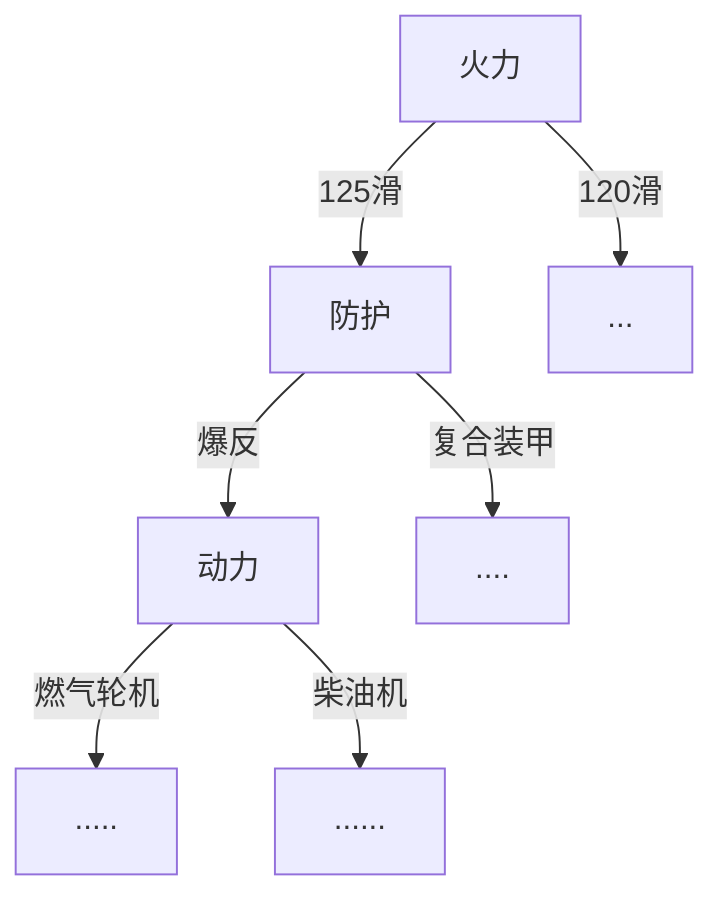

# 决策树

## 一、决策树

决策树是一类常见的机器学习方法，决策树将通过训练集获得一个用于决策的树模型。比如分类一辆坦克，人们会先考虑坦克的火炮是什么，再看坦克防护性能和机动性能等等，通过一层一层的、形似于树形结构的决策过程来得到问题的答案，这也是人们在面临决策问题时的一种很自然地处理机制。



一般的，一颗决策树包含一个根结点、若干个内部节点和若干个叶节点，*叶节店对应于决策结果*，*其他每个节点则对应于一个属性测试*，每个节点包含的样本集合根据属性测试的结果被划分到子节点中，根结点包含样本全集。从根结点到每个叶节点的路径对应了一个判定测试序列。

决策树学习的目标就是产生一颗泛化能力强，即处理未见示例能力强的决策树，其基本流程遵循简答而直观的分治策略。

## 二、划分选择

决策树学习的关键是选择最优划分属性的过程，一般而言，随着划分过程不断进行，我们希望决策树的分支节点所包含的样本尽可能属于同一类别，即节点的“纯度”越来越高。

### 1.信息增益

信息熵（information entropy）是度量样本集合纯度最常用的一种指标，假定当前样本集合D中第k类样本所占比例为$p_k(k=1,2,3,...,m)$，则$D$的信息熵被定义为：$Ent(D) = -\sum_{k=1}^{m}p_k * log_2p_k$。$Ent(D)$的值越小，$D$的纯度越高。

假定离散属性$a$有$V$个可能的取值${a^1, a^2,...,a^V}$，若使用$a$来对样本集D进行划分，则会产生$V$个分支节点，其中第$v$个分支节点包含了$D$中所有在属性$a$上取值为$a^v$的样本，记为$D^v$。

可以得到$D^v$的信息熵，再考虑到不同的分支节点所包含的样本数不同，给分支节点赋予权重$\frac{|D^v|}{|D|}$，故根据属性$a$来对样本集$D$进行划分的信息增益为$Gain(D,a) = Ent(D)-\sum^V_{v=1}\frac{|D^v|}{|D|}Ent(D^v)$。

信息增益是一种用于确定应该在哪里分裂树节点的度量。在构建决策树时，算法会根据训练数据的特征来构建树节点，并将数据集根据该特征进行分裂。信息增益度量了使用该特征分裂数据集所获得的纯度提升。当数据集中的数据分布均匀时，熵最大；当数据集中的所有数据都属于同一类别时，熵最小。信息增益度量了使用某个特征对数据进行分裂后，熵的减少量。即使用该特征能够带来多少关于数据集的信息，并帮助我们更好地对数据进行分类。一般而言，信息增益越大，则意味着使用属性$a$来划分所获得的“纯度提升”越大。

### 2.增益率

增益率（Gain Ratio）是用于选择最佳划分属性的一种属性选择度量。它可以通过比较每个属性的信息增益和其自身的固有信息量之间的比率来计算。如果在单纯的使用信息增益进行度量，一旦出现某种类似于编号、身份证等类别较多、能够将样本分类后的节点纯度较高但是分类收益较低的特征时，信息增益就无法用来度量。

因此定义增益率为：$GainRatio(D, a) = \frac{Gain(D, a)}{IV(a)}$。

其中$IV(a) = -\sum^{V}_{v=1}(\frac{|D^v|}{|D|}) * log2(\frac{|D^v|}{|D|})$，称为属性a的固有值，a可能的取值数量越多，则固有值越大。

增益率适合用于处理离散型特征且取值较少的数据集，而对于取值比较多的连续型特征，可以采用其他指标，例如信息增益比率、基尼指数等。

### 3.基尼指数

基尼指数（Gini Index）是一种*衡量样本集合纯度的指标*。在决策树中，**基尼指数越小表示集合越纯，即样本归属于同一类别的概率越大**。

对于一个有K个类别的分类问题，假设我们有一个样本集合D，其中第k类样本的比例为pk（k=1,2,...,K）。则D的基尼指数可以表示为：$Gini(D) = 1 - \sum_{k=1}^{K} p_k^2$ 。这里的1表示样本的总体可能性。如果集合D中的所有样本都属于同一类别，则基尼指数为0，表示集合纯度最高。

对于某一个属性a对集合D进行划分时，会得到若干个子集合$D_1,D_2,...,D_v$，其中第j个子集合$D_j$中包含了集合D中在特征a上取值为$a_j$的样本。我们可以使用加权基尼指数来衡量这个划分的好坏，定义为：$Gini_{index}(D,a) = \sum_{j=1}^{v} \frac{|D_j|}{|D|} Gini(D_j)$，其中，|Dj|表示集合Dj的样本数目，|D|表示集合D的样本总数。

在构建决策树时，我们会比较每个特征A对应的基尼指数Gini(D,A)，选择基尼指数最小的特征进行分裂。这个分裂过程会一直进行下去，直到满足停止条件为止，例如树的深度达到预设值或者节点样本数达到一定阈值。

## 三、剪枝处理

剪枝是决策树算法对付过拟合的重要手段，在决策树学习过程中可能会造成决策树分支过多，导致树模型把训练集自身的一些特征当作所有数据的一般性质而导致过拟合，因此可通过主动剪枝以减少过拟合并提高模型泛化能力。

决策树的剪枝分为预剪枝和后剪枝两种方式。

### 1.预剪枝

预剪枝是在构造决策树的过程中，提前停止树的生长，以避免过度拟合的情况出现。在预剪枝中，当某个节点的样本数小于一定阈值时，或者某个节点的信息增益小于一定阈值时，就会停止该节点的分裂，并将该节点标记为叶节点。这样，可以避免构造出过于复杂的决策树，从而提高模型泛化能力。

一般来说，在建立决策树过程中，我们会对某个节点进行预划分，计算节点在划分之前和划分之后在测试集上的准确率，以得到决策树在这个节点上的划分是否使得决策树的准确率上升。


预剪枝可以让决策树的很多分支没有展开，这不仅降低了过拟合的风险也减少了训练时间和测试时间。不过另一方面，有些分支可能在目前节点上的展开导致决策树准确率下降，但是在分支的后续的节点上却可能让决策树的性能有显著提高，预剪枝基于贪心的策略带来了欠拟合的风险。

### 2.后剪枝

后剪枝是在构造完整个决策树之后，通过剪掉一些不必要的子树来提高模型的泛化能力。后剪枝的基本思想是将一些叶节点合并起来，形成一个新的子树，并计算合并前后模型在验证集上的性能差异，如果合并后的模型性能没有显著降低，则进行剪枝操作。这个过程重复进行，直到无法再进行剪枝为止。


后剪枝的具体实现方法有很多种，其中比较常见的有：

1. Reduced Error Pruning（REP）：从下往上遍历整个决策树，在每个节点上分别尝试将该节点替换为其子树的叶节点，并计算替换前后模型在验证集上的性能差异，如果替换后的性能没有显著降低，则进行剪枝操作。
2. Cost-Complexity Pruning（CCP）：通过对每个子树引入一个惩罚项来控制剪枝的复杂度，具体地，定义一个复杂度函数，包括树的深度和叶节点的数量等因素，以此来控制模型的复杂度。
3. Minimum Description Length（MDL）：通过最小描述长度原则来选择最优的模型，即选择最小化描述模型所需的长度的模型。在决策树中，描述长度可以通过叶节点的数量和每个叶节点所需要的二进制位数来计算。

不同的剪枝方法在具体实现时可能会有一些差异，但其核心思想都是通过减少决策树的规模和复杂度，从而提高模型的泛化能力。

## 四、连续与缺失值

### 1.连续值处理

关于决策树学习中，样本的数值为连续属性的时候，连续属性的可取值数目不再有限，因此不能直接根据连续属性的可取值来对节点进行划分，因此可以使用连续属性离散化技术。

最简单的方法是使用二分法对连续属性进行处理，二分法是指将连续值特征离散化为多个二元特征（即二分法），以便将其用于决策树算法中。这种方法可以在决策树中自动划分连续值特征，避免了对特征进行手动处理的麻烦。下面是处理连续值的二分法的详细过程：

1. 排序：对于给定的连续值特征，首先将其进行排序。
2. 选择划分点：选择相邻两个值的中间点作为划分点，对于n个不同的连续值，可以选择n-1个划分点。
3. 计算划分点的信息增益：使用划分点将数据划分成两个子集，并计算这些子集的信息增益。
4. 选择最优划分点：在所有可能的划分点中选择具有最大信息增益的点作为最终的划分点。
5. 递归划分：将数据集根据最优划分点划分为两个子集，并对每个子集递归进行上述步骤，直到满足停止条件为止。

假设我们有一个连续值特征“年龄”，其取值范围为[18, 60]，我们需要将其离散化为二元特征。下面是一个二分法的详细例子：

1. 排序：对于年龄特征，我们将其从小到大排序，得到如下序列：

   18, 20, 23, 27, 31, 36, 41, 45, 50, 56, 60

2. 选择划分点：选择相邻两个值的中间点作为划分点，得到如下10个划分点：

   19, 21.5, 24.5, 29, 33.5, 38.5, 43, 47.5, 53, 58

3. 计算划分点的信息增益：使用划分点将数据划分成两个子集，并计算这些子集的信息增益。例如，对于划分点24.5，将数据集划分成两个子集：[18, 20, 23, 27, 31, 36, 41]和[45, 50, 56, 60]。然后计算这两个子集的信息增益，选取信息增益最大的点作为最优划分点。

4. 选择最优划分点：在所有可能的划分点中选择具有最大信息增益的点作为最终的划分点。例如，计算所有划分点的信息增益后，我们得到划分点24.5具有最大的信息增益，因此选择24.5作为最优划分点。

5. 递归划分：将数据集根据最优划分点24.5划分为两个子集，并对每个子集递归进行上述步骤，直到满足停止条件为止。

需要注意的是，停止条件可以根据具体的情况进行设置，例如，可以设置树的深度、节点中样本的数量等。另外，划分点的选择也可以根据不同的算法来进行选择，例如，使用信息增益率、基尼指数等作为选择标准。

### 2.缺失值处理

现实任务中常常会遇见不完整样本，即样本的某些属性值缺失，尤其是在属性数目较多的情况下，往往会有大量样本出现缺失值，通常有以下三种处理方式：

1. 删除缺失值所在的样本：如果训练数据集中某个样本存在缺失值，可以将该样本从数据集中删除。这种方法简单有效，但会导致训练数据集变小，可能会影响决策树的性能。
2. 插值法：对于缺失值，可以使用插值法来填补。例如，可以使用平均值、中位数、众数等统计量来填补数值型特征的缺失值；可以使用样本集合中出现最多的类别来填补分类特征的缺失值。这种方法可以使数据集中缺失值的影响降到最低，但可能会引入一些误差，尤其是在缺失值比例较大的情况下。
3. 特殊处理：对于某些特定类型的数据集，可以进行特殊处理。例如，在文本分类问题中，可以将缺失值所在的文档看作一种特殊的文本，采用特殊的处理方式来处理。

需要注意的是，在决策树算法中，如果采用删除缺失值所在的样本的方法，可能会使得叶子节点的类别分布不均衡，从而影响决策树的性能。因此，在实际应用中，通常会采用插值法或特殊处理等方法来处理缺失值。同时，对于处理分类特征的缺失值，可以采用多数表决法、平均值填充等方法来进行处理。

## 五、决策树实验

### 一、数据的分析与处理

``` python
def load_data(path):
    csv_data = pd.read_csv(path, delimiter=',')
    # 检查是否有缺失值
    print("训练数据缺失值：")
    print(csv_data.isnull().sum())
    # 观察到缺失值较少，对于总数据量来说不值一提，因此直接丢弃缺失值
    csv_data = csv_data.dropna()
    print(csv_data.info())
    X = csv_data[['drugName', 'condition', 'usefulCount', 'sideEffects', 'rating']].values
    y = csv_data[['rating']].values
    return X, y
```

首先通过pandas库加载csv文件，在对training数据集的观察中发现，数据本身缺失值数量较少，大约在总数据集的0.5%作业，因此选择直接舍弃掉有缺失值的数据。

同时对训练集的几个数据维度recordId,drugName,condition,reviewComment,date,usefulCount,sideEffects观察发现，recordId和reviewComment,date三个维度属于药品本身的无关属性，这三个属性的取值对药品的ranting没有影响，因此在构建决策树的时候舍弃这三个维度。

### 二、决策树的设计

``` python
def uniquecounts(rows):
    results = {}
    for row in rows:
        #计数结果在最后一列
        r = row[len(row)-1]
        if r not in results:results[r] = 0
        results[r]+=1
    return results # 返回一个字典
# 熵
def entropy(rows):
    from math import log
    log2 = lambda x:log(x)/log(2)
    results = uniquecounts(rows)
    #开始计算熵的值
    ent = 0.0
    for r in results.keys():
        p = float(results[r])/len(rows)
        ent = ent - p*log2(p)
    return ent
# 定义节点的属性
class decisionnode:
    def __init__(self, col=-1, value=None, results=None, tb=None, fb=None):
        self.col = col  # col是待检验的判断条件所对应的列索引值
        self.value = value  # value对应于为了使结果为True，当前列必须匹配的值
        self.results = results  # 保存的是针对当前分支的结果，它是一个字典
        self.tb = tb  ## desision node,对应于结果为true时，树上相对于当前节点的子树上的节点
        self.fb = fb  ## desision node,对应于结果为true时，树上相对于当前节点的子树上的节点
# 基尼不纯度
# 随机放置的数据项出现于错误分类中的概率
def giniimpurity(rows):
    total = len(rows)
    counts = uniquecounts(rows)
    imp = 0
    for k1 in counts:
        p1 = float(counts[k1]) / total
        for k2 in counts:
            if k1 == k2: continue
            p2 = float(counts[k2]) / total
            imp += p1 * p2
    return imp
# 改进giniimpurity
def giniimpurity_2(rows):
    total = len(rows)
    counts = uniquecounts(rows)
    imp = 0
    for k1 in counts.keys():
        p1 = float(counts[k1]) / total
        imp += p1 * (1 - p1)
    return imp
# 在某一列上对数据集进行拆分。可应用于数值型或因子型变量
def divideset(rows, column, value):
    # 定义一个函数，判断当前数据行属于第一组还是第二组
    split_function = None
    if isinstance(value, int) or isinstance(value, float):
        split_function = lambda row: row[column] >= value
    else:
        split_function = lambda row: row[column] == value
    # 将数据集拆分成两个集合，并返回
    set1 = [row for row in rows if split_function(row)]
    set2 = [row for row in rows if not split_function(row)]
    return (set1, set2)
# 以递归方式构造树
def buildtree(rows, scoref=entropy):
    if len(rows) == 0: return decisionnode()
    current_score = scoref(rows)
    # 定义一些变量以记录最佳拆分条件
    best_gain = 0.0
    best_criteria = None
    best_sets = None

    column_count = len(rows[0]) - 1
    for col in range(0, column_count):
        # 在当前列中生成一个由不同值构成的序列
        column_values = {}
        for row in rows:
            column_values[row[col]] = 1  # 初始化
        # 根据这一列中的每个值，尝试对数据集进行拆分
        for value in column_values.keys():
            (set1, set2) = divideset(rows, col, value)

            # 信息增益
            p = float(len(set1)) / len(rows)
            gain = current_score - p * scoref(set1) - (1 - p) * scoref(set2)
            if gain > best_gain and len(set1) > 0 and len(set2) > 0:
                best_gain = gain
                best_criteria = (col, value)
                best_sets = (set1, set2)

    # 创建子分支
    if best_gain > 0:
        trueBranch = buildtree(best_sets[0])  # 递归调用
        falseBranch = buildtree(best_sets[1])
        return decisionnode(col=best_criteria[0], value=best_criteria[1],
                            tb=trueBranch, fb=falseBranch)
    else:
        return decisionnode(results=uniquecounts(rows))
```

通过递归的方式构建决策树

### 三、剪枝

``` python
def prune(tree,mingain):
    # 如果分支不是叶节点，则对其进行剪枝
    if tree.tb.results == None:
        prune(tree.tb,mingain)
    if tree.fb.results == None:
        prune(tree.fb,mingain)
    # 如果两个子分支都是叶节点，判断是否能够合并
    if tree.tb.results !=None and tree.fb.results !=None:
        #构造合并后的数据集
        tb,fb = [],[]
        for v,c in tree.tb.results.items():
            tb+=[[v]]*c
        for v,c in tree.fb.results.items():
            fb+=[[v]]*c
        #检查熵的减少量
        delta = entropy(tb+fb)-(entropy(tb)+entropy(fb)/2)
        if delta < mingain:
            # 合并分支
            tree.tb,tree.fb = None,None
            tree.results = uniquecounts(tb+fb)
```

1. 计算每个节点的经验熵；

2. 递归地从树的叶节点向上回缩，如果将某一个父节点的所有叶节点合并，能够使得其损失函数减小，则进行剪枝，将父节点变成新的叶节点；

3. 返回2，直到不能继续合并。

### 四、分类

``` python
# 对新的观测数据进行分类
def classify(observation, tree):
    if tree.results != None:
        return tree.results
    else:
        v = observation[tree.col]
        branch = None
        if isinstance(v, int) or isinstance(v, float):
            if v >= tree.value:
                branch = tree.tb
            else:
                branch = tree.fb
        else:
            if v == tree.value:
                branch = tree.tb
            else:
                branch = tree.fb
        return classify(observation, branch)

```

传递给函数四个维度的数据，并分类返回一个包含分类结果的字典对象

### 五、Micro-F1和Macro-F1分数

``` \
micro_f1 = f1_score(y_valid, y_valid_pred, average='micro')
    macro_f1 = f1_score(y_valid, y_valid_pred, average='macro')
    print('Macro-F1: {}'.format(macro_f1))
    print('Micro-F1: {}'.format(micro_f1))
```


### 六、测试集结果

在测试集上的预测结果输出到ans.csv中。