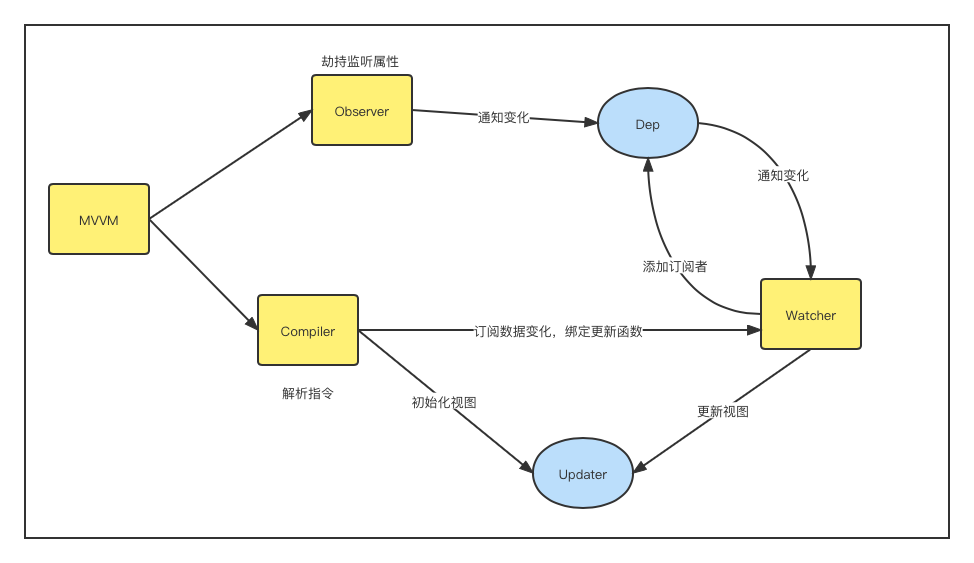
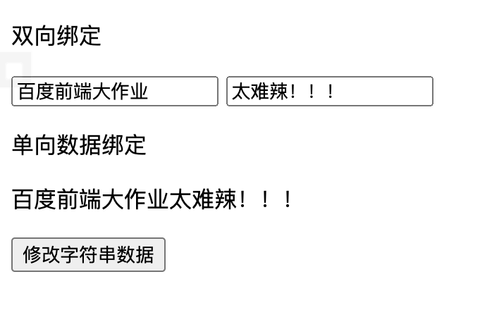
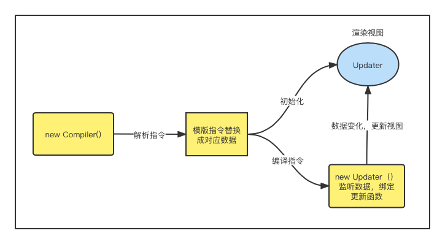
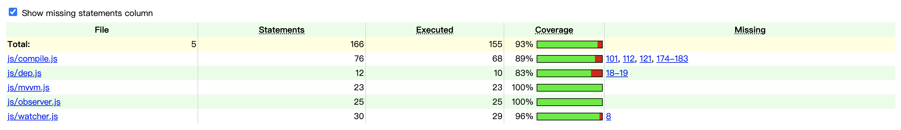

# 百度前端大作业文档
学号：201250171
姓名：汪博文<br>

## 一、整体结构
```
.
├── README.md
├── img
│   ├── 1.png
│   ├── Compile.png
│   ├── test.png
│   └── ?\201?\213?\233?.png
├── js
│   ├── compile.js
│   ├── dep.js
│   ├── mvvm.js
│   ├── observer.js
│   └── watcher.js
├── mvvm.html
└── report
    ├── js
    │   ├── compile.js
    │   ├── dep.js
    │   ├── mvvm.js
    │   ├── observer.js
    │   └── watcher.js
    ├── jscoverage-highlight.css
    ├── jscoverage-ie.css
    ├── jscoverage-throbber.gif
    ├── jscoverage.css
    ├── jscoverage.html
    ├── jscoverage.js
    └── mvvm.html
```
<br>
mvvm.html文件为网页文件，mvvm.js、compile.js、observer.js、watcher.js为实现数据劫持、发布订阅模式，在mvvm.html中简单实现数据双向绑定和单向绑定。
<br>
为了实现mvvm的双向绑定，我采用的方法是实现以下几点： 1、实现一个数据监听器Observer，能够对数据对象的所有属性进行监听，如有变动可拿到最新值并通知订阅者 2、实现一个指令解析器Compile，对每个元素节点的指令进行扫描和解析，根据指令模板替换数据，以及绑定相应的更新函数 3、实现一个Watcher，作为连接Observer和Compile的桥梁，能够订阅并收到每个属性变动的通知，执行指令绑定的相应回调函数，从而更新视图 4、mvvm入口函数，整合以上三者。
<br>



## 二、详细设计
<br>

### mvvm.html
页面整体结构如下：

双向绑定为两个输入框，输入框的内容分别是data中的两个变量，页面数据和
data数据双向绑定，在页面上修改字符串，data中的变量会同步修改，实现html
中的修改流入data。点击"修改字符串数据"可以随机修改后面的变量为另一个
字符串，实现js对data的修改，让修改的变量流入页面，实现双向流动。单向数
据绑定部分是这两个字符串链接起来，为单向链接，只能从页面读取data变量
不能修改data变量，点击"修改字符串数据"可以随机修改后面的变量为另一个
字符串，实现js对data的修改，让修改的变量单向流入页面。

### observer.js
利用Obeject.defineProperty()来监听属性变动 那么将需要observe的数据对象进行递归遍历，包括子属性对象的属性，都加上 setter和getter 这样的话，给这个对象的某个值赋值，就会触发setter，那么就能监听到了数据变化。

### dep.js
实现一个消息订阅器，很简单，维护一个数组，用来收集订阅者，数据变动触发notify，再调用订阅者的update方法

### compile.js
主要做的事情是解析模板指令，将模板中的变量替换成数据，然后初始化渲染页面视图，并将每个指令对应的节点绑定更新函数，添加监听数据的订阅者，一旦数据有变动，收到通知，更新视图，如图所示：


### watcher.js
Watcher订阅者作为Observer和Compile之间通信的桥梁，主要做的事情是: 1、在自身实例化时往属性订阅器(dep)里面添加自己 2、自身必须有一个update()方法 3、待属性变动dep.notice()通知时，能调用自身的update()方法，并触发Compile中绑定的回调。

### mvvm.js
MVVM作为数据绑定的入口，整合Observer、Compile和Watcher三者，通过Observer来监听自己的model数据变化，通过Compile来解析编译模板指令，最终利用Watcher搭起Observer和Compile之间的通信桥梁，达到数据变化 -> 视图更新；视图交互变化(input) -> 数据model变更的双向绑定效果。

## 三、测试
测试使用乐jscoverage项目，通过下载jscoverage实现对js文件的白盒测试，在运行jscoverage以后，生成report文件夹，包含有添加了测试断点的js文件。
在浏览器中运行jscoverage.html以后，在页面中加载mvvm.html，进行操作测试，测试覆盖率如下：

